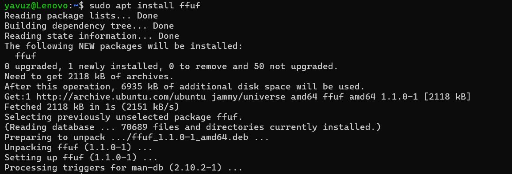

# FFUF

<figure><figcaption></figcaption></figure>

FFUF aracı Go dili ile yazılmış web sitelerinde kullanılabilen bir dizin tarama aracıdır. Benzer işlemleri yapan Gobuster, Dirbuster vb. araçlar gibi temel olarak iki parametreye ihtiyaç duyar. Biri tarama yapılacak bir hedef, diğer ise tarama esnasında kullanılacak bir wordlist.

Bu yazıda Gobuster yazımda olduğu gibi temel olarak dizin tarama özelliklerinden bahsedeceğim.

### Kurulum

FFUF'u yüklemek için yapmak gerekenler çok basit. Komut satırına `sudo apt install ffuf` yazmak yeterli olacaktır.

<figure><figcaption></figcaption></figure>

Bu işlemin başarı ile sonuçlanıp sonuçlanmadığını anlamak için  `ffuf --help` yazdığımızda aracımızın yardım ekranın çıkması lazım.

### FUZZ kelimesi

Bir sistemin veya uygulamanın beklenmedik veya hatalı davranışlarını ortaya çıkarmak amacıyla rastgele veya hatalı girdilerle test edilmesi anlamına gelir.

### Directory Fuzzing

Parametre olarak verilen bir web sitesi altında bulunan dizinleri/klasörleri tespit etmek için kullanılır. Tespit edilen klasörlerden çeşitli gizli sayfalara erişilebilir, çeşitli zafiyetler sömürülebilir.&#x20;

FFUF aracı ile dizin taraması yapmak için şöyle bir söz dizimine ihtiyacımız var:

`ffuf -u <hedefURL> -w <wordlist>`

Daha önce Gobuster ve benzeri bir araçla çalıştıysanız sadece hedef URL'i vermeniz yeterlidir. Ama FFUF aracımızda küçük bir değişiklik var. URL'i ekledikten sonra FUZZ yazmamız gerekiyor.

**Örnek:**

`ffuf -w subdomains-top1million-5000.txt -u https://www.bakka.gov.tr/FUZZ`

Burada FUZZ yazma amacımız wordlisten alınan kelimelerin nereye geleceğinin göstermek içindir.&#x20;

* https://www.bakka.gov.tr/admin
* https://www.bakka.gov.tr/test          vb. şeklinde linklere deneme yapılıyor.

FFUF hakkında çeşitli araştırma, yazılar okursanız şöyle bir yazım ile karşılaşabilirsiniz:

`ffuf -w subdomains-top1million-5000.txt:FUZZ -u https://www.bakka.gov.tr/FUZZ`

Burada yapılan şey yukarıda bahsettiğimle aynı şey oluyor. Buradaki işlemi wordlisten alınan kelimelerin FUZZ kelimesine atandığını sonrasında bu kelimeleri url'e eklendiğini düşünebilirsiniz. Eğer wordlisti verdikten sonra iki nokta ( : ) ile böyle bir kelime ataması yaparak tarama yapmak istiyorsanız illa FUZZ yazmanıza gerek yok. &#x20;

`ffuf -w subdomains-top1million-5000.txt:asd -u https://www.bakka.gov.tr/asd`

Wordlisten sonra noktalı virgül ile istediğinizi yazabilirsiniz ama URL'in sonuna aynı kelimeyi eklemelisiniz.&#x20;

Hangi tarzda arama cümlesi yazacağınız size kalmış.

Gobuster yazımda da daha iyi anlatabilmek için kullandığım localimde bulunan bu dosya yapısını kullanacağım.&#x20;

<figure><figcaption></figcaption></figure>

Kullanacağımız wordliste yukarıdaki dosyalar ve dizinler olmadığı için "denemeKlasoru" kelimesini ekliyorum. Sonrasında tarama yapmak için şu komutu yazıyoruz:

`ffuf -u http://192.168.1.5/CTF/ctfLogin/FUZZ -w subdomains-top1million-5000.txt`

<figure><figcaption></figcaption></figure>

Localimizde yaptığımız sitede böyle bir sonuç alıyoruz. Canl bir sitede yapmak istiyorsak değişen bir şey olmuyor. Şimdi canlı bir site olan [https://www.bakka.gov.tr/](https://www.bakka.gov.tr/) sitesinde deneyelim.

`ffuf -u https://www.bakka.gov.tr/FUZZ -w subdomains-top1million-5000.txt`

FFUF ile tarama yaparken hedef sisteme sürekli istek gönderdiğimiz için, sıkı bir güvenlik politikası olan  sitelerde sürekli aynı IP üzerinden çıkan istekler şüpheli olacağı için site tarafından engellenme durumu söz konusu olabilir.&#x20;

İstek sayısını çok fazla arttırmamız durumunda server gelen bütün isteklere cevap veremez ve devre dışı kalabilir. Bu yüzden istemsizce DOS-DDOS saldırısı yaparak hedefimizi devre dışı bırakmamak için istek sayılarımızı makul bir seviyede tutmalıyız.

Domain taramasına geçmeden önce dizin taramasında kullanabileceğiniz ek parametrelerden bahsetmek istiyorum.

* \-mc \<statusCODE> : HTTP durum kodlarına göre bir filtreleme yapar. Belirtilen durum kodlarına sahip cevapları **ekrana yansıtır.**

`ffuf -u https://www.hedefsite.tr/FUZZ -w wordlist.txt -mc 200,301`

Sadece 200 ve 301 durum kodunu alan cevapları gösterir.

* \-fc \<statusCode> : HTPP durum kodlarına göre bir filtreleme yapar. Belirtilen durum kodlarını sahip cevapları **ekrana yansıtmaz.**

`ffuf -u https://www.hedefsite.tr/FUZZ -w wordlist.txt -fc 404,403`

404 ve 403 durum kodları dönen cevapları göstermez.

* \-o \<dosya ismi> : Çıktıların verilen dosya ismine kayıt edilmesi için kullanılır.

`ffuf -u https://www.hedefsite.tr/FUZZ -w wordlist.txt -o result.txt`

Taramanın sonucunu result.txt oluşturup dosyanın içine kaydeder.

* \-t \<sayi> : Aynı anda kaç parçacığın (threads) çalışacağını belirlendiği parametredir. Default olarak 40 dır. Ne kadar fazla parçacık olursa o kadar aynı anda istek atılır demektir. Çok fazla threads sayısı çok fazla isteğe çok fazla istek sistemin çökmesine ya da sistemden banlanmamıza yol açabilir.

`ffuf -u https://www.hedefsite.tr/FUZZ -w wordlist.txt -t 100`

### Page Fuzzing

Bulduğumuz dizinde hangi uzantıya sahip dosyaların olduğun anlamak için uzantılar üzerinden de bir fuzzing işlemi gerçekleşitirebiliriz. Bunu yapmak için index dosyasının hangi uzantıya sahip olduğunu anlamamız gerekiyor. Wordlist olarak eklentilerin olduğu bir [wordlist](https://github.com/InfoSecWarrior/Offensive-Payloads/blob/main/File-Extensions-Wordlist.txt) kullanabiliriz.

`ffuf -u http://192.168.1.5/CTF/ctfLogin/denemeKlasoru/indexFUZZ -w extens-wordlist.txt`

Yukarıdaki kodun çıktısı olarak anladık ki ilk adımda bulduğumuz denemeKlasoru içinde bulunan index dosyasının uzantısın .php olduğunu buluyoruz. Bundan sonraki adımda dizin içindeki dosyaları keşfetmek için .php uzantılı bir wordlist kullanacağız.

<figure><figcaption></figcaption></figure>

&#x20;

Bulduğumuz bu klasorun içinde tam olarak ne olduğunu bilmiyoruz. Yeni bulduğumuz bu klasör içinde yine tarama yapabiliriz. Sadece kullanacağımız URL de küçük bir değişik olucak ayrıca wordlistimizi değiştireceğiz. Araştırarak sık kullanılan dosya isimlerini içeren bir [wordlist](https://github.com/emadshanab/WordLists-20111129/blob/master/Filenames\_Doted\_All.wordlist) buldum.

<figure><figcaption></figcaption></figure>

Denemeklasorunun içinde ise şu 4 dosya bulunuyor. Şimdi FFUF ile bu 3 dosyayı bulmak için şu komutu yazıyoruz.

`ffuf -u http://192.168.1.5/CTF/ctfLogin/denemeKlasoru/FUZZ -w subdomain-filename.txt`

<figure><figcaption></figcaption></figure>

Sonuç olarak şöyle bir sonuç alıyoruz.

### Subdomain Fuzzing

Bu konu başlığımızda ise FFUF ile subdomainlerin varlığı kontrol edeceğiz. Subdomain keşfetmek bizim ne işimize yarayacak derseniz, gizli veya hassas bilgileri bulma, eski veya güvenliksiz uygulamalar, farklı uygulama ve servisleri bulma gibi durumlarda işimize yarar.

Syntax olarak daha önce yaptıklarımıza gayet benzer bir şey yapacağız sadece kullandığımız FUZZ kelimesi URL'in sonunda değil başında yer alacak. Google'un bir sürü subdomani i olduğu için bu örneğimizde Google'ı kullanacağım.&#x20;

`ffuf -u https://www.FUZZ.google.com -w subdomains-top1million-5000.txt`

<figure><figcaption>
Yukarıda gördüğünüz üzere bir sürü subdomain çıkıyor.
</figcaption></figure>

### Recursive Fuzzing

Rekürsif bir şekilde bulduğu dosyaların içine gire gire tarama yapan bir arama tipidir. Bu arama tipini kullanabilmek için -recursion ve -recursion-depth parametrelerin vermemiz lazım.

\-recursion parametresi taramanın aktif edilmesi için kullanılır. -recursion-depth ise kaç klasör ve dizin ötesine kadar tarama yapılacağını belirtmek için kullanılır.

Örnek bir kullanım:

`ffuf -w subdomains-top1million-5000.txt -u https://www.bakka.gov.tr/FUZZ -recursion -recursion-depth 5 -e .php , .html`

Burada kullandığım -e parametresi wordliste bulunan kelimelerin sonuna eklenir ve denemeler bunun üzeriden yapılır.

Ne kadar büyük bir -recursion-depth değeri verirseniz tarama o kadar uzun sürer.

> Bu yazı [*Yavuz Kuk*](https://www.linkedin.com/in/yavuzkuk/) tarafından hazırlanmıştır.