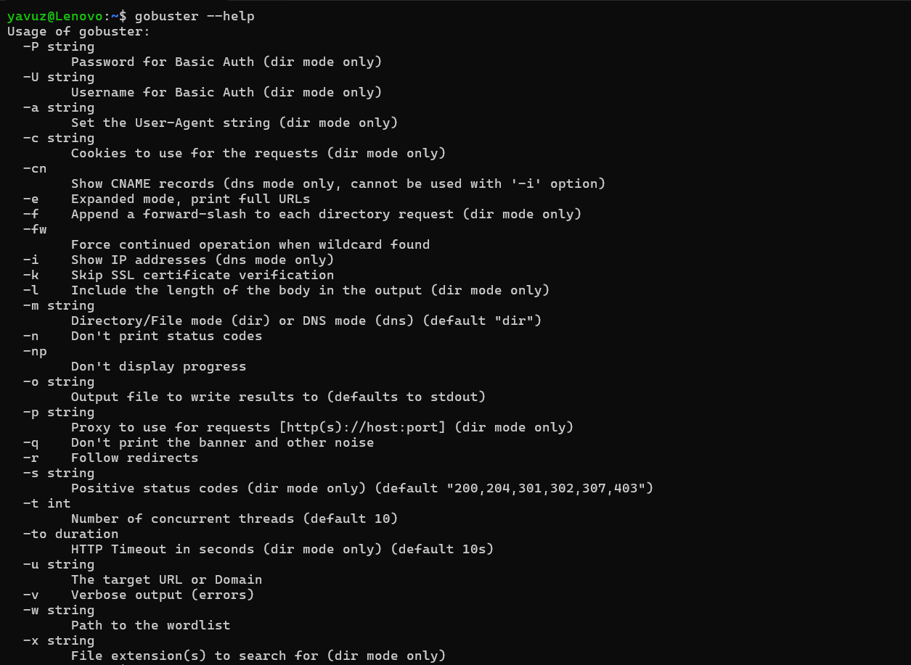
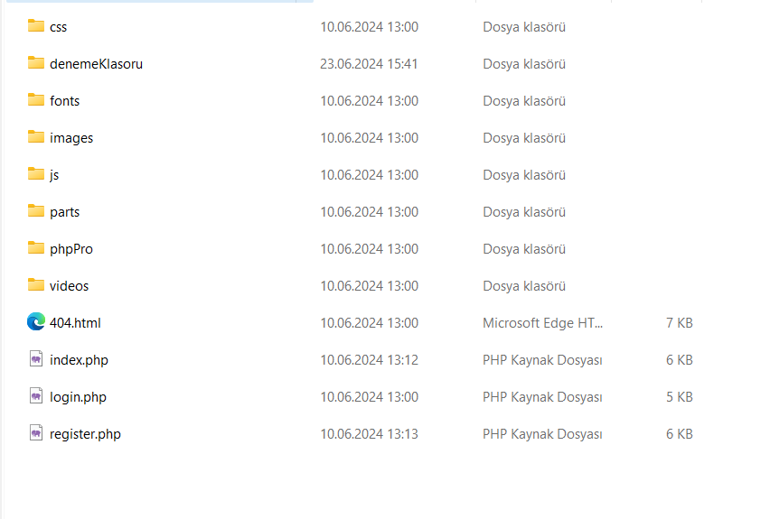
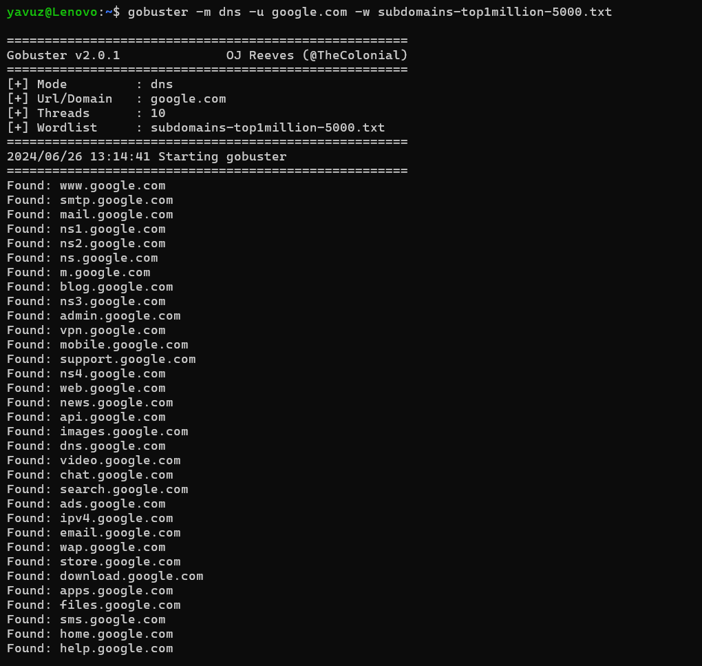
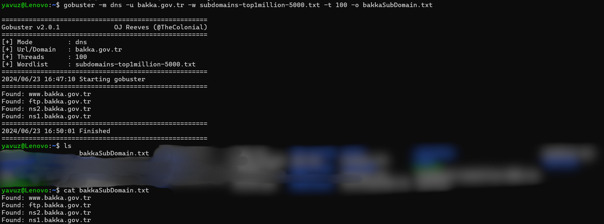

# Gobuster

<figure><figcaption></figcaption></figure>

Gobuster web uygulamalarında brute force yöntemiyle dizin tararaması ve alt alan adı taraması yapmak için kullanılan açık kaynaklı bir araçtır. Bu araç, özellikle web sunucularında gizli veya erişilebilir dizinleri, dosyaları ve DNS alt alan adlarını bulmak için kullanılır.

GO programlama diliyle yazılmış bir **brute force** aracıdır. Keşif aşamalarında hızlı ve güçlü bir araç olmasından ötürü sıklıkla kullanılmaktadır.&#x20;

### Kurulum adımları

<figure><figcaption></figcaption></figure>

`sudo apt install gobuster` diyerek sistemimize kurulum yapıyoruz. Sonrasında sisteme gobusterın inip inmediğini kontrol etmek için `gobuster --help` yazısını yazıyoruz.

<figure><figcaption></figcaption></figure>

Karşımıza buna benzer bir sayfanın çıkması lazım.

Aracımızı kullanmadan önce tam olarak neler yaptığını anlamamız lazım. Temel olarak aracımıza tarama yapacağımız bir URL ve bu taramad kullanacağı bir wordlist vermemiz lazım.&#x20;

## Gobuster Directory E**numeration**

Gobuster kullanarak bir web sitesi üzerinde bulunan dizinler üzerinde tarama yapabilriz. Bunu size daha kolay özetlemek için kendi localhostumda bir site hazırlıyorum.&#x20;

<figure><figcaption></figcaption></figure>

Oluşturduğum sitenin dosya yapısı bu şekildedir. Şimdi gobuster aracıma ana cihazımın local ip adresimi ve localimde bulunan [wordlistimi ](https://github.com/danielmiessler/SecLists/blob/master/Discovery/Web-Content/common.txt)veriyorum. Yaptığımız işlemin çalışıp çalışmadığını anlamak için  wordliste olmayan "denemeKlasoru" kelimesini ekliyorum.&#x20;

Şimdi gobuster üzerinde işlem yapabiliriz.

`gobuster -u <URL> -w <wordlist> -s < 200`,`204,301,302,307,403`>&#x20;

* \-u : Hangi web sitesinde bir tarama yapacağımızı belirtiriz
* \-w : Wordlistimizin pathini veririz.
* \-s : Status codeları filtrelemek için kullanılır. (Sadece dir modda geçerlidir)

Yukarıda yazdığımız kodu kendimize göre düzenleyip toolu çalıştırıyoruz.

<figure><figcaption></figcaption></figure>

Bahsettiğimiz bu adımları kullanarak pentest attığımız bir web sitesinin sahip olduğu dosyaları görebiliriz.&#x20;

## Gobuster DNS E**numeration**

Gobuster'ın DNS modu, belirli bir domain için DNS alt alan adlarını keşfetmek amacıyla kullanılır. Bu mod ile, gizli veya bilinmeyen alt alan adlarını bulabilir ve bu alt alan adlarının var olup olmadığını doğrulayabilirsiniz. DNS alt alan adları keşfi, siber güvenlik testlerinde önemli bir rol oynar çünkü farklı alt alan adlarında farklı uygulamalar, servisler veya güvenlik açıkları bulunabilir.&#x20;

Gobuster'ın _dir enumeration_ yaparken herhangi bir mod belirtmedik çünkü default olarak gobuster _dir enumeration_ yapıyor.

DNS Enumeration örneğini yapmayı ise Google üzerinden göstereceğim. DNS enumeration yaparken URL ve wordlist vermek zorundayız. DNS taraması yapmak için Seclist içinde bulunan başka bir [wordlisti](https://github.com/danielmiessler/SecLists/blob/master/Discovery/DNS/subdomains-top1million-5000.txt) kullanıyoruz. Bunların dışında DNS taraması moduna geçtiğimizi haber vermemiz lazım. Tabiki de karşımıza çıkan erişim gerektiren bazı alt domainlere ulaşamayacağız.

DNS Enumeration yapmak için şu kodu yazıyoruz:

`gobuster -m dns -u <URL> -w <Wordlist>`&#x20;

* \-m : Gobuster'ı hangi modda çalıştıracağımızı belirtmiş oluyoruz. (Default dir)
* u : Hedef URL
* \-w : Wordlist path

<figure><figcaption></figcaption></figure>

Google hakkında DNS taramamız uzun sürüyor. Ama daha basit bir web sitesinde çalıştığınızda daha az kayıt bize dönmekte.

Temel olarak Gobuster kullanmaya öğrendik ama bunların yanında Gobuster'ın sahip olduğuı çeşitli parametreler var. Basit bir şekilde bunlardan bahsetmek istiyorum.&#x20;

&#x20;

* \-t (Threads) : Threads sayısını artırmak, tarama hızını artırabilir, ancak aynı zamanda IP banlanma riskinizi de artırabilir. Ne kadar fazla threads aynı anda o kadar istek atmak anlamına gelir. -t değeri sayısal bir değer alır. Default olarak değeri 10 dur.
* \-to (Time out) : Her bir HTTP isteği için maksimum bekleme süresini belirler. Bir istek gönderildikten sonra sunucudan yanıt alınana kadar geçen süredir. Eğer sunucudan belirtilen süre içinde yanıt alınamazsa, Gobuster isteği zaman aşımına uğramış olarak değerlendirir.   Kullanımı -to 50s  şeklindedir.
* \-o (Output) : Çıktının bir yere kaydedilmesi için kullanılır.

<figure><figcaption></figcaption></figure>

Yukarıda ise BAKKA'ya DNS taraması gerçekleştiriyoruz ve çıktısını kaydediyoruz. Threads parametresini 100 yapıyoruz.&#x20;

Daha deyatlı bilgi içi `gobuster --help` komutunu kullanın.

**Not:** Yasal ve etik kurallara uymak önemlidir. Sadece izin verilen hedeflerde tarama yapmalı ve hedef sistemlere aşırı yük bindirmemelisiniz.

> Bu yazı [*Yavuz Kuk*](https://www.linkedin.com/in/yavuzkuk/) tarafından hazırlanmıştır.