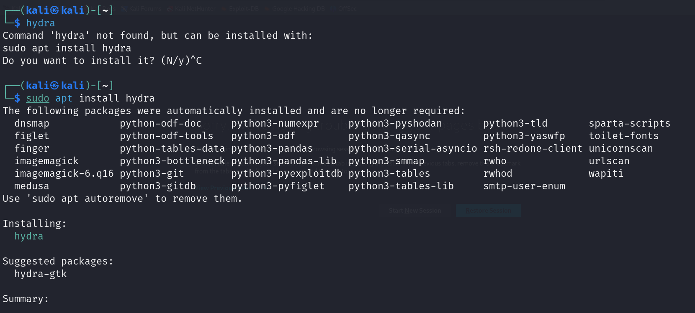
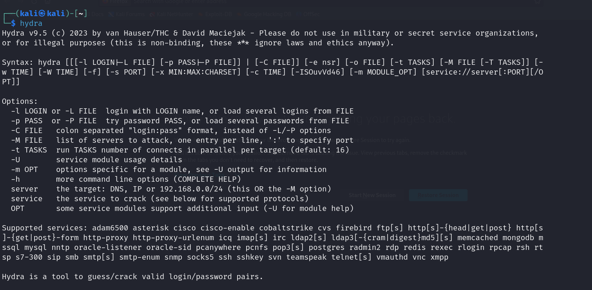
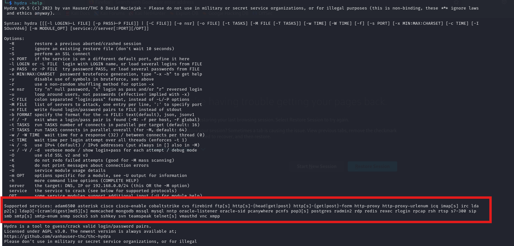

# Hydra


<figure></figure>

Hydra toolu Brute-force yapmak için kullanılan, Kali Linux içinde default olarak gelen bir araçtır. Çok fazla protokolü destekler ve dene yanılma yöntemiyle sonuca ulaşılır. Deneme yanılma yapabilmesi için wordlistlere ihtiyacı vardır.

Eğer kullandığınız cihazda Hydra yoksa şu şekilde yükleyebilirsiniz.

<figure></figure>

Yükleme işleminden sonra aracımızın yüklenip yüklenmediğini anlamak için ```hydra``` yazdıktan sonra karşımıza şu şekil bir sayfa çıkması gerekiyor.

<figure></figure>


Hydra'nın desteklediği protokolleri görmek için ```hydra --help``` yazmamız gerekiyor.

<figure></figure>

Hydra‘nın desteklediği protokoller: Asterisk, AFP, Cisco AAA, Cisco auth, Cisco enable, CVS, Firebird, FTP, HTTP-FORM-GET, HTTP-FORM-POST, HTTP-GET, HTTP-HEAD, HTTP-POST, HTTP-PROXY, HTTPS-FORM-GET, HTTPS-FORM-POST, HTTPS-GET, HTTPS-HEAD, HTTPS-POST, HTTP-Proxy, ICQ, IMAP, IRC, LDAP, MEMCACHED, MONGODB, MS-SQL, MYSQL, NCP, NNTP, Oracle Listener, Oracle SID, Oracle, PC-Anywhere, PCNFS, POP3, POSTGRES, Radmin, RDP, Rexec, Rlogin, Rsh, RTSP, SAP/R3, SIP, SMB, SMTP, SMTP Enum, SNMP v1+v2+v3, SOCKS5, SSH (v1 and v2), SSHKEY, Subversion, Teamspeak (TS2), Telnet, VMware-Auth, VNC and XMPP.

---

Bu yazımızda Hydra ile <a href="https://tryhackme.com/r/room/hydra">Try Hack Me</a>üzerinden SSH ve Login Brute Force üzerinden örnekler göreceğiz.

Laboratuara geçmeden önce temel olarak Hydra aracının kullanım şeklinden bahsedelim.

Hydra aracının verdiğimiz listelerden aldığı değerlerle Brute-force saldırısı yaptığını belirtmiştik.

Bir sistem düşünün bu sisteme giriş yaparken hem kullanıcı adına hem de bir şifreye ihtiyacımız vardır. Bu yüzden Brute-force yaparken 2 farklı liste vermemiz gerekiyor.

Bazı durumlarda kullanıcı adını ya da şifreyi biliyor olabiliriz. Bu durumda sadece bir tane liste vermemiz yeterli olacaktır.

hydra aracı ile temel bir Brute force işlemi için aşşağıdaki komut yapısı kullanılır.
 ```
 hydra -L <usernamePath> -P <passwordPath> <IP> <servis> -V
  ```
Komut yapısını adım adım incelersek başta hangi aracı kullanacağımızdan bahsetmiş bulunuyoruz.

- -L parametresi ile kullanıcı adlarını içeren dosyanın pathini parametre olarak veriyoruz.
- -P parametresi ile parolaları içeren dosyanın pathini parametre olarak veriyoruz.
- -\<IP> ile belirtlmiş olduğumuz yere hedef IP değerimiz geliyor.
- -\<servis> şeklinde belirtilmiş olan yere ise hangi servise brute-force attığımızı belirtmek için kullanıyoruz. Örnek vermek gerekirse: ssh,ftp vb.
- -V parametresi ile gönderilen isteklerin daha detaylı çıkltılarını almak için kullanılır.

Yukarıda bahsettiğim gibi bazı durumlarda kullanıcı adını ya da şifreyi liste olarak değil de tekil olarak vermek isteyebiliriz. Bunun içinse şu parametreleri kullanabiliriz.

- -l : Tek bir kullanıcı adı vermek için kullanılır.
- -p : Tek bir şifre vermek için kullanılır.

---
Örnek vermek gerekise bir SSH protokolüne Brute-force atmak istiyoruz ve kullanıcın adının <i>root</i> olduğunu tahmin ediyoruz.

Bu durumda SSH protokolüne saldırıda bulunmak için şu komutu yazmamız gerekiyor.

```
hydra -l root -P passwordList.txt <IP> ssh -v
```

Bu komut satırında girilen Ip adresinde root adlı kullanıcı (eğer varsa) üzerinde SSH protokolüne Brute-force saldırısı deniyoruz.

Şimdi Try Hack Me içinde bulunan Hydra modulünde çalışma yapacağız. Öncelikle hedef sistemi çalıştırıyoruz.

Öncesinde hedefimizde hangi sistemlerin çalışıp çalışmadığını öğrenmek için <i>nmap</i> taraması yapacağız.

<figure><image src="../assets//hydra/nmapTarama.png"></figure>

Çıktıya baktığımmızda 2 tane port açık gözüküyor.
- 22/tcp ssh
- 80/tcp http

Http portu açık olduğuna göre bir web sitesi çalışıyor durumdadır. Verilen Ip'yi tarayıcımızda arama çubuğuna yazdığımızda şu şekil bir sayfa karşımıza çıkıyor.

<figure><image src="../assets//hydra/hydraWeb.png"></figure>

Soruda bize Molly isim kişinin web şifresini ve SSH  şifresi soruluyor. Ana hedefimiz Molly. Bu verilen sorudan sonra bizim kullanıcı adımızın molly olup olamadığını düşünmemiz lazım.

Verilen Ip adresine SSH bağlantısı üzerinden saldırı işlemi gerçekltireceğiz. Bu işlem için şu komutu yazmamız gerekiyor.

```
hydra 10.10.185.140 ssh -l molly -P usr/share/wordlist/Seclist/Password/xato-net-10-million-passwords-10000.txt -f -V
```
Burada -f parametresinin amacı doğru kullanıcı adı - şifre ikisili bulunduktan sonra aracın kapatılması için kullanılmıştır. Eğer -f parametresi kullanılmasaydı aracımız doğru ikiliyi bulmasına rağmen parametre olarak verdiğimiz şifre listesinin sonuna kadar çalışmaya devam edecekti.

-V parametresi ise o esnada denenen kullanıcı adı şifre ikililerini göstermek için kullanılır.

Aracımız liste olarak verdiğimiz değerleri molly ile eşleyip sistem üzerinde deneme yapıyor.

Örnek olarak şifre listemiz şu şekilde olsun:

```
adminPassword
password123
passw@rd
1234567
.
.
.
.
.
```

Hydra sırasıyla şu denemeleri yapacaktır.

```
molly - adminPassword
molly - password123
molly - passw@rd
molly - 1234567
.
.
.
.
.
```
Bu girilen kullanıcı adı şifre ikililerinden hangisi doğruysa aracımız bize gösteriyor olucak.

<figure><image src="../assets//hydra/hydraSSH.png"></figure>


1316 tane denemeden sonra doğru cevaba ulaşıyoruz. 
<i>molly - butterfly</i>

Molly adlı kullanıcın SSH şifresini öğrendikten sonra SSH servisine bağlanmamız gerekiyor. SSH ile bağlanmak için ```ssh molly@10.10.185.140``` şeklinde komut giriyoruz. Bize şifre soruyor bulduğumuz şifreyi yazıyoruz ve SSH servisi üzerinden erişim elde ediyoruz.

<figure><image src="../assets//hydra/mollySSHAnswer.png"></figure>

İçinde bulunduğumuz dizinde flag2.txt değerini okuyup cevap olarak girebiliriz.


---

Şimdi ise bizden Molly'nin web sayfasına giriş yaparken kullandığı şifresini bulmamız isteniyor.

Bunun için normal şartlarda Burp Suite ile Brute-force yapmak akla gelebilir ama Burp Suite Community versiyonu çok yavaş bir şekilde istek atmakta. Bundan dolayı daha hızlı olan Hydra'yı kullanabiliriz.

Daha önce Burp Suite ile Brute Force attıysanız, giden istek üzerinde gönderilen verileri seçip listelerin o alanla yer değiştirmesi üzerinden çalışan bir mantık.

<figure><image src="../assets//hydra/burpSuite.png"></figure>

Örnek vermek gerekirse Molly'nin web sitesine giriş yapmaya çalıştığımızda arka tarafta servera şöyle bir istek gönderiliyor. Aşşağı kısımda işaretli olanlar ise bizim manipüle etmek istediğimiz kısımlar. Parametre olarak vereceğimiz listeler işaretli olan yerlere gelip istekler gönderecek.

Bu yüzden web sitesinin arka tarafta kullanmış olduğu parametreler bizim için çok önemli. Bu parametreleri öğrenmek için öncesinde Burp Suite ile bir isteği yarıda kesip öğrenebiliriz bunun dışında sağ tık yapıp incele menüsünden hangi parametrelerin kullanıldığını öğrenebiliriz.

<figure><image src="../assets//hydra/parametre.png"></figure>

Sitenin hangi parametreleri kullanıp neye göre istek yaptığını öğrendik. Bundan sonra şu komut ile web sitesine Brute-force atıyoruz.

```
hydra 10.10.185.140 -l molly -P xato-net-10-million-passwords-1000.txt http-post-form "/login:username=^USER^&password=^PASS^:Your username or password is incorrect." -V -f
```
http-post-form yazısı ile post tipinde bir veri gönderiyor olduğumuzu belirtiyoruz.

Bu komutta verilen Ip adresinin altında bulunan /login dizininin içinde bulunan username ve password kısımlarına Brute-force atıyoruz. Verdiğimiz kullanıcı ismi USER yazan kısma eşitleniyor. Verdiğimiz parola listesi ise PASS yazan yere yerleşiyor ve Brute force işlemi başlıyor. <i>
Your username or password is incorrect.</i> yazan kısım ise  yanlış bir cevap girdiğimizde sistemin bize dönen hata mesajını temsil ediyor.

<figure><image src="../assets//hydra/hydraWebAnwer.png"></figure>


Elde ettiğimiz şifreyi giriş ekranında kullanarak sisteme girip sonuncu flagi elde edebiliyoruz.

<figure><image src="../assets//hydra/webFlag.png"></figure>

> Bu yazı [*Yavuz Kuk*](https://www.linkedin.com/in/yavuzkuk/) tarafından hazırlanmıştır.