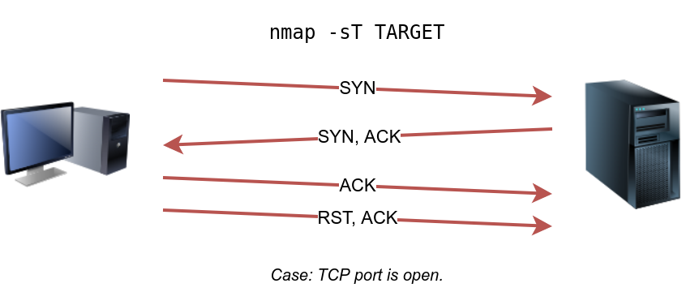
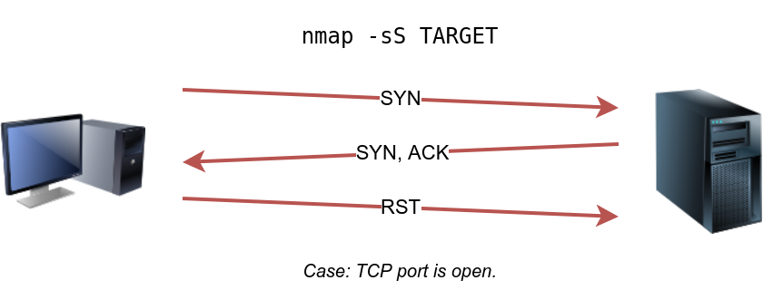

# Nmap

<figure><figcaption></figcaption></figure>

Nmap(Network Mapper) ağ keşfi ve güvenlik denetimleri için kullanılan açık kaynaklı ve güçlü bir tarama aracıdır. Nmap sayesinde ağda bulunan cihazları, bu cihazların kullandığı servisleri, servislerin versiyonları, açık olan portları, işletim sistemlerini listeleyen bir araçtır. 

Nmap'in bize vermiş olduğu çıktılar sayesinde hedef sistemin kullandığı servisler üzerinden zafiyet taraması yapabiliriz. 

```sudo apt install nmap```

Yukarıdaki komut sayesinde sistemimize Nmap aracını yükleyebiliriz.

Nmap'in normal kullanış şekli şu şekildedir.

```nmap <ip adresi/adresleri>```

Nmap verdiğimiz Ip adresi yada Ip adres aralığında olan cihazların port taramasını yapar. Eğer Nmap aracımıza bir Ip aralığı verirsek örnek vermek gerekirse ```10.10.123.0/24``` Nmap öncelikle bu aralıkta aktif olan cihazları tarar sonrasında sadece aktif olan cihazların port taramasını gerçekleştirir. 

Bazı durumlarda biz sadece aktif cihazları görmek isteriz. Port taraması yapmasını istemeyiz. 

## -sn 

-sn parametresi Nmap aracının port taraması yapmasını engeller ve sadece aracın aktif cihazları göstermesini sağlar.

```nmap -sn 192.168.1.0/24```

Yukarıda yazdığım kod ile 192.168.1.1 - 192.168.1.255 arasındaki aktif cihazları bize döndürür. Port taramasına geçmeden önce hedef sistemin aktif olup olmadığını anlamamız lazım.

Bunun için çeşitli parametreler kullanılır. 

## -PE
Komut satırı sayesinde istediğimiz sisteme ```ping``` atabiliyoruz. Aktif cihazları taramak için bu ping atma yöntemini kullanacağız. 

Birçok güvenlik duvarı ICMP echo engeller; MS Windows'un yeni sürümleri, varsayılan olarak ICMP echo isteklerini engelleyen bir ana bilgisayar güvenlik duvarı ile yapılandırılmıştır. 

```sudo nmap -sn -PE 10.10.68.0/24```

<figure><figcaption></figcaption></figure>

## -PP

ICMP echo istekleri genellikle engellendiğinden, bir sistemin çevrimiçi olup olmadığını anlamak için ICMP Timestamp (Zaman damgası) veya ICMP Address Mask (Adres Maskesi) isteklerini de düşünebilirsiniz. Nmap, zaman damgası isteğini kullanır ve Zaman Damgası yanıtı alıp almayacağını kontrol eder.

-PP parametresiyle birlikte hedefe sistem saatini sorgulamak için paket gönderilir. Eğer sistem aktif ise sistem geri dönüş sağlar.

```sudo nmap -sn -PP 10.10.68.0/24```

<figure><figcaption></figcaption></figure>

## -PM
Benzer şekilde Nmap, adres maskesi sorgularını kullanır ve adres maskesi yanıtı alıp almadığını kontrol eder.

```sudo nmap -sn -PM 10.10.68.0/24```

<figure><figcaption></figcaption></figure>


## -PS

Hedef sisteme SYN paketi gönderilir eğer hedef sistem açıksa SYN-ACK paketi gönderir. Eğer hedef sistem aktif değilse RST paketi gönderir.

<figure><figcaption></figcaption></figure>

## -PA

Hedef sisteme ACK paketi gönderir. Bu tarama işlemini yapabilmek için Nmap'i root yetkilerine sahip olarak çalıştırıyor olmanız gerekir. root yetkilerine sahi olmayan bir kullanıcı olarak denerseniz, Nmap 3 yönlü bir el sıkışma girişiminde bulunacaktır.

```sudo nmap -PA -sn 10.10.68.220/24```

<figure><figcaption></figcaption></figure>


## -PU

Son olarak, ana bilgisayarın çevrimiçi olup olmadığını keşfetmek için UDP kullanabiliriz. TCP SYN ping'in aksine, açık bir porta bir UDP paketi göndermenin herhangi bir yanıta yol açması beklenmez. Ancak, kapalı bir UDP portuna bir UDP paketi gönderirsek, bir ICMP port erişilemez paketi almayı bekleriz; bu, hedef sistemin açık ve kullanılabilir olduğunu gösterir.

Aşağıdaki şekilde açık bir UDP portuna gönderilen ve herhangi bir yanıt tetiklemeyen bir UDP paketini görüyoruz. Ancak herhangi bir kapalı UDP bağlantı noktasına bir UDP paketi göndermek, dolaylı olarak hedefin çevrimiçi olduğunu belirten bir yanıtı tetikleyebilir.

```sudo nmap -PU -sn 10.10.68.220/24```

<figure><figcaption></figcaption></figure>

<figure><figcaption></figcaption></figure>


## Port nedir?

Port taraması yapmadan önce portun ne olduğundan bahsedelim. Bilgisayarlar ve sunucular üzerindeki portlar, uygulamaların bilgi alışverişi yapabilmesi için kullanılan sanal giriş ve çıkış noktalarıdır. Bir port, belirli bir protokol (örneğin, TCP veya UDP) ve belirli bir uygulama tarafından iletişim için kullanılır. 

0'dan 65535'e kadar numaralandırılmıştır.

Çok bilinen portlar şunlardır:
- Port 80: HTTP (web trafiği)
- Port 443: HTTPS (güvenli web trafiği)
- Port 22: SSH (güvenli uzaktan erişim)
- Port 25: SMTP (e-posta iletimi)

Nmap üzerinden port taraması yapmadan önce portların bulunabileceği durumdan bahsedelim.

- Open: Bir hizmetin belirtilen bağlantı noktasını dinlediğini gösterir.
- Close: Port erişilebilir olmasına rağmen belirtilen port hiçbir hizmetin dinlemediğini belirtir. Erişilebilir derken, erişilebilir olduğunu ve bir güvenlik duvarı veya diğer güvenlik cihazları/programları tarafından engellenmediğini kastediyoruz.
- Filtered: Nmap'in, porta erişilemediği için bağlantı noktasının açık mı yoksa kapalı mı olduğunu belirleyemediği anlamına gelir. Bu durum genellikle Nmap'in bu porta ulaşmasını engelleyen bir güvenlik duvarından kaynaklanır.
- Unfiltered: Port erişilebilir olmasına rağmen Nmap'in portun açık mı yoksa kapalı mı olduğunu belirleyemediği anlamına gelir. Bu durumla ACK taraması -sA kullanılırken karşılaşılır.


## -sT (TCP Connect Tarama)

-sT parametresi, TCP taraması için kullanılan en basit yöntemdir ve "tam açık tarama" olarak bilinir. Bu tarama, standart bir TCP üç yönlü el sıkışmayı tamamlar. Nmap, hedef sisteme bir TCP SYN paketi gönderir. Hedef sistem SYN-ACK ile yanıt verirse, Nmap ACK paketi göndererek bağlantıyı tamamlar ve hemen ardından bağlantıyı kapatır.

<figure><figcaption></figcaption></figure>

Bu tarama yöntemi, herhangi bir ayrıcalık gerektirmez, yani root yetkileri olmadan da kullanılabilir.

Tam bir bağlantı kurulduğundan, bu tarama yöntemi hedef sistemde daha belirgin izler bırakır ve güvenlik duvarları tarafından daha kolay tespit edilebilir.

## -sS (TCP SYN Tarama)

Nmap default tarama modudur. Kullanmak için root yetkilerine sahip olmak gerekir. -sS parametresi, TCP portlarının taranması için kullanılan en yaygın yöntemlerden biridir. Bu tarama, "yarı açık tarama" olarak da bilinir, çünkü tam bir TCP üç yönlü el sıkışma işlemi gerçekleştirmez.

Nmap, hedef sisteme bir TCP SYN paketi gönderir. Eğer hedef sistem, SYN-ACK paketi ile yanıt verirse, bu, portun açık olduğunu gösterir.
Nmap, yanıt aldıktan sonra, bağlantıyı tamamlamak yerine RST paketi gönderir. Böylece, hedef sistem bağlantının kapatıldığını düşünür.

<figure><figcaption></figcaption></figure>

Bu yöntem, hedef sistemin loglarında tam bir bağlantı olarak görünmez, bu da daha az iz bırakır. SYN paketlerinin gönderilmesi güvenlik duvarları tarafından tespit edilebilir.


## -sN (Null Tarama)

Null Scan, TCP segmentindeki bayrakların hiçbirini set etmez, yani gönderilen TCP paketinde hiçbir bayrak bulunmaz. Hedef sistem, bu tür bir paketi aldığında, eğer port kapalıysa bir RST (reset) paketi ile yanıt verir. Eğer port açıksa, genellikle herhangi bir yanıt verilmez.

<figure><figcaption></figcaption></figure>

<figure><figcaption></figcaption></figure>

## -sF (FIN Tarama)

FIN bayrağı işaretlenmiş TCP paketleri gönderir. FIN paketini alan port eğer açıksa herhangi bir cevap vermez. Eğer port kapalı ise sistem RST bayrağı döner.

<figure><figcaption></figcaption></figure>


<figure><figcaption></figcaption></figure>

## -sX (Xmas Tarama)
 
Noel taraması, adını Noel ağacı ışıklarından alır. Xmas taraması FIN, PSH ve URG bayraklarını aynı anda ayarlar. -sX seçeneğiyle Noel taramasını seçebilirsiniz. RST paketi alınırsa portun kapalı olduğu anlamına gelir. Aksi taktirde açık|filtreli olarak raporlanacaktır.

<figure><figcaption></figcaption></figure>


<figure><figcaption></figcaption></figure>

## -sA (ACK Tarama)

-sA parametresi, sistemin bir firewall (güvenlik duvarı) tarafından korunup korunmadığını anlamak için kullanılabilir. Bu tarama tipi, ACK bayrağı set edilmiş TCP paketleri gönderir ve gelen yanıtlara dayanarak portların durumu hakkında bilgi toplar. Ancak, asıl amacı portların açık veya kapalı olduğunu belirlemek değil, güvenlik duvarı kurallarını test etmektir.

## -sU (UDP Tarama)

-sU parametresi, UDP portlarının taranması için kullanılır. TCP'den farklı olarak, UDP bağlantısız bir protokoldür, bu nedenle üç yönlü el sıkışma gibi bir işlem yapılmaz.

Nmap, hedef sisteme belirli bir UDP portuna veri gönderir ve yanıt bekler. Eğer port kapalıysa, genellikle bir ICMP "Port unreachable" (Erişilemez port) mesajı döner. Eğer port açık ise, genellikle bir yanıt alınmaz (bu, UDP'nin doğası gereğidir).

<figure><figcaption></figcaption></figure>

<figure><figcaption></figcaption></figure>


Port taramaları yaparken çeşitli port ve tarama hızı için seçim yapabiliriz.

Hangi portların taranacağını belirlemek için ````-p```` parametresi kullanılır. Eğer ben 80 ve 443 portlarını taramak istiyorsam şu şekilde bir kullanım sağlamam gerekiyor.

```nmap -p80,443 <ip>```

Eğer bütün portları taramak istiyorsam ````-p-```` şeklinde kullanmam lazım. Örnek komut şu şekildedir.

```nmap -p- <ip>```

Ayrıca taramanın hızını ayarlayabiliriz. Bunun için 5 farklı seçeneğimiz vardır. -T parametresinin yanına 0-5 arasında sayı yazdığımızda tarama hızı ayarlanmış olur.

- paranoyak (0)
- sinsi (1)
- kibar (2)
- normal (3)
- agresif (4)
- inanılmaz (5)

Bazı sistemlerde kendimizi belli etmeden tarama yapmamız gerek ve -T0 yada -T1 bunun için iyi bir seçenek olacaktır.

Örnek bir komut şöyledir:

```nmap -T2 -p- <ip>```

## -D (Decoy)

Bazı tarama işlemlerinde tarama yapan IP adresleri arasında bizim IP adresimizden farklı IP adreslerinin de olması işime gelir. Tespit edilme olasılığımızı azaltır.

Bunun için -D parametresini kullanıyoruz. Şöyle bir komut işimizi görecektir.

```nmap -D 10.10.0.1,10.10.0.2,ME MACHINE_IP```

Bu komut isteklerin 10.10.0.1, 10.10.0.2 ve benim IP adresimden geliyormuş gibi gösterecektir ve bu sayede tespit edilmemiz daha da zorlaşacaktır.

Açık portları bulduktan sonra kullanılan servisi ve servis versiyonu bizim işimize yarayacaktır. Bu yüzden -sV parametresine ihtiyacımız var.

## -sV (Service Version)

Nmap'te -sV parametresi, port taramalarında servislerin ve uygulamaların versiyon bilgilerini tespit etmek için kullanılır. Versiyon tespiti yapmak için sisteme tam bir bağlantı yapmamız gerekiyor. -sS bağlantı tipini kullanamayız. Bağlantının kurulması gereklidir çünkü Nmap, bağlantıyı tam olarak kurmadan ve port ile iletişim kurmadan sürümü keşfedemez.

```nmpa -sV <IP>```

### --version-intensity

Hedef sistem üzerinde versiyon taraması yaparken sistem üzerinde ne kadar agresif olmak istediğimizi belirtmek için kullanırız. 0-9 arasında değer alır. 
- 0: En düşük yoğunlukta versiyon tespiti. Nmap, yalnızca en temel testleri gerçekleştirir.
- 9: En yüksek yoğunlukta versiyon tespiti. Nmap, servisin versiyonunu belirlemek için tüm olası testleri uygular.

## İşletim Sistemi Tespiti

Nmap işletim sistemlerini (Operating System) tespit edebilir. Bunun için -O parametresini kullanmalıyız.

````nmap -O <IP>````

## -sC

Nmap'te -sC parametresi, "default scripts" olarak bilinen Nmap Scripting Engine (NSE) betiklerini çalıştırmak için kullanılır. Bu parametre, Nmap taraması sırasında belirli güvenlik kontrolleri, bilgi toplama ve zafiyet analizleri gibi işlemleri gerçekleştirmek için yaygın olarak kullanılan betikleri otomatik olarak çalıştırır.

-sC parametresi, belirli bir hedefte yaygın güvenlik açıklarını hızlıca kontrol etmek veya hedef hakkında daha fazla bilgi toplamak için idealdir.

```nmap -sC <IP>```


Kaynak: [THM Network Security](https://tryhackme.com/module/network-security)

> Bu yazı [*Yavuz Kuk*](https://www.linkedin.com/in/yavuzkuk/) tarafından hazırlanmıştır.