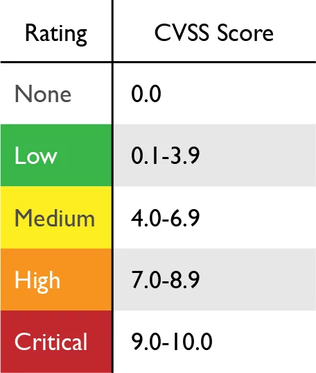

# CVSS nedir?

Günümüzde gelişen teknolojiyle birlikte farklı farklı zafiyetler ortaya çıkmıştır. Siber güvenlik uzmanlarının daha ortaya çıkan bu zafiyetleri daha rahat sınıflandırabilmesi için CVSS dediğimiz Common Vulnerability Scoring System ortaya çıkmıştır.

<figure>

</figure>

Çeşitli parametreler kullanılarak bu sistem sayesinde zafiyetlerin ciddiyetini 0.0 ile 10.0 arasında puanlayabiliyoruz.

Bu sistem temel olarak 3 ana grup altında toplanan parametrelere dayanır.
- Base (Temel)
- Temporal (Zamana Bağlı)
- Environmental (Çevresel)

## Base Score
Zafiyetin sabit değişmeyen özellikleri değerlendirilir. Zafiyetin teknik kısmına odaklanır.

### Attack Vector
Zafiyetin hangi ortamda ortaya çıktığını/tetiklendiğinin belirtildiği yerdir.

- Ağ
- Fiziksel
- Uzaktan
- Yerel Ağ

### Attack Complexity
Zafiyeti sömürmek için gereken çabayı belirtir.
- Düşük
- Yüksek

### Privileges Required
Zafiyeti sömürmek için herhangib bir yetkiye sahip olup olunmadığı belirtilir.
- Yetkiye gerek yok
- Düşük
- Yüksek

### User Interaction
Saldırının başarılı olması için kullanıcı müdahalesi gerekip gerekmediği.

- Gerekiyor
- Gerekmiyor

### Confidentiality Impact
Verinin gizliliğine etkisi belirtilir.
- Etkisi yok
- Düşük etki
- Tam etki

### Integrity Impact
Verinin doğruluğuna etki belirtilir.
- Etkisi yok
- Düşük etki
- Tam etki

### Availability Impact
Sistem kullanılabilirliğine etkisi.
- Etkisi yok
- Düşük etki
- Tam etki

***

## Temporal Score
Bu metrikler zafiyetin zamanla değişebilecek durumlarını değerlendirir.

### Exploit Code Maturity
Zafiyeti sömürmek için kullanılan araçların kullanılabilirliği.

- Kanıtlanmış
- Teorik
- Henüz kanıtlanmamış

### Remediation Level
Zafiyetin giderilmesine yönelik çözümler belirtilir.
- Kalıcı çözüm var
- Geçici çözüm var
- Çözüm yok

### Report Confidence
Zafiyetin doğruluğu ve güvenilirliği belirtilir.

- Doğrulanmış
- Kısmi güvenilir
- Bilinmiyor

## Environmental Score
Zafiyetin belirli bir ortam üzerindeki etkisini değerlendirir.

### Security Requirements
Ortama özgü gizlilik, bütünlük ve kullanılabilirlik gereksinimlerinin önemi.
- Düşük
- Orta
- Yüksek

### Modified Base Metrics
Temel metriklerin belirli bir ortama göre yeniden değerlendirilmesi.

***
## CVSS skorunun hesaplanması

CVSS skorunu hesaplayan çeşitli web siteleri vardır. Bu siteler aracılığıyla, zafiyet hakkında yukarıda bahsettiğimiz parametreleri doldurarak bir CVSS skoru oluşturur.

CVSS skorları şu şekilde kategorize edilir.

<figure>

</figure>

https://chandanbn.github.io/cvss/
https://www.cybersecurity-help.cz/vdb/cvss3/
https://www.first.org/cvss/calculator/4.0
