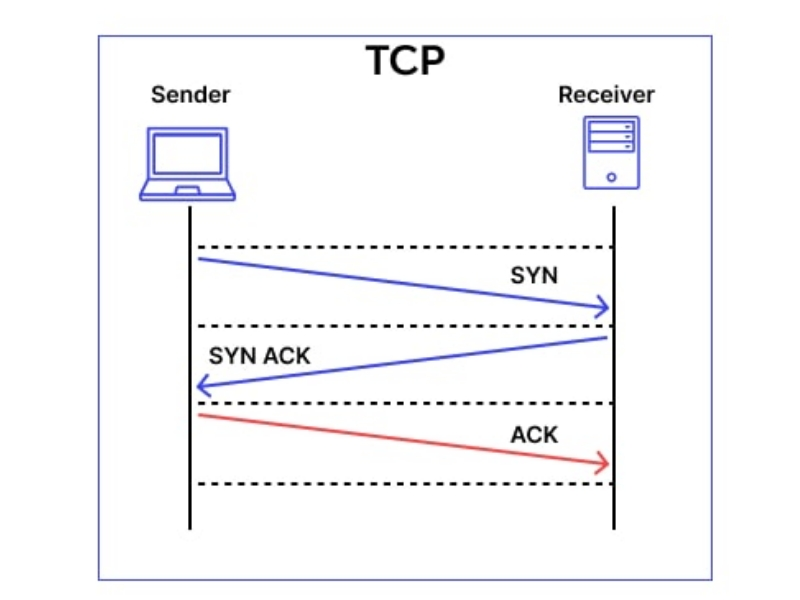
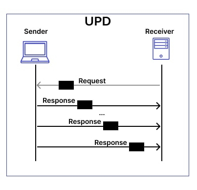
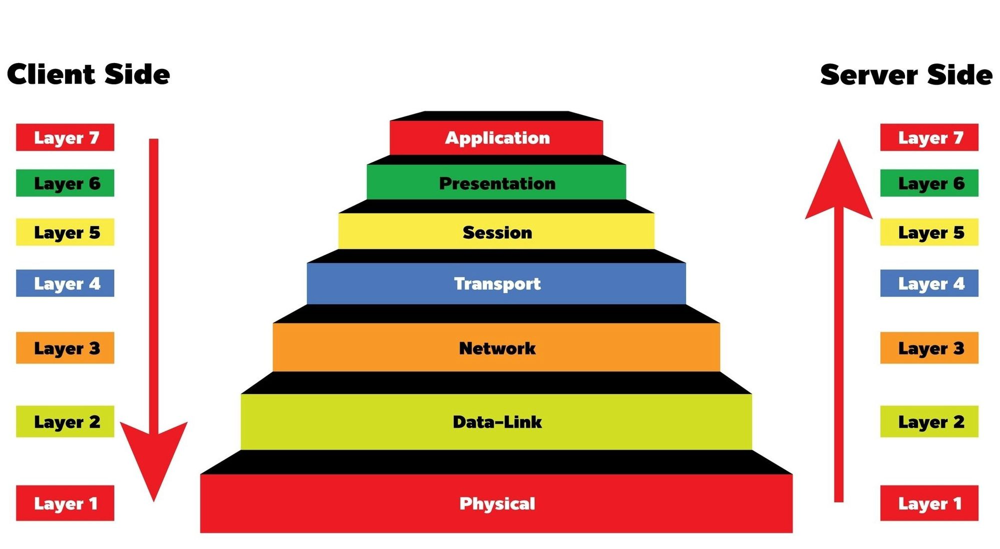

# OSI modeli nedir?

Bu yazıda OSI modelinin ne olduğundan bahsedeceğiz. Öncelikle neden OSI modeline ihtiyaç duyuyoruz bu konuya değinelim.

Cihazlar arasında veri iletiminin standartlaştırılmasını sağlamak ve farklı sistemlerin uyum içinde çalışmasını temin etmektir. 7 tane katmanı vardır. Her katman, belirli bir işlevi yerine getirerek iletişimi düzenler ve sorunları izole eder. Bu sayede, ağ yönetimi daha verimli hale gelir ve farklı üreticilere ait cihazlar arasında sorunsuz bir iletişim sağlanır.

<figure>

</figure>

Eğer veriyi üreten kişiyseniz, veri önce Application katmanında başlar ve her katmanda işlenerek sırasıyla Physical katmanına doğru ilerler. Bu süreçte her katman, veriyi kendi belirlediği şekilde işler ve bir alt katmana iletir. Diğer taraftan, veriyi alan kişi iseniz, Physical katmandan gelen veriyi alır, her katmanda çözümleyerek ve işleyerek en son Application katmanında veriyi elde edersiniz. Bu şekilde, OSI modelindeki her katman veri iletişimi için gerekli olan belirli işlemleri yapar ve verinin doğru bir şekilde iletilmesini sağlar.

## Physical layer
Fiziksel katman OSI modelinin en alt katmanınıdır ve ağdaki fiziksel iletim ortamını ve veri iletiminin donanımını yönetir. Ethernet kabloları,fiber optik kablolar,Wifi örnek olarak verilebilir.

## Data link layer
Verinin daha kolay gönderilebilmesi için "frames" dediğimiz parçalara ayırır. Ayrıca iletilen verilerin hatalı olup olmadıkları kontrol edilir.

Bir önceki katmandan gelen verilere hedef cihazın MAC adresini ekler. Ağ cihazlarına ait fiziksel adresleri (MAC adresleri) kullanarak, doğru cihazlar arasında iletişim sağlar.

## Network layer
Hazırlanan verinin hangi IP adresine gönderileceğinin belirlendiği bir katmandır. Belirlenen IP adresi bir üst katmandan gelen verilerin başına eklenir.

## Transport layer
Gönderilecek olan verinin hangi protokolle gönderileceği bu kısımda belli olur. İki farklı protokolümüz var:
- TCP
- UDP

Kullanım amacına göre kullanılan protokol değişebilir.

### TCP (Transmission Control Protocol)
TCP protokolü sayesinde verilerimizi gönderebiliyoruz ve bu süreçte bize verilerin teslim edilebilirliğini garanti ediyor. TCP protokolü, veri iletiminde güvenliği sağlamak için akış kontrolü ve hata denetimi mekanizmaları sunar. Bu sayede, veriler düzgün bir şekilde sıralanır ve hedefe ulaştığında eksiksiz bir şekilde teslim edilir. Ayrıca, veri kaybı durumunda kaybolan paketler tekrar gönderilir, böylece güvenilir bir iletişim sağlanır. Bu özellikler, TCP'yi internet üzerindeki kritik uygulamalar için ideal hale getirir.

Bu işlem sonucunda herhangi bir veri kaybına uğramayacağımız garanti diyebiliriz.

İletişim kurmak için 3-Way Handshake (3'lü el sıkışma) denilen bir süreç olur. Bu süreçte client server ile iletişim kurmak istediğini belirtir ve serverdan cevap bekler.

HTTP,HTTPS,E-mail sistemleri kullanır.

<figure>

</figure>

### UDP (User Datagram Protocol)
UDP protokolü sayesinde de verilerimizi gönderebiliriz. UDP, TCP'nin aksine verilerinizin güvenle iletileceğinin garantisini vermez. Verileriniz doğru bir şekilde teslim edilmediyse tekrar gönderilmez. Bir bütün olarak verilerin iletilmesi kontrol edilmediği için TCP'ye göre daha hızlıdır.

Veriyi alan kişinin veriyi doğru bir şekilde alıp almadığı umrunda değildir.

Video Uygulamaları,Online oyunları örnek verilebilir.

<figure>

</figure>

## Session layer
İki cihaz arasındaki iletişimi başlatmak, sürdürmek ve sonlandırmakla sorumludur. Bu katman, veri iletimi sırasında her iki uç arasındaki bağlantıyı düzenler ve yönetir. Aynı zamanda, veri alışverişi sırasında oturumun kesilmesi ya da yeniden başlatılması gerektiğinde buna karar verir. Örneğin, bir video konferans sırasında oturum katmanı, her iki tarafın eş zamanlı bağlantılarının devam etmesini sağlar. Bu şekilde, Session Layer, veri iletiminin sorunsuz bir şekilde gerçekleşmesini garantiler.

## Preasantation layer
verilerin doğru formatta iletilmesini sağlar. Bu katman, veriyi alıcı için anlamlı bir hale getirmek amacıyla şifreleme, sıkıştırma ve format dönüşümleri yapar. Örneğin, bir dosya gönderilirken, Presentation Layer, alıcı cihazın anlayabileceği bir formata dönüştürülmesini sağlar. Ayrıca, veri güvenliğini sağlamak için şifreleme işlemleri de bu katmanda gerçekleşir. Bu katman, veri iletiminden önce ve sonra verinin doğru formatta olması için gerekli düzenlemeleri yaparak, sistemler arasındaki uyumluluğu sağlar.

## Application layer
OSI modelinin en üst katmanı olup, kullanıcıların doğrudan etkileşimde bulunduğu katmandır. Bu katman, ağ üzerinde çalışan uygulamaların veriye erişmesini ve veri göndermesini sağlar. Web tarayıcıları, e-posta istemcileri, dosya paylaşım yazılımları gibi uygulamalar bu katmanda çalışır. Ayrıca, HTTP, FTP, SMTP gibi protokoller de Application Layer’da yer alır. Kullanıcı ile ağ arasındaki arayüzü sağlayarak, verilerin doğru uygulamalara yönlendirilmesini ve kullanıcı taleplerine uygun şekilde işlenmesini sağlar.

## Encapsulation ve Decapsulation
Encapsulation ve Decapsulation, OSI modelinde veri iletiminin temel süreçlerindendir. 

- Encapsulation, verinin gönderici tarafından her katmandan geçerken üzerine ilgili katmana ait header eklenmesi işlemidir. Bu süreç, Application katmanında başlar ve veri Physical katmana ulaşana kadar devam eder. Örneğin, bir veri paketine Transport katmanında port numaraları, Network katmanında IP adresleri ve Data Link katmanında MAC adresleri eklenir.

- Decapsulation ise, alıcı tarafta gerçekleşir ve veri, Physical katmandan Application katmanına doğru ilerlerken her katmandaki header bilgilerinin sırasıyla çıkarılması işlemidir. Bu sayede, gönderilen veri alıcı uygulama tarafından doğru bir şekilde yorumlanabilir. 

Encapsulation ve Decapsulation, cihazlar arasında verinin hatasız, düzenli ve anlaşılır bir şekilde iletilmesini sağlar.

<figure>

</figure>

> Bu yazı [_Yavuz Kuk_](https://www.linkedin.com/in/yavuzkuk/) tarafından hazırlanmıştır.
