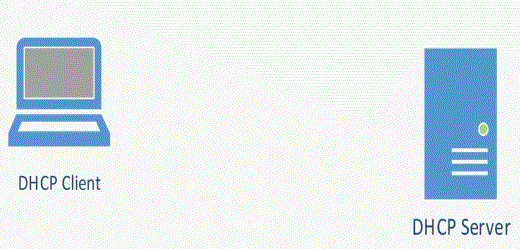

# DHCP (Dynamic Host Configuration Protocol)

Bir önceki [yazıda](/network/ip46.md) IP adresinin ne olduğundan bahsetmiştik. Şimdi ise IP adreslerini otomatik olarak atayan DHCP teknolojisini inceleyeceğiz.

DHCP dediğimiz bu teknolojiyi basit bir şekilde anlatmak gerekirse, bilgisayarınızı açtığınızda ve ağa bağlandığınızda, internete çıkmak için bir IP adresine ihtiyacınız vardır. DHCP daha sonra değineceğimiz gibi çeşitli işlemler sonucunda bize bir IP adresi verir. 

DHCP IP adreslerinin dışında Subnet Mask, Default Gateway,DNS sunucusunun adresini de döndürür.

*** 
DHCP protokü sayesinde manuel olarak IP ataması yapmaya gerek kalmadan otomatik olarak IP ataması yapılır ve verimli bir şekilde IP atanmaları gerçekleşir.

***

## IP atama süreci

DHCP tarafından IP ataması gerçekleşirken şu süreçler gerçekleşir:

- <b>DHCP Discover:</b> İnternete çıkmak isteyen cihaz (masaüstü bilgisayar, dizüstü bilgisayar,telefon,tablet vb.) bağlanmak istediği ağda DHCP sunucusunun var olup olmadığını bütün ağda bir yayın (broadcast) mesajı yayınlar ve sunucunun var olup olmadığını kontrol eder. Eğer ağda bir DHCP sunucusu varsa internete çıkmak için bir IP adresine ihtiyacımız olduğunu belirtiyoruz ve bize bir IP adresi atamasını istiyoruz.

- <b>DHCP Offer:</b> Bir önceki adımda bulduğumuz DHCP sunucusu bu adımda bize uygun gördüğü, boşta olan bir IP adresi teklifinde bulunur.

- <b>DHCP Request:</b> Cihaz, sunucunun teklif ettiği IP adresini kabul ettiğini belirtmek için DHCP Request mesajı gönderir.

- <b>DHCP ACK:</b> Sunucu, cihazın isteğini onaylamak için DHCP ACK mesajı gönderir. Bu mesajla birlikte, istemciye IP adresi ve diğer yapılandırma bilgileri atanır.

Sunucu, IP adresini artık cihaza "kiralanmış" olarak işaretler ve bu adresi başka bir cihaza atamaktan kaçınır. Cihaz, bu aşamadan sonra kendisine atanmış IP adresini kullanarak ağa bağlanabilir.

> Bu yazı [_Yavuz Kuk_](https://www.linkedin.com/in/yavuzkuk/) tarafından hazırlanmıştır.