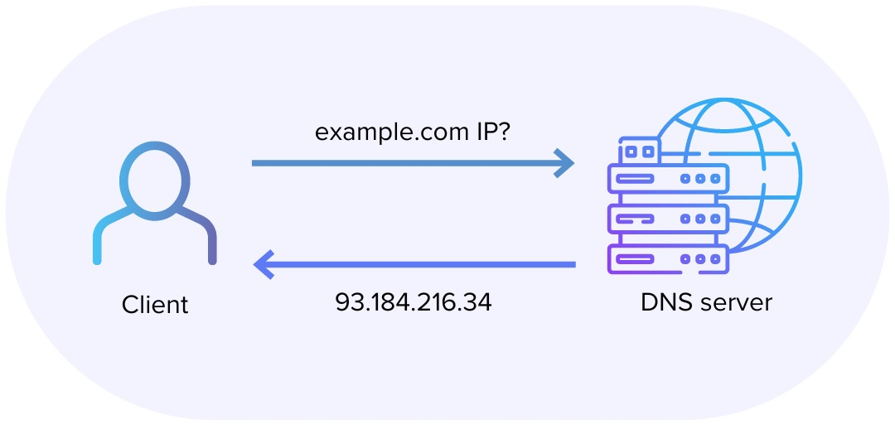

# DNS

Bir web sitesinin içeriğine ulaşmak istiyorsunuz 
DNS (Domain Name System), internette kullandığımız en temel protokollerden biridir. Kullanıcıların domain adı (alan adı) kullanarak web sitelerine erişmesini sağlayan bir sistemdir. Örneğin, bir tarayıcıya www.example.com yazdığınızda, DNS bu alan adını IP adresine çevirerek sizi ilgili sunucuya yönlendirir. Bu sistem, internetin çalışmasını mümkün kılan temel taşlardan biridir.

DNS, Domain Name System kelimelerinin kısaltmasıdır ve Türkçe'ye "Alan Adı Sistemi" olarak çevrilebilir. DNS, domainleri (örneğin, google.com veya facebook.com) IP adreslerine (örneğin, 142.250.190.78) dönüştüren bir sistemdir.


```
125.56.23.143                                      google.com
100.45.34.42                                        facebook.com
67.90.123.56                                        karabuk.edu.tr
...........                                         .............
```

## Neden IP adresleri neden domain değil?

İnternet üzerindeki cihazlar birbirleriyle IP adresleri aracılığıyla iletişim kurar. Ancak, kullanıcılar için IP adreslerini hatırlamak zordur. Bu nedenle, DNS, domainleri IP adreslerine çevirerek interneti insanlar için daha kullanılabilir hale getirir.



***

## DNS'in Çalışma Prensibi

Bir web sitesine erişmek istediğimizde kullanıcının girmiş olduğu web sitesinin IP adresini elde etmemiz gerekir. Bunun için şu adımlar izlenir:

- <b>DNS Recursive Resolve (DNS Tekrarlı Çözüm)</b>
Bir DNS sunucusunun bir IP adresini bulmak ve istemciye geri döndürmek için diğer birkaç DNS sunucusuyla iletişim kurduğu yerdir.

- <b>Root DNS (Kök sunucu)</b>
DNS hiyerarşisinin en üst seviyesidir. . (nokta) ile gösterilir ancak genellikle kullanıcılar tarafından görülmez.Tüm üst seviye domainlerin (TLD) bilgisini içerir ve yönlendirme yapar.

- <b>TLD (Top Level Domain - Üst Seviye Domain)</b>
Root katmanının hemen altındaki seviyedir ve domainlerin genel kategorilerini belirtir.
Domainleri çeşitli kategorilere göre sıralar. 

Genel TLD: ```.com .org .net .info ```
Ülke kodlu: ```.uk .de .us .tr ```
Belirli topluluklara özel: ```.gov .edu ```

- <b>Second Level Domain (İkinci Seviye Domain)</b>
TLD'nin hemen altındaki seviyedir. Genellikle markalar, şirketler, ya da bireylerin isimlerini içerir.


Root DNS aranan domain adresinin IP değerinin hangi TLD sunucusunda olduğunu bilir ve diğer DNS sunucularına yönlendirir.

***

## DNS Kayıt Türleri

DNS, farklı türde kayıtları barındırır. Bunlardan en yaygın olanları şunlardır:

- <b>A Record</b>
Alan adını bir IPv4 adresine eşler. Örneğin, example.com için bir A kaydı, 192.168.1.1 gibi bir IP adresi döner.

- <b>AAAA Record</b>
Alan adını bir IPv6 adresine eşler. IPv6 destekleyen cihazlar için kullanılır.

- <b>MX Record</b>
E-posta trafiğini yönlendirmek için kullanılır. Hangi mail sunucularına e-postaların gönderileceğini belirler.

- <b>TXT Record</b>
Alan adıyla ilgili doğrulama ve bilgi eklemek için serbest metin tutar. Örneğin, SPF (Spam önleme), DKIM (E-posta imzalama) veya doğrulama gibi işlemler için kullanılır.

- <b>CNAME Record</b>
Bir alan adını başka bir alan adına yönlendirir. Örneğin, www.example.com için bir CNAME, example.com adresine yönlenebilir.


## DNS Nasıl Çalışır?


Bir kullanıcı tarayıcısına bir alan adı (example.com) yazdığında DNS sorgusu başlar. Sorgu sırasıyla Root DNS sunucularına (hangi TLD'ye ait olduğunu öğrenmek için), ardından ilgili TLD DNS sunucusuna (örneğin, .com için), son olarak da alan adının kayıtlı olduğu Second-Level DNS sunucusuna (alan adı için A) iletilir. Bu süreç sonunda elde edilen IP adresi (93.184.216.34 gibi) ile tarayıcı, siteye bir HTTP/HTTPS isteği gönderir ve içerik yüklenir.

> Bu yazı [_Yavuz Kuk_](https://www.linkedin.com/in/yavuzkuk/) tarafından hazırlanmıştır.