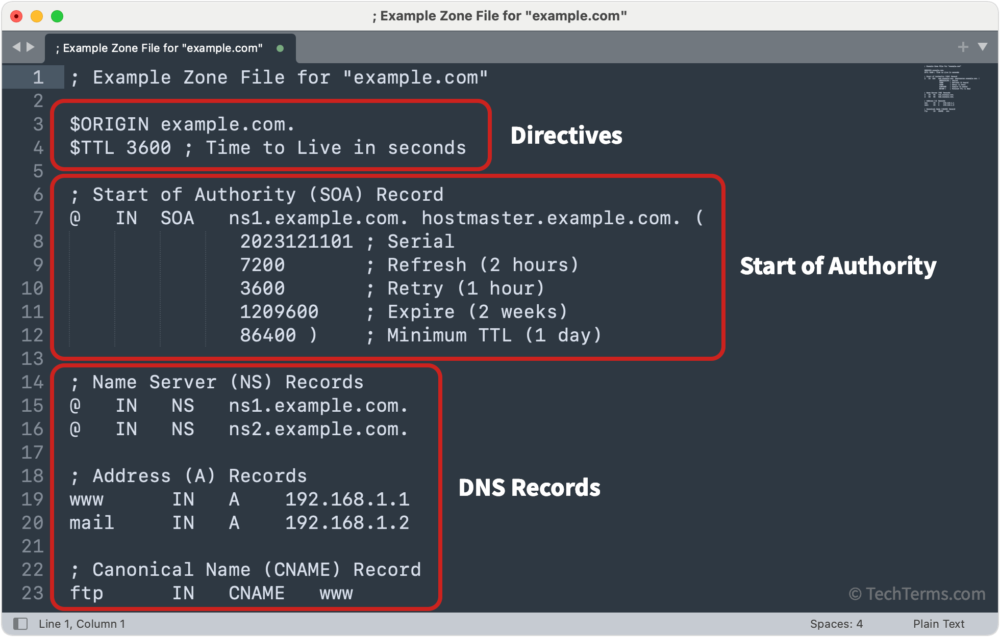

# DNS Zone Transfer

Bir önceki yazıda DNS nedir demiştik. Şimdi DNS yapılandırmasından dolayı ortaya çıkabilecek zafiyetlerden biri olan DNS Zone Transferden bahsedeceğim.

Öncelikle Zone dosyaları nedir bunlardan bahsedelim. Bizim sahip olduğumuz bir domain adresine ait kayıtları içeren bir dosya olarak düşünebiliriz. Bu dosyanın içinde sub/domain adresine karşılık gelen IP adresleri, CNAME kayıtları, MX kayıtları yer alabilir.

<figure>

</figure>


Normal şartlarda yetkisiz birinin bu dosyaya erişiminin olmaması lazımdır.


## Zone Transferi Nedir?

Zone dosyasının genel olarak ne olduğunu anladık. Adından da anlaşılacağı üzere bu dosyayı çeşitli koşullarda transfer etmek isteriz. 

DNS, domain adreslerini IP adreslerine çevirmek konusunda kritik bir öneme sahiptir. Eğer DNS sistemleri çalışmazsa başarılı bir şekilde domainlerden IP adresleri elde edemeyiz.

Bu yüzden en kötü olasılık düşünülerek DNS Zone dosyaları farklı DNS sunucuları arasında paylaşılır. Eğer bir DNS sunucusuna ulaşılamazsa diğer DNS sunucusu devreye girer ve domain adresini IP adresine çevirir.

Burada öğreneceğimiz iki tane kavram var.
- Primary DNS (Master DNS)
- Secondary DNS (Slave DNS)

Primary DNS, domaine ait tüm kayıtları ilk olarak burada tanımlanır ve saklanır. Zone dosyası burada oluşturulur ve diğer sunuculara buradan kopyalanır. Zone dosyalarının asıl kaynağıdır. 

Secondary DNS, Primary DNS’ten veri çeken yedek bir DNS sunucusudur. Kendisi zone dosyası oluşturmaz, Primary’den zone transferi (AXFR) ile veri alır.

Eğer Primary DNS'de bulunan zone dosyasında bir değişiklik olursa belirli zaman aralıklarında bu bilgiler Secondary DNS'e aktarılır. Bu işleme DNS Zone Transfer denir.

<figure>

</figure>


Normalde DNS zone transfer işlemleri yalnızca yetkili Second DNS sunucuları tarafından gerçekleştirilmelidir; ancak bu işlemin herhangi bir dış IP tarafından yapılabiliyor olması, sunucunun hatalı yapılandırıldığını ve ciddi bir bilgi sızıntısı zafiyetine açık olduğunu gösterir.

----------------------------

## DNS Zone Transfer Sonuçları

Başarılı bir zone transfer, bir saldırgana hedef sistemin DNS altyapısına dair tam bir harita sunar. Bu bilgiler, keşif (reconnaissance) aşamasında çok değerlidir ve doğrudan saldırılara zemin hazırlayabilir.

--------------------------

## DNS Zone Transfer Saldırısı Yapalım

Bu zafiyeti deneyebilmemiz için bilerek DNS Zone Transfer zafiyeti bıraılmış olan [zonetransfer.me](https://digi.ninja/projects/zonetransferme.php) domain adresi üzerinden DNS Zone Transfer deneyeceğiz.

Bu işlemi yapmak için yetkili DNS sunucusunu öğrenmek lazım

```
:~$ dig NS zonetransfer.me

; <<>> DiG 9.18.30-0ubuntu0.24.04.2-Ubuntu <<>> NS zonetransfer.me
;; global options: +cmd
;; Got answer:
;; ->>HEADER<<- opcode: QUERY, status: NOERROR, id: 35140
;; flags: qr rd ra; QUERY: 1, ANSWER: 2, AUTHORITY: 0, ADDITIONAL: 1

;; OPT PSEUDOSECTION:
; EDNS: version: 0, flags:; udp: 512
;; QUESTION SECTION:
;zonetransfer.me.		IN	NS

;; ANSWER SECTION:
zonetransfer.me.	7200	IN	NS	nsztm2.digi.ninja.
zonetransfer.me.	7200	IN	NS	nsztm1.digi.ninja.

;; Query time: 407 msec
;; SERVER: 8.8.8.8#53(8.8.8.8) (UDP)
;; WHEN: Wed Jul 16 23:40:50 +03 2025
;; MSG SIZE  rcvd: 96


```

Bu sonuçtan görüyoruz ki nsztm1.digi.ninja ve nsztm2.digi.ninja yetkili DNS sunucuları. Bu DNS sunucuları üzerinden DNS Zone Transfer denemesi yapacağız ve domain adresi ile ilgili bilgiler edineceğiz.

```
:~$ dig axfr @nsztm2.digi.ninja zonetransfer.me

; <<>> DiG 9.18.30-0ubuntu0.24.04.2-Ubuntu <<>> axfr @nsztm2.digi.ninja zonetransfer.me
; (1 server found)
;; global options: +cmd
zonetransfer.me.	7200	IN	SOA	nsztm1.digi.ninja. robin.digi.ninja. 2019100801 172800 900 1209600 3600
zonetransfer.me.	7200	IN	DNSKEY	256 3 7 AwEAAapoL+InQBYx2oi3dI424+dEDFgnVW0cOINfCY3jLrngZxBsEur8 ByhMOQsxoIOYu/7b3c8tj2BwlQquqxZe79QHSW78fK7D+bP/8AosnBG5 K5gJXEvphEtJ9x8/X0Y971XaW9lLmtJ6h4AXsrbgTr2g9KOiPSIbvDPM W8qLMaQkTm89hvPc+NuzrOEOPNhoXs/iPM+SQzrvTBfr6y0w2yPtYYdW I1kN76OQBxh0xjIdlyT0QKiohKq2bybPROJO7K3NlDc8oaOZoXH5/RfL DQzxzXyYSV8fLwimUeulo7YA11I/AHQ7DsUsFu2S2vxGCyR8nmx9gYbN 4sBvTF2i5eM=
zonetransfer.me.	301	IN	TXT	"google-site-verification=tyP28J7JAUHA9fw2sHXMgcCC0I6XBmmoVi04VlMewxA"
zonetransfer.me.	7200	IN	MX	0 ASPMX.L.GOOGLE.COM.
zonetransfer.me.	7200	IN	MX	10 ALT1.ASPMX.L.GOOGLE.COM.
zonetransfer.me.	7200	IN	MX	10 ALT2.ASPMX.L.GOOGLE.COM.
zonetransfer.me.	7200	IN	MX	20 ASPMX2.GOOGLEMAIL.COM.
zonetransfer.me.	7200	IN	MX	20 ASPMX3.GOOGLEMAIL.COM.
zonetransfer.me.	7200	IN	MX	20 ASPMX4.GOOGLEMAIL.COM.
zonetransfer.me.	7200	IN	MX	20 ASPMX5.GOOGLEMAIL.COM.
zonetransfer.me.	7200	IN	A	5.196.105.14
zonetransfer.me.	7200	IN	NS	nsztm1.digi.ninja.
zonetransfer.me.	7200	IN	NS	nsztm2.digi.ninja.
zonetransfer.me.	7200	IN	CERT	PKIX 0 0
.....
.....
.....
```

> Bu yazı [_Yavuz Kuk_](https://www.linkedin.com/in/yavuzkuk/) tarafından hazırlanmıştır.