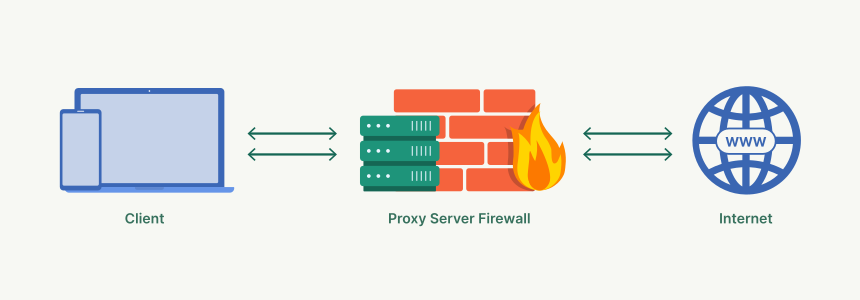

# Firewall nedir?

Firewall sistemleri sunucunuza gelen giden paketlerin geçmesine izin veren bir kale suru gibi düşünebilirsiniz. 

Teknik olarak açıklamasına bakarsak, bilgisayarları ve sistemleri tehlikeli isteklerden korumak için kullanılan bir yazılım veya donanımdır. Firewall aracılığıyla tanımlanan kurallara göre gelen paketlerin uygun olup olmadığını kontrol eder ve uygun paketlerin geçmesin izin verir.

Firewall hem gelen hem de giden trafiği düzenleyerek ağı şunlardan korur:

- Virüsler, backdoor, kimlik avı e-postaları ve DoS/DDoS saldırıları gibi dış tehditleri engeller. Güvenlik duvarları gelen trafik akışlarını filtreleyerek hassas verilere yetkisiz erişimi önler ve olası kötü amaçlı yazılım enjeksiyonlarını engeller.
- Bir firewall, belirli türdeki giden trafiği kısıtlamak için kurallar ve politikalar uygulayabilir; bu da şüpheli etkinliği belirlemeye ve veri sızdırmayı azaltmaya yardımcı olur.

***
Yapılarına göre 2 çeşit firewall türü vardır.
- <b>Yazılımsal Firewall:</b> Yazılımsal firewaller, işletim sistemi üzerinde çalışan yazılımlardır. Bu tür firewaller, bir bilgisayar veya sunucuya yüklenerek gelen ve giden trafiği kontrol eder.
- <b>Donanımsal Firewall:</b> Ağ trafiğini filtrelemek için kullanılan sunucudan bağımsız bir cihazdır.

***

Firewalllar mimari yapısına göre temel olarak 5 tanedir.

## Packet Filtering Firewall
Gelen-giden paketlerin hedef IP, kaynak IP ve port numaralarına bakarak tanımlanan kurallara göre paketin engellenme durumunu kontrol eder.
Bu güvenlik duvarları nispeten basit ve uygun maliyetli olsa da, paketlerin içeriklerini inceleyemedikleri için karmaşık saldırılara karşı daha az etkili oluyorlar.

</img>

## Stateful Firewall
Ağ trafiğini analiz ederken bağlantıların durum bilgisini (state) takip edebilen bir güvenlik duvarıdır. Bu tür firewall, bir oturum sırasında gerçekleşen veri akışını izler ve state table denilen bir tabloya kaydeder bu bilgileri kullanarak paketlerin engellenme durumu hakkında bir çıkarım yapar. Ağ trafiğinin tüm bağlamını ve ilerleyişini izleyerek daha derinlemesine bir analiz sunar ve böylece ağ güvenliğini artırır.

## Proxy Firewall
Proxy firewall, hedef sunucu ile istemci(client) arasında bir konumda bulunur. İstemci bir web sitesine istek atmak istediğinde öncelikle proxye istek atar. Gelen istek kural setlerine uygunluğuna göre kontrol edilir ve uygunsa kabul edilir. Proxy, client adına sunucuya bir istek gönderir ve dönen cevap üzerinde incelemeler yaparak zararlı yazılımları ve kötü niyetli trafiği engeller. Proxy firewall'ın kendine ait bir IP adresi vardır, bu yüzden dışarıdan gelene bir istek içeride bulunan sunucu ile iletişime geçmemiş olur.

## Web application firewall (WAF)
WAF dediğimiz yapı sunucunun önünde yer alarak gelen HTTP isteklerini inceler ve sistemi çeşitli zafiyetlere karşı korumaya çalışır. Bir web uygulamasının önüne bir WAF yerleştirerek, web uygulaması ile İnternet arasında bir kalkan oluşturulur. 

## Unified threat management (UTM) firewall
Farklı farklı cihazların ve yazılımların yapacağı işlemleri tek bir cihazda toplanmış haline UTM firewall diyoruz. UTM cihazları, ağ güvenliğini sağlamak için birden fazla güvenlik özelliğini tek bir platformda birleştiren ve işletmelere kapsamlı koruma sağlayan sistemlerdir. Virüs, spam, saldırılar gibi tehditlerle mücadele etmek ve iş sürekliliğini sağlamak için geliştirilmişlerdir.

Bu cihazlar, bir güvenlik duvarından çok daha fazlasını sunarak saldırı tespiti ve önleme, antivirüs, içerik filtreleme, spam engelleme ve VPN gibi özellikleri aynı cihazda bir araya getirir.

## Next-generation firewall (NGFW)

Next-Generation Firewall (NGFW), modern ağ güvenliği tehditlerine karşı koruma sağlamak için geleneksel güvenlik duvarı işlevlerini gelişmiş güvenlik özellikleriyle birleştiren ileri teknoloji güvenlik cihazlarıdır. NGFW’ler, temel olarak geleneksel güvenlik duvarlarının sunduğu paket filtreleme, ağ adresi çevirisi (NAT), sanal özel ağ (VPN) desteği ve durumsal paket incelemenin ötesine geçerek gelişmiş tehdit önleme yetenekleri sunar.

> Bu yazı [_Yavuz Kuk_](https://www.linkedin.com/in/yavuzkuk/) tarafından hazırlanmıştır.
