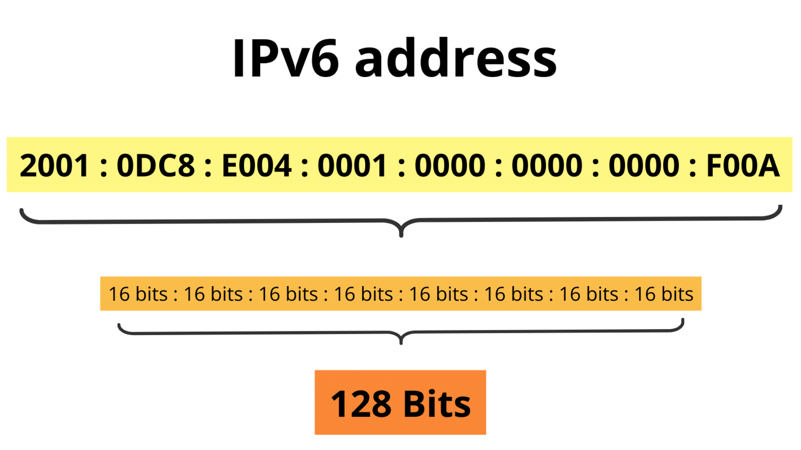

# IPv4/6 nedir?

Daha önceki yazıda internetin ne olduğundan ve nasıl çalıştığından bahsetmiştik. Bu yazıda ise iletişim işlemleri gerçekleşirken cihazların birbirlerini tanımasını sağlayan IP teknolojisinden bahsedeceğiz. 

<image src="../assets/network/ipv46/ipv4v6.jpg"></image>

Konumuzun başlarında öncelikle IPv4 teknolojisinden ve sonrasında geliştirilen IPv6 teknolojisnden bahsedeceğim. 

## IP (Internet Protocol) ye neden ihtiyaç duyarız?
Basit bir şekilde açıklamak gerekirse IP adresleri, internetteki her cihazın benzersiz bir adres numarasına sahip olmasına yarar. Sahip oldukları bu adresler sayesinde diğer cihazlar ile iletişime geçebilirler. Bu süreci şu şekilde daha rahat anlayabiliriz:

Bir arkadaşınız ile mektuplaştığınızı düşünün mektubun arkadaşınız ulaşması için hedef bir adrese sahip olması lazım. Tamam hangi apartmanda yada sitede olduğunu yazdınız ayrıca hangi dairede oturduğunu belirten bir daire numarası eklemeniz gerekiyor. Eğer siz gerekli adres bilgilerini vermezseniz sizin iletmek istediğiniz bilgi hedefine ulaşamayacak ve size geri bir dönütte bulunamayacak.

İşte bizim IP adresi dediğimiz yapı da tıpkı bir ev adresi bir daire numarası gibi sizin nerede olduğunuzu tarif eden bir yapı olarak düşünebilirsiniz.

Bir web sitesine istek attığımızda web server tarafından dönecek cevabı almak isteriz ki web sitesine erişebilelim. Bu yüzden istek atarken Source IP adresine kendi IP adresimizi yazarıp göndeririz, Target IP kısmına ise hedef olarak istek attığımız IP adresini yazarız.

## IP adresi yapısı
IP adresleri 4 adet blok şeklinde sayılardan oluşur. Bu sayılar 0-255 arasında değerler değerler alabilir. Bu bloklar . (nokta) ile ayrılır.

<image src='../assets/network/ipv46/ipv4.jpg'></image>

IPv4 4 blok olmak üzere toplamda 32 bitten oluşur. Bu 32 bit 2 farklı değer alabileceği için en fazla 2³² (4.294.967.296) adet IP adresine sahip olabiliyoruz. Günümüzde gelişen teknoloji ve IOT alanıyla birlikte bu IP adresleri yetmemektedir.Bu sorunu çözmek ve IP adreslerini daha verimli kullanmak amacıyla NAT (Ağ Adresi Çevirisi) ve IPv6 gibi yeni teknolojiler geliştirilmiştir. IPv6, çok daha geniş bir adresleme kapasitesine sahip olup, modern internetin ihtiyaçlarına cevap verecek şekilde tasarlanmıştır.

IPv6 sistemi 128 bitten oluştuğu için 340 undeksilyon (3.4028237e+38) kadar IP adresine sahip olabiliriz.

***

## Neden tam anlamıyla IPv6'ya geçmiyoruz?

IPv4 sisteminin bize yetmemesinden dolayı sonu gelmiş olmasına rağmen hala tam anlamıyla IPv6 sistemine geçemedik. Bunun sebebi  mevcut ağ cihazları, yazılımlar ve sistemler IPv4 tabanlıdır. Bunların IPv6 ile uyumlu hale getirilmesi maliyetli ve zaman alıcıdır.

> Bu yazı [_Yavuz Kuk_](https://www.linkedin.com/in/yavuzkuk/) tarafından hazırlanmıştır.