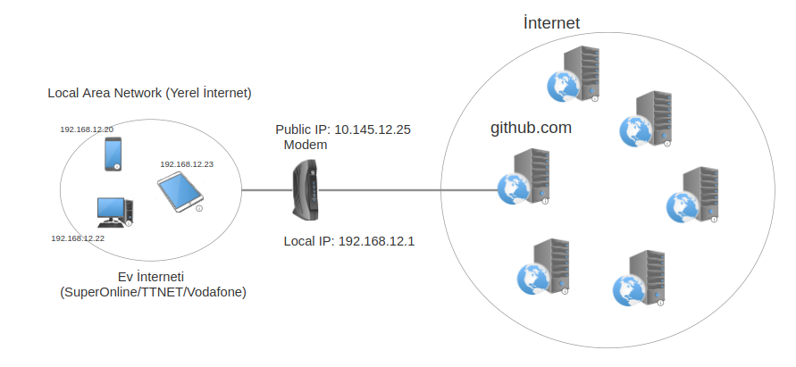
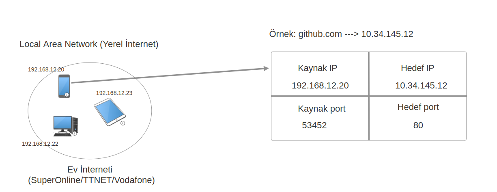
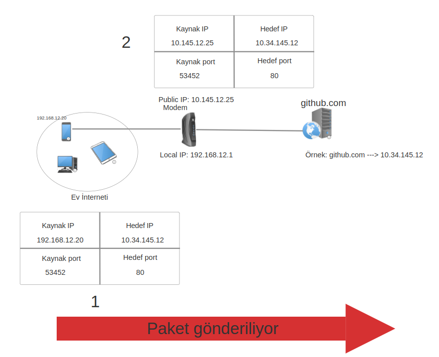
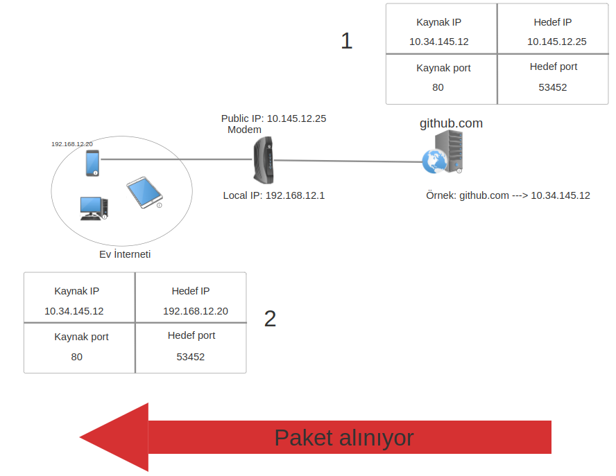

# NAT nedir?

Daha önce [IPv4/6](ip46.md) yazısında bahsettiğimiz gibi internete çıkan her cihazın bir IP adresine ihtiyacı vardır.IPv4 koşulları altında dünya çapında kullanabileceğimiz 4,294,967,296 adet IP adresi olduğunu söylemiştik. Günümüzde gelişen teknolojilerle birlikte bu IP adresleri yetmemektedir.

Evinizde bir bilgisayar, bir telefon, bir tablet ve iki akıllı ampul olduğunu düşünün. Sadece bireysel olarak sizin evinizde 5 cihaz IP adresine sahip oluyor. Bu durumu dünya genelinde düşündüğümüzde, elimizdeki mevcut IP adresi sayısını çoktan aşmış durumdayız. İşte bu durumda NAT bizim karşımızda çıkıyor.

Öncelikle kelime anlamından bahsedelim. Açılımı Network Address Translation, Türkçeye çevirmek istersek Adres değişimi olarak çevirebiliriz.

İnternet sağlayıcıları (SuperOnline, TTNET, Vodafone), sınırlı sayıdaki IP adreslerinden her müşterisine bir tane olacak şekilde atama yapar.Atanan bu IP adresine public IP diyebiliriz. İnternet sağlayıcısının bize tahsis ettiği public IP adresinin dışında, ev gibi yerel ağlarda kullandığımız cihazların kendi aralarında iletişim kurmak için kullandıkları private(local) IP adresleri de bulunur. 

<figure>

</figure>


NAT, aynı ağdaki cihazların internete erişmek için public IP adresini kullanmasını sağlar. Bu sayede evimizde bulunan diğer cihazlara public IP adresi atamamıza gerek kalmaz.

## NAT nasıl çalışır?

Var olan cihazlarımız ile internet sağlayıcı tarafından bize sağlanan public IP ile ağa çıkarken hangi paket hangi chazdan çıktığını bilmemiz gerekiyor çünkü dönecek olan cevabın paketin çıktığı cihaz olması gerekiyor.

Paket cihazdan çıkarken kaynak IP kısmına cihazın localde sahip olduğu IP adresi yazılır. IP adresi değiştirilmeden hedef sisteme ulaşırsa localde çalışan IP adresine erişemeyeceği için dönen cevap başarılı olmaz.

<figure>

</figure>

Yukarıdaki github.com adresine istek atmak istiyoruz ve hedef IP kısmına IP adresini yazıyoruz. İstek 192.168.12.20 IP adresli cihazdan çıktığı için kaynak IP kısmına IP adresimizi yazıyoruz. Eğer hedefe bu şekilde bir paket ulaşırsa dönecek olan cevabı 192.168.12.20 public IP adresine sahip olan cihaza döndürmeye çalışacaktır ama bu IP adresi bizim telefonumuzun private (local) IP adresi, bu yüzden dönen cevap bize ulaşamayacaktır.

***

Bu durumlarda kullanmış olduğumuz modem ile internete çıkmamız gerekiyor. Bu süreçte şu işlemler olacaktır:

- Cihaz kendi IP adresini ve hedef IP adresini yazar ve modeme gönderir.
- Modem public IP adresine sahip olduğu için dönecek olan cevabı da alabilir. Kaynak IP adresini kendi public IP adresiyle değiştirir.
- Kaldırılan private (local) IP adresi ve port bilgileri ```NAT Translation Table'a``` kaydedilir. Bu tablo sayesinde hangi local IP adresi hangi hedef IP cihazına paket gönderdiğini takip edebiliyoruz.
- Paket, hedef IP adresine gönderilir.
- Paket gönderildikten sonra dönen cevap için paket oluşturulur. Hedef IP adresi kısmına bizim modemimizin public IP adresi yazılır. Kaynak IP adresi kısmına ise ilk başta hedeflediğimiz IP adresi yazılır ve paket gönderilir.
- Paket modemimize ulaşır ```NAT Translation Table'a``` paketi gönderen cihaza, dönen cevap ulaştırılmış olur.

<figure>

</figure>

2.paket gönderilirken kaynak IP adresi değiştiriliyor.

<figure>

</figure>

Gelen cevaba göre, paketin IP başlıkları değiştirilir ve yanıt, isteği gönderen cihaza ulaştırılır. Bu sayede, tek bir public IP üzerinden işlem gerçekleştirilmiş olur.

> Bu yazı [_Yavuz Kuk_](https://www.linkedin.com/in/yavuzkuk/) tarafından hazırlanmıştır.