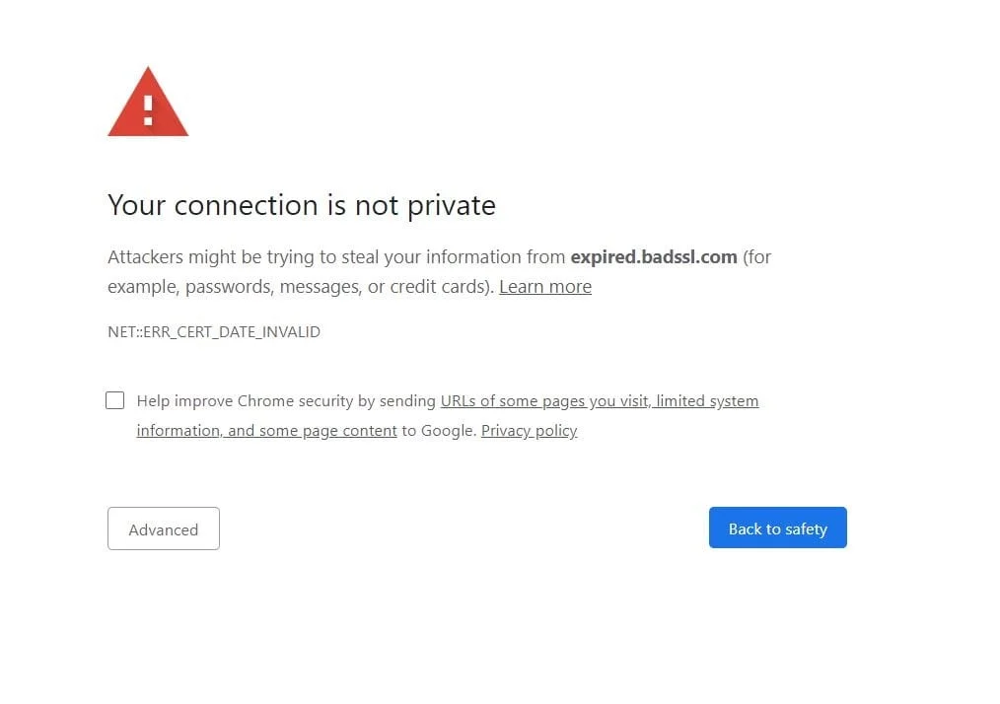
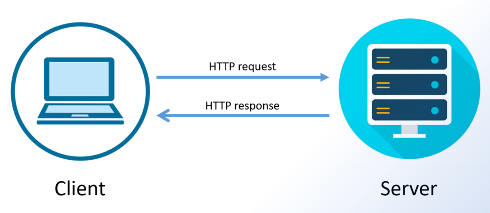
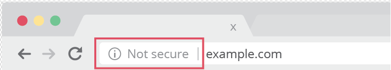

# SSL/TLS Nedir?

Bu yazıda günlük hayatta sıkça kullandığımız belki de tam olarak ne olduğunu bilmediğimiz SSL güncel adıyla TLS'den bahsedicem. Bir web sitesine bağlandığımızda "Bağlantı güvenli değil" vb. bir uyarı alırız. Bu uyarının asıl sebebi SSL/TLS'dir. 

<figure>

</figure>

Güncel olarak TLS teknolojisi kullanılıyor olsa da eski adı SSL'dir. Alışkanlıklardan dolayı TLS teknolojisine SSL denildiğini görebilirsiniz ama günümüzde SSL değil TLS kullanılıyor.

Temel anlamda biz bir web sitesine istek attığımız zaman ne oluyor bundan bahsedelim. Biz bir istekte bulunuyoruz ve sunucu tarafında bizim isteğimize uygun bir cevap hazırlanıyor ve cevap bize dönüyor. Temelde sistem bu şekilde çalışıyor. Bu sürece [Request-Reponse](https://firatesatoglu.medium.com/http-mesaj-yap%C4%B1s%C4%B1-request-response-nedir-metotlar%C4%B1-nelerdir-stat%C3%BC-kodlar%C4%B1-nedir-818faa3fd49e) diyoruz.

<figure>

</figure>

Bu Request-Response sürecinde bizim isteklerimiz ve bize gelen cevaplar internet üzerinden herkesin görebileceği bir şekilde gelir. Yani gönderilen veriler herkes tarafından okunabilir, plain text bir şekildedir. Örnek vermek gerekirse bir giriş işlemi yapacağınız sırada girdiğiniz kullanıcı adı ve şifre herhangi bir şifreleme kullanılmadan karşı tarafa iletilmeye çalışır. Bu süreçte ağınızı dinleyen kişi şifresiz bir şekilde gönderilen verilerinizi rahatlıkla okuyabilir. Verileriniz kötü kişilerin eline geçmesin diye tarayıcılar güvenli bağlantılı ile veri transferi yapmayan sitelere giriş yapmaya çalıştığımızda yukarıdaki hatayı veriyor. 

Ayrıca URL kısmına baktığınızda ziyaret ettiğiniz sitenin güvenli olmadığına dair bir uyarı görebilirsiniz.

<figure>

</figure>

Bu güvenlik sorunlarını çözmek için HTTPS protokolü devreye girer. HTTPS, HTTP ile aynı protokol mantığını kullanır ama verileri TLS/SSL ile şifreleyerek gönderir. Böylece ağ üzerinde veri yakalansa bile içerik anlaşılmaz hâle gelir ve sadece iletişime dahil olan taraflar tarafından okunabilir. Bu sayede trafiği inceleyen biri trafiği yakalasa bile veriyi anlamlandıramaz.

```
// Şifrelendirmeden önce
This is a string of text that is completely readable

// Şifrelendikten sonra
ITM0IRyiEhVpa6VnKyExMiEgNveroyWBPlgGyfkflYjDaaFf/Kn3bo3OfghBPDWo6AfSHlNtL8N7ITEwIXc1gU5X73xMsJormzzXlwOyrCs+9XCPk63Y+z0=
```

Yukarıdaki veri alıcı tarafa ulaştığında veriyi çözümler ve anlamlandırabilir. TLS, iletişim sırasında iki taraf arasında ortak bir anahtar (session key) oluşturur. Bu anahtar sayesinde, gönderilen verilerin hem şifrelenmesini hem de alıcı tarafından çözülmesini sağlar. Ortak anahtarın güvenli bir şekilde paylaşılması ise TLS handshake süreciyle sağlanır. Handshake sırasında istemci (tarayıcı) ve sunucu, hangi TLS sürümünü ve şifreleme algoritmalarını kullanacaklarını belirler, sunucunun kimliğini doğrular ve güvenli bir ortak anahtar oluştururlar.

## TLS/SSL Sertifikası

Verilerin güvenli iletimi için SSL/TLS'den bahsetmiştik. Bu işlemlerin başarılı bir şekilde devam edebilmesi için SSL/TLS sertifikalarına sahip olmaları gerekir. TLS sertifikası, sitenin kimliğini doğrulayan ve güvenli iletişim için gerekli olan açık anahtarı içeren dijital bir belgedir. Sertifika sayesinde istemci (tarayıcı) sunucunun gerçekten doğru site olup olmadığını anlayabilir ve sahte sitelerden korunur.  

TLS sertifikaları [CA](https://www.ssl.com/article/what-is-a-certificate-authority-ca/) (Certificate authority) denilen, internet üzerinde güvenilir kabul edilen ve sertifikaları doğrulayan bir kurumdur. Bir sertifika CA tarafından imzalandığında, tarayıcı veya istemci bu sertifikayı güvenilir olarak kabul eder ve bağlantıyı güvenli olarak değerlendirir.

Eğer bir web sitesi kendi kendine sertifika oluşturup imzalasa (self-signed certificate), tarayıcı bu sertifikayı güvenilir bulmaz. Bunun sonucu olarak kullanıcıya “Bu site güvenli değil” veya “Sertifika doğrulanamadı” gibi uyarılar gösterilir. Self-signed sertifikalar teknik olarak TLS şifrelemesi sağlasa da, kimlik doğrulaması yapılmadığı için güvenilirlik problemi oluşur. Bu yüzden gerçek internet ortamında, özellikle bankalar, e-ticaret siteleri ve kullanıcı verisi işleyen tüm siteler, CA imzalı sertifikalar kullanır.

Bir TLS sertifikası şu bilgileri içerir:

- Sertifikanın hangi alan adı için düzenlendiği

- Sertifikayı alan kişi, kurum veya cihaz

- Sertifikayı veren sertifika otoritesi (CA)

- Sertifika otoritesinin dijital imzası

- Sertifika ile ilişkili alt alan adları

- Sertifikanın veriliş ve geçerlilik tarihleri

- Sunucunun açık anahtarı (özel anahtar sunucuda gizli tutulur)

## TLS Handshake

<figure>

</figure>


 web sayfası güvenli bir oturum başlatmak için gerekli olan açık anahtarı içeren SSL sertifikasını gönderir. Web tarayıcısı ile web sitesi arasındaki veri aktarımında kullanılan birincil protokol HTTPS’tir ve veri transferinin güvenliğini artırmak için şifrelenmiştir. Kullanıcılar, bankacılık hesaplarına giriş yaparken, e-posta hizmetlerini kullanırken veya sağlık sigortası sağlayıcılarına erişirken hassas bilgiler aktarırlar. HTTPS, web sitelerinin bilgilerinin ağda kolayca görüntülenmesini önler. Normal HTTP üzerinden bilgi gönderildiğinde, veri paketlere ayrılır ve bu paketler ücretsiz yazılımlar kullanılarak kolayca “sniff” edilebilir. HTTP üzerinden yapılan tüm iletişimler düz metin halinde gerçekleştiğinden, doğru araçlara sahip herkes bu bilgilere erişebilir. HTTPS ile trafik şifrelenir; dolayısıyla paketler yakalansa veya ele geçirilse bile içerik anlamlı bir şekilde görüntülenmez. HTTPS, port 443 üzerinden çalışır ve bu, HTTP’nin kullandığı port 80’den farklıdır. HTTPS, HTTP’den ayrı bir protokol değildir; HTTP’nin TLS/SSL şifrelemesi ile kullanılmasıdır.


Bir kullanıcı TLS kullanan bir web sitesine gittiğinde, kullanıcı cihazı ile web sunucusu arasında TLS el sıkışması başlar. Bu süreçte, taraflar hangi TLS sürümünü (TLS 1.0, 1.2, 1.3 vb.) ve hangi şifreleme algoritmalarını kullanacaklarını belirler, sunucunun kimliğini TLS sertifikasıyla doğrular ve el sıkışma tamamlandıktan sonra mesajları şifrelemek için oturum anahtarları oluşturur. RSA tabanlı bir el sıkışmada, istemci premaster secret’ı kendisi oluşturur, sunucunun açık anahtarıyla şifreler ve sunucuya gönderir.

SSL el sıkışmaları artık TLS el sıkışmaları olarak adlandırılır; ancak “SSL” terimi hâlâ yaygın olarak kullanılmaktadır. TLS el sıkışması, TLS kullanan bir iletişim oturumunu başlatan süreçtir. El sıkışma sırasında iki taraf birbirini tanır, doğrular, kullanacakları kriptografik algoritmaları belirler ve oturum anahtarları üzerinde anlaşır. TLS el sıkışması, istemci ve sunucunun el sıkışmayı tamamlamak ve iletişimi sürdürebilmek için gerekli bilgileri değiş tokuş ettiği birden fazla adımdan oluşur. İstemci, desteklediği TLS sürümünü, şifreleme algoritmalarını ve “client random” olarak bilinen rastgele bir bayt dizisini içeren bir “client hello” mesajı gönderir. Sunucu, “server hello” mesajıyla SSL sertifikasını, seçilen şifreleme algoritmasını ve “server random” adlı rastgele bayt dizisini gönderir. İstemci, sunucunun SSL sertifikasını sertifikayı veren sertifika otoritesi ile doğrular. İstemci, “premaster secret” adlı bir rastgele bayt dizisini sunucuya gönderir. Premaster secret, sunucunun açık anahtarıyla şifrelenir ve yalnızca sunucu tarafından özel anahtarla çözülebilir. İstemci ve sunucu, client random, server random ve premaster secret’tan oturum anahtarlarını üretir ve aynı sonuçlara ulaşırlar. El sıkışma tamamlanır ve iletişim, oluşturulan oturum anahtarları kullanılarak güvenli bir şekilde devam eder. Tüm TLS el sıkışmalarında asimetrik kriptografi (açık ve özel anahtar) kullanılır, ancak tüm el sıkışmalarda oturum anahtarlarını oluştururken özel anahtar kullanılması gerekmez. Örneğin, ephemeral Diffie-Hellman el sıkışmasında istemci ve sunucu, premaster secret’ı bağımsız olarak hesaplamak için DH parametrelerini değiş tokuş eder. Oturum anahtarları, premaster secret, client random ve server random kullanılarak oluşturulur ve güvenli simetrik şifreleme sağlanır. Bu oturum anahtarları, TLS el sıkışmasından sonra tüm iletişimlerin şifrelenip çözülmesinde kullanılır.
