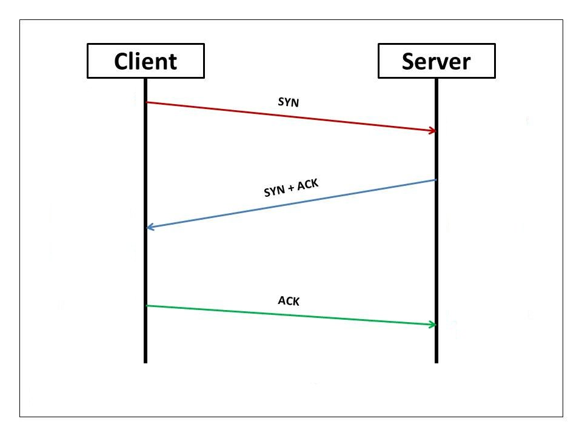
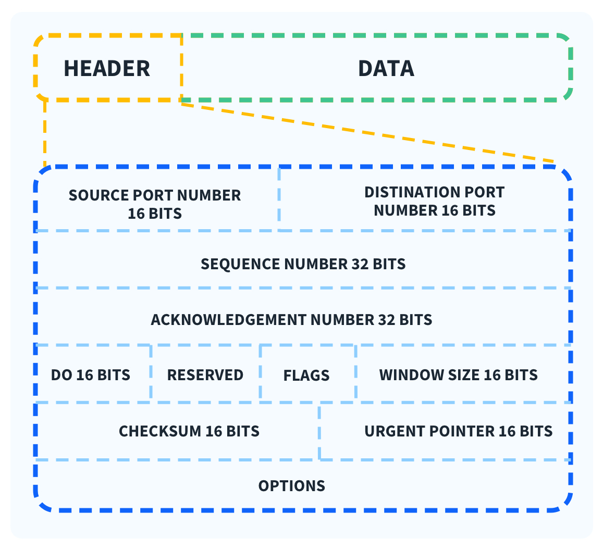

# TCP (Transmission Control Protocol)

Bu yazıda daha önce [TCP/IP](../network/tcpIp.md) ve [OSI](../network/OSImodel.md) modellerinde bahsettiğimiz Transport katmanında kullanılan TCP (Transmission Control Protocol)'den bahsedeceğim.

Transport katmanını hatırlamak gerekirse üst katmanlar oluşturulan ve düzenlenen verinin hedef cihaza ulaştırılmasında kullanılacak olan protokolün belirlendiği katmandır. TCP protokolü haricinde [UDP](./udp.md) protokolü vardır.

## TCP’nin Temel Özellikleri

<b> 1) Bağlantı özellikleri</b>
TCP, iki cihaz arasında iletişim başlamadan önce bir bağlantı oluşturur. Bu bağlantı, Üçlü El Sıkışma (Three-Way Handshake) adı verilen bir süreçle başlar.

<figure></figure>

- İstemci verilere göndermeden önce bağlantı kurulması için SYN paketi ile bağlanmak istediğini bildirir.
- Sunucu bağlantı isteğini kabul ettiğini belirten bir SYN-ACK bayrağı ile yanıt verir.
- İstemci, sunucunun cevabını doğrular ve bir ACK bayrağı göndererek bağlantıyı başlatır.

Bu adımlar sonrasında, veri aktarımı başlatılabilir.

<b>2) Güvenilir Veri İletimi</b>
TCP, veri paketlerinin iletilip iletilmediğini kontrol eder. Eğer bir paket kaybolursa, göndericiye bu durum bildirilir ve paket yeniden iletilir.

<b>3) Sıralama ve Bütünlük</b>
Gelen veri parçalarını doğru sıraya koyar. Paketler sıralı şekilde ulaştırılır ve eksik parçalar tamamlanır.

<b>4) Akış Kontrolü (Flow Control)</b>
İstemci ve sunucu arasındaki iletişim hızını optimize eder. Sunucu, mevcut kapasitesini bildirerek istemcinin veri gönderme hızını kontrol edebilir.

<b> 5) Hata Kontrolü (Error Control)</b>
TCP, verinin gönderim sırasında bozulmasını engellemek için hata kontrol mekanizmaları içerir. Yanlış bir paket tespit edilirse, sunucuya tekrar gönderilmesi talep edilir.

## TCP Header Yapısı

Verileri karşı tarafa gönderirken verilerin başına header dediğimiz başlıklar eklenir. TCP başlıkları şu şekildedir:

<figure></figure>

- <b>Source Port:</b> Gönderen cihazın port numarası
- <b>Destination Port:</b> Alıcı cihazın port numarası
- <b>Sequence Number:</b> Verinin sırasını belirten numara
- <b>Acknowledgment Number:</b> Alıcı tarafından onaylanan verinin bir sonraki numarası
- <b>Flags:</b> SYN, ACK, FIN gibi kontrol bayrakları
- <b>Window Size:</b> Alıcının mevcut kapasitesi
- <b>Checksum:</b> Hata kontrol mekanizması
- <b>Urgent Pointer:</b> Acil veriler için işaretçi görevi görülür.

## TCP'nin avantajları
<b>1) Güvenilirlik</b>

Veri kaybını önler ve eksik paketleri yeniden iletir.

<b>2) Hata Kontrolü</b>

Hatalı veya bozuk paketleri algılar ve düzeltir.

<b>3) Bağlantı Tabanlı</b>

İki uç cihaz arasında düzenli ve kontrollü bir bağlantı sağlar.

<b>4) Akış Kontrolü</b>

Veri aktarımını alıcı cihazın kapasitesine göre ayarlar.

## TCP’nin Dezavantajları

<b>1) Yavaşlık</b>
Güvenilirlik ve hata kontrol mekanizmaları nedeniyle UDP’ye göre daha yavaştır.

<b>2) Daha Fazla Kaynak Kullanımı</b>

Header bilgisi ve bağlantı yönetimi için ekstra kaynak kullanır.

<b>3) Gerçek Zamanlı İletişim için Uygun Değil</b>
Örneğin, canlı yayın gibi düşük gecikme gerektiren uygulamalarda UDP tercih edilir.

> Bu yazı [_Yavuz Kuk_](https://www.linkedin.com/in/yavuzkuk/) tarafından hazırlanmıştır.
