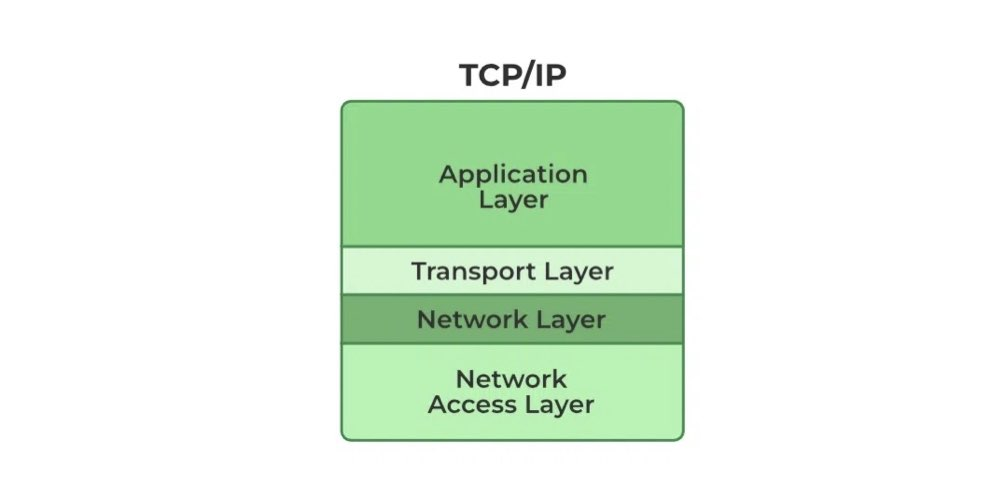

# TCP/IP modeli nedir?

Bilgisayar ağlarının temelini oluşturan TCP/IP modeli, cihazların birbiriyle iletişim kurmasını sağlayan protokoller ve katmanlardan oluşur. İnternetin temeli olan bu model, veri iletişimini standartlaştırarak, farklı cihazların ve yazılımların birbiriyle sorunsuz çalışmasını mümkün kılar. TCP/IP, adını iki temel protokolünden alır: Transmission Control Protocol (TCP) ve Internet Protocol (IP).

[OSI modeline](OSImodel.md) göre daha sade olan TCP/IP modeli, dört temel katmandan oluşur.

<figure>

</figure>

## Application layer
Bu katman, kullanıcıların doğrudan etkileşimde bulunduğu uygulamaların veri alışverişini sağlar. Örneğin, bir web sitesini ziyaret ettiğinizde HTTP protokolü, bir dosya transferi yaptığınızda ise FTP veya SFTP protokolü bu katmanda çalışır. Kullanıcı uygulamaları ve ağ arasında bir köprü görevi görür.

## Transport layer
Verinin hangi protokol ile gönderileceğinin belirlendiği katmandır. İki tane katman vardır.

### TCP (Transmission Control Protocol)
Verinin sıralı, eksiksiz ve hatasız bir şekilde iletilmesini sağlar.

### UDP (User Datagram Protocol)
Daha hızlı bir iletim sağlar ancak hata kontrolü yoktur.

## Internet layer
Verilerin doğru adreslere yönlendirilmesinden sorumludur. IP bu katmanda kullanılır ve cihazlara özgü benzersiz IP adresleri ile verilerin doğru hedefe ulaşmasını sağlar. Bu katman, veriyi kaynak ile hedef arasında birçok ağ üzerinden taşır.

## Network Access layer
Fiziksel ağ bağlantısını sağlayan katmandır. Veri, kablo, kablosuz sinyaller veya fiber optik vb. fiziksel ortamlar üzerinden iletilir. MAC adresleri ve donanım seviyesinde protokoller bu katmanda çalışır.

> Bu yazı [_Yavuz Kuk_](https://www.linkedin.com/in/yavuzkuk/) tarafından hazırlanmıştır.
