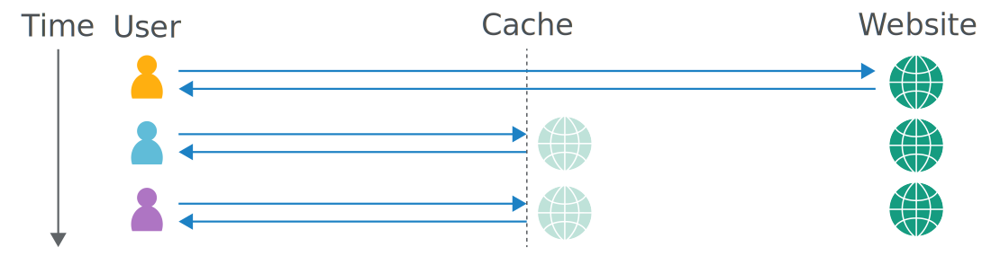

# Web Cache nedir?

Daha önceki konularda bir web sitesine nasıl istek atacağımızdan bahsetmiştik. Bu kez, bu isteklerin daha performanslı bir şekilde işlenebilmesi için kullanılan yöntemlerden birine, web cache kavramına odaklanacağız.

Web cache kelimesinin Türkçe karşılığına baktığımızda, "Web sitesini belleklemek/saklamak" anlamına gelebileceğini söyleyebiliriz. Çalışma mantığını incelediğinizde, neden bu şekilde adlandırıldığını daha iyi anlayacaksınız.

***
## Web cache nasıl çalışır?
Web cache mantığına göre, bir web sitesinin temel bileşenleri (örneğin, web sayfaları, resimler, videolar ve diğer dosyalar), kısa süreliğine depolanarak aynı içeriklere erişmek isteyen kullanıcılara daha hızlı ve kolay bir deneyim sunulur.

Bu yapı, web sitesinin bileşenlerini kısa süreliğine saklayarak sunucunun üzerindeki yükü azaltır ve aynı zamanda kullanıcı isteklerinin doğrudan sunucuya iletilmesini önler. Böylece, sunucuda oluşabilecek yoğunluğun önüne geçilmiş olur.

***

Web cache mantığını şu şekilde örnekleyebiliriz. example.com adında bir web sitesine istek attığınızı düşünün. Bu web sitesinin sahipleri web cache kullanıyorlar olsun. Bir kullanıcı bir istek attığında bütün kullanıcılara sunulan içeriklerin bir kısmı web cache üzerinde kısa bir süre depolanır. Belirli bir süre ve istek sayısı geçtikten sonra bu kayıtlar silinir ve yeni kayıtlar beklenir.

Başka kullanıcılar siteye istek attıklarında web cache üzerinde bulunan veri silinmediyse, yeni kullanıcı verileri sunucudan almaktansa web cache üzerinden alır ve işlem tamamlanmış olur.

<figure>

</figure>

## Cache key
Bir web cache üzerinde bulunan bir isteğin başarılı bir şekilde döndürülüp döndürülemeyeceğini anlamak için "Cache key" kullanılır. Cache key, web cache'e kaydedilen bir isteğin, gelen yeni istekle aynı olup olmadığını belirlemek için kullanılan bir mekanizmadır.

Bir istek web cache'e kaydedilirken, bu isteğin belirli bileşenleri (örneğin, istek satırı ve başlıklar gibi) kaydedilir. Daha sonra gelen isteklerin, bu kaydedilen içeriklerle eşleşip eşleşmediği kontrol edilir. Bu kontrol sırasında kullanılan ve isteğin hangi bileşenlerinin karşılaştırılacağını belirleyen yapıya cache key denir. Web cache tarafından kontrol edilmeyen başlıklara ise unkeyed(anahtarsız) denir.

***

```
İstek 1
Web cache boş

GET / HTTP/2
Host: karabuk.edu.tr
User-Agent: curl/8.5.0
Accept: */*
X-Cache: miss
```

Yukarıda karabuk.edu.tr adresine gönderilen bir istek gözüküyor. ```X-Cache:miss``` kavramı isteğin herhangi bir cacheden dönmediğini bize gösteriyor yani cache şimdilik boş ve cevap web cache üzerinden değil sunucu üzerinden döndürülüyor. Bu tür isteklerde cache key genel olarak şunlardan oluşur:
- İstek metodu: ```GET```
- URL Yolu: ```/```
- Host başlığı: ```karabuk.edu.tr```

Yukarıda bulunan istek bahsedilen cache keylere göre kayıt edilir. Bir sonraki gelecek istek bu cache key değerleriyle aynı değerlere sahipse web cache üzerinden cevap döndürülür.

***

```
İstek 2

GET / HTTP/2
Host: karabuk.edu.tr
User-Agent: curl/8.5.0
Accept: */*
X-Cache: hit
```

Bu istekte cache key değerleri (metod,URL yolu,host başlığı) web cachede saklanan değerlerle aynı olduğu için bu istek bize web cache üzerinden dönüyor. 

<figure>

</figure>

***

```
İstek 3

GET /?search=mühendislik HTTP/2
Host: karabuk.edu.tr
User-Agent: curl/8.5.0
Accept: */*
X-Cache: miss
```
Bu isteğe baktığımızda metot, host başlığı web cache de saklanan istekle aynı ama URL yolu farklı. Bu yüzden istenen içerik web cacheden değil sunucudan döner. Bu durumu ayrıca ``X-Cache:miss`` parametresinden de görebiliriz.

## Web cache tespiti
Hedef bir web sitesinde web cache kullanılıp kullanılmadığını tespit etmek için çeşitli yöntemler vardır.

Bunlardan biri dönen cevabın header değerlerine bakmak. ```X-Cache```, ```X-Cache-Status```, ```Age``` ve ```Cache-Control``` gibi header değerlerinin olması hedef sistemde web cache yapısının kullanıldığını kanıtlar.

Burada bulunan ```Age``` başlığı yanıtın cache'de ne kadar süredir bulunduğunu (saniye cinsinden) belirtir.

***

İlk gönderilen istek sunucu tarafından döndürüleceği ve sonrasında cacheleneceği için, cache'den gelen yanıtlar genellikle doğrudan sunucudan gelen yanıtlardan daha hızlıdır. Yanıt süresini ölçerek bir cache kullanımını fark edebilirsiniz.


## Web cache poisoning

Sonuç olarak, web cache mekanizmaları, performans ve hız açısından büyük avantajlar sunarken, yanlış yapılandırıldığında veya zayıf güvenlik önlemleri alındığında ciddi güvenlik açıklarına yol açabilir. Özellikle Web Cache Poisoning adı verilen bir saldırı türü, cache mekanizmasını hedef alarak kullanıcıların sahte veya manipüle edilmiş içeriklere erişmesine neden olabilir. Bu saldırı türünün nasıl çalıştığını ve korunma yollarını detaylıca incelemek için [Web cache poisoning]() yazısını okuybilirsiniz.


> Bu yazı [_Yavuz Kuk_](https://www.linkedin.com/in/yavuzkuk/) tarafından hazırlanmıştır.
