---
layout:
  title:
    visible: true
  description:
    visible: true
  tableOfContents:
    visible: true
  outline:
    visible: true
  pagination:
    visible: true
---

# File Upload

Web sitenizde dosya yükleme alanınız olduğunu düşünün. Bu yükleme alanından her türlü verinin geçmesini istemezsiniz. İhtiyaç duyduğunuz dosya türünden başka bir dosyaya ihtiyaç duymazsınız. Resim yükleme alanında .exe dosyasının ya da .php dosyasının ne işi var.&#x20;

İşte bu tür hataların yol açtığı zafiyetlere File Upload zafiyeti diyoruz. Peki bu zafiyet ile neler yapabiliriz. Yüklemiş olduğumuz dosyalar server üzerinde depolandığı için doğru dosyayı doğru şekilde yüklersek sistem üzerinde komut çalıştırabiliriz. (RCE)

Peki bu sistemler istenilen dosya tipinin dışında bir dosya gönderdiğimizde hiç mi anlamıyorlar. Tabii ki anlıyorlar ve hatta web siteleri bu zafiyeti kapatmak için çeşitli filtrelemeler yapmaya çalışıyorlar. Kötü niyetli insanlar ise bu filtreleme işlemlerini devre dışı bırakıp sistemde kod çalıştırmak istiyorlar.

Bu konuyu daha iyi anlatabilmek için [Try Hach Me Upload Vulnerabilities](https://tryhackme.com/r/room/uploadvulns) odasından yararlanacağım. Öncelikle odayı çalıştırmam gerekiyor. Sırasıyla filtrelemenin olmadığı sistemlerden filtrelemenin olduğu sistemlere doğru adım adım ilerleyeceğiz.&#x20;

### Filtresiz File Upload

Öncelikle filtresiz olan file upload üzerinden örnek yapmak istiyorum. Bir web sitesini düşündüğünüzde yüklenen resimler, videolar vb. dosyalar uploads ya da assets klasörü altında depolanır.

Bir site düşünün upload klasörü içinde home.jpg isminde bir fotoğraf dosyası var ve siz dışarıdan bir dosya yüklediğinizde bu klasörün içine yükleniyor. Eğer gerekli kontroller yapılmadıysa aynı isme sahip bir dosyayı daha önce var olan bir dosyanın üzerine yazabilirsiniz.

Normalde web sitelerinde bu tür bir sorunla karşı karşıya kalmamak için sistemin o an ki zamanını çeşitli fonksiyonlarla şifreleyip benzersiz dosya isimleri oluşturup kaydedilir.

İlk örneğimizde filtresiz bir uygulama yükleme ekranı var ve var olan bir dosya adıyla bir ekleme yaparsak üzerine yazıyor.&#x20;

### Lab 1

Öncelikle sitemizde bir dosya yükleme ekranı var ve arka tarafta bir dağ fotoğrafı var.

<figure>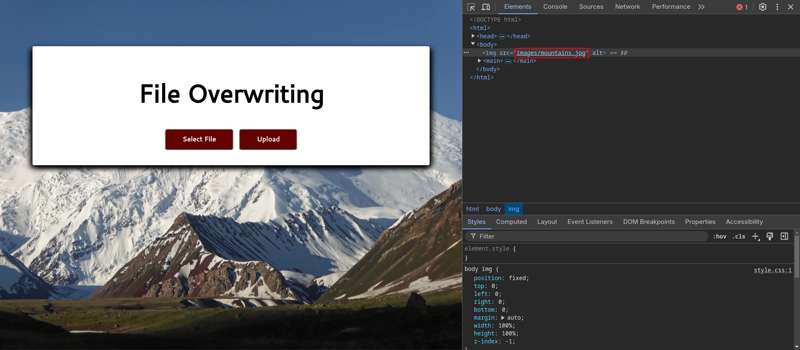<figcaption></figcaption></figure>

Ve arkadaki dağ fotoğrafının ismi mountains.jpg yukarıda konumuzun var olan dosyaların üstüne fotoğraf ekleyip o dosyanın üzerine yazmak olduğunu bildiğimiz için kendi sistemimizde bulunan bir fotoğrafın ismini mountains.jpg haline getirip yüklemeyi deniyorum.

<figure>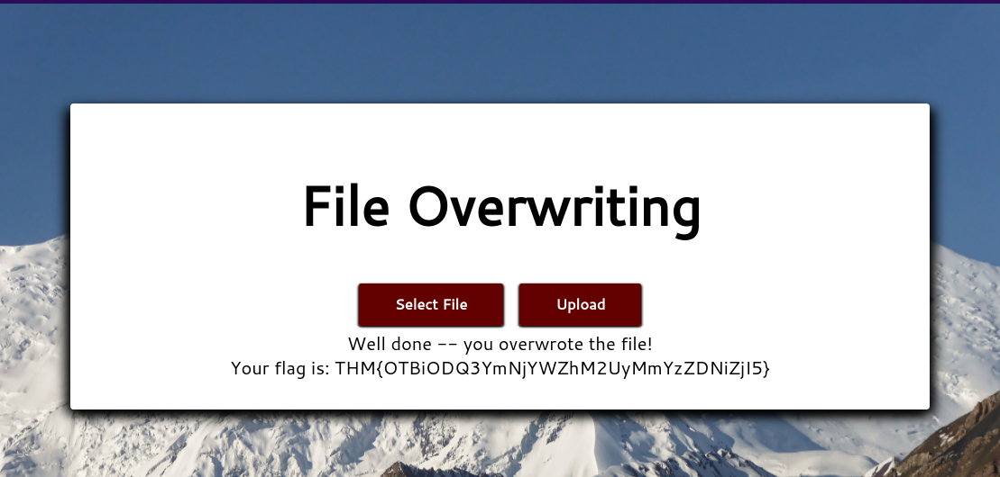<figcaption></figcaption></figure>

Ve cevaba ulaşıyorum. Normal sistemlerde bu tür dosya üzerine yazma işlemi olmaz. Yüklediğiniz dosyanın başına ya da sonuna rastgele bir karakter grubu oluşturulup eklenmesi yada o an ki saatin farklı fonksiyonlara göre hashlenmiş hali dosya ismine eklenir. Bu sayede her dosya isminin diğerinden benzersiz olması sağlanır.

### Lab 2

Tamam biz var olan bir dosya üzerine yükleme yaptık ama bu bizim ne işimize yarayacak. İlk başta bahsettiğim sistem üzerinde kod çalıştırma nasıl yapılır onu anlatacağım. Öncelikle bunu yapmak için 2 farklı yöntem kullanabiliriz.&#x20;

İlkinde sisteme shell dosyası yükleyip istediğimiz kodu çalıştırabileceğiz. İkincisinde ise sistemin bize bağlanması sağlayarak sistem üzerinde kod çalıştıracağız.

Ayrıca bu yüklediğimiz dosyaların çalıştırılması için hangi dizinde saklandıklarını bulmamız lazım ve o dosyalara ulaşmamız gerekiyor.&#x20;

Öncelikle sisteme shell yükleyip çalıştıramaya çalışalım. Bunun için [**p0wny-shell**](https://github.com/flozz/p0wny-shell)'i kullanacağım indirdikten sonra sayfada bulunan yükleme alanında yüklemeye çalışıyorum.

<figure>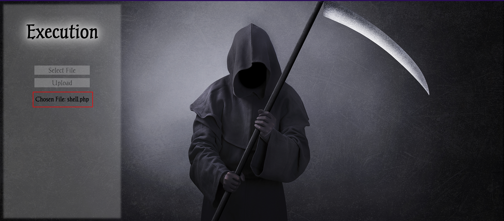<figcaption></figcaption></figure>

Yükle dedikten sonra herhangi bir sıkıntı yaşamadan başarıyla php dosyamızı yüklüyoruz. Tamam ama bizim bu dosyaya ulaşıp kodlarımızı çalıştırmamız gerekiyor. Bunun için öncelikle yüklediğimiz içieriğin nerede depolandığını öğrenmemiz gerekiyor. Bunun için dizin taraması yapmamız gerekiyor. Gobuster aracı bu iş için kullanılabilir.&#x20;

Dosyaları bulabilmek için gobuster ile şu komutu yazmamız gerekiyor.

```
gobuster -u http://shell.uploadvulns.thm -w common.txt -t 60
```

<figure>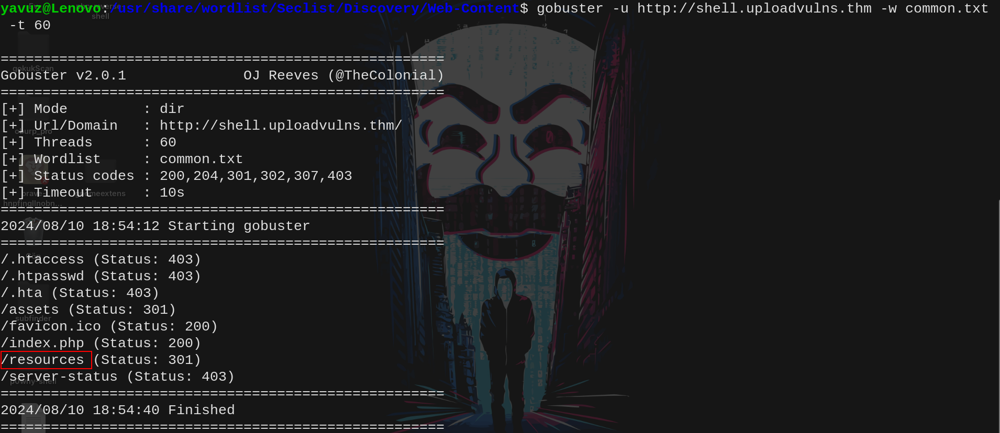<figcaption></figcaption></figure>

Resources diye bir klasör bulunmakta yüklediğimiz içerikler burada depolanıyor olabilir. Url üzerinden bu klasöre erişmeye çalışalım.&#x20;

<figure>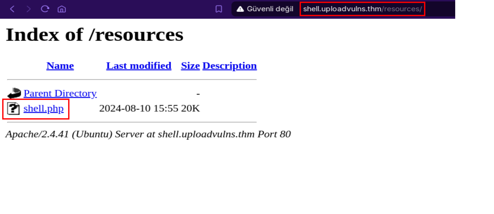<figcaption></figcaption></figure>

Yüklediğimiz shell.php dosyasını görebiliyoruz ve çalıştırabiliyoruz.

<figure>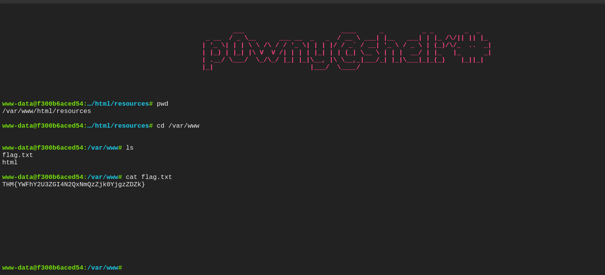<figcaption></figcaption></figure>

Yüklediğimiz p0wny@shell sayesinde artık sistem üzerinde kod çalıştırabiliyor durumdayız. Ve `/var/www` altında bulunan flag.txt dosyasında bulunan değeri elde etmiş oluyoruz. Bunun dışında reverse shell dediğimiz bir yöntemle de sistemin bize bağlanmasını sağlayabiliriz.&#x20;

***

Reverse shell  yöntemini kullanmak için [şu adresteki](https://github.com/pentestmonkey/php-reverse-shell) dosyaları indirmemiz gerekiyor. Bu yöntemi yaparken vereceğimiz IP adresine ve port adresine bağlanmasını sağlamalıyız. Bunların dışında yüklediğimiz dosyayı az önce yaptığımız gibi url üzerinden ulaşıp çalıştırmamız gerekiyor ve kendi bilgisayarımızda gelen isteği dinlememiz gerekiyor. Bunun içinde netcat aracımızı kullanacağız. Öncelike yukarıda belirttiğim Github linkinde ki dosyaları indirelim.

Sonrasında indirdiğimiz dosyaların içinde bulunan php-reverse-shell.php dosyasında şu değişiklikleri yapıyoruz.&#x20;

<figure>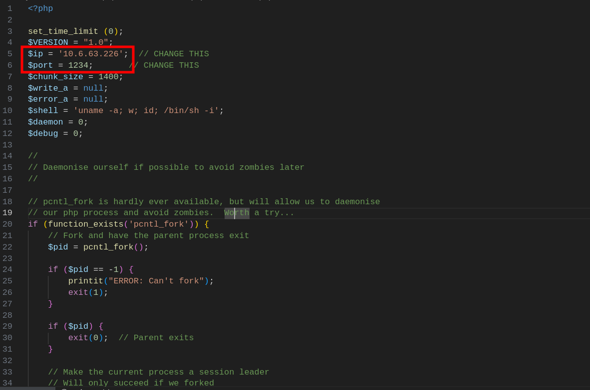<figcaption></figcaption></figure>

Belirttiğim bu iki satırda hangi IP adresine ve hangi porta bağlanacağımız belirtiyoruz. THM odasına bağlandığımız IP adresini yazmamız gerekiyor.  Port adresine de istediğimiz bir port adresini eklemeliyiz.  Sonrasında  bu değişikliği yaptığımız php dosyasını sisteme yükleyebiliriz.&#x20;

Yükledikten sonra yukarıda verdiğimiz port üzerinden dinleme yapmalıyız. Bu işlem için netcat aracını kullanıyoruz. Sistemin istediğimiz IP ve port adresi üzerinden bağlanması için url üzerinden erişip çalıştırmamız lazım.

Öncelikle üstünde değişiklikler yaptığımız reverse shell dosyasını sisteme yüklememiz gerekiyor. Dosyamızı yükledik ve resources klasörü altından ulaşabiliyoruz.&#x20;

<figure>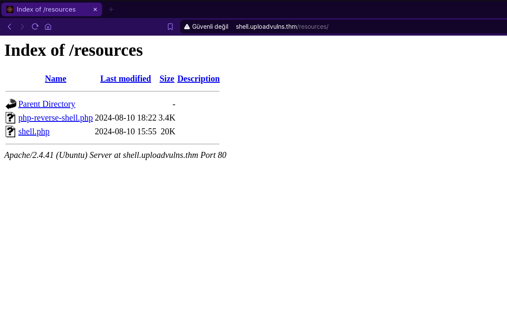<figcaption></figcaption></figure>

Yüklemiş olduğumuz dosyaya tıklamadan önce kendi bilgisayarımızda netcat ile gelen isteği dinlememiz gerek. Daha önce belirttiğimiz port üzerinden şu komut ile dinlemeye başlayalım.

```
nc -lnp 1234
```

Burada yazdığımız 1234 port numaramızı belirtiyor ve gelen istekleri dinliyoruz. Sonrasında yüklediğimiz dosyaya tıkladığımızda sistem terminal ekranımıza bağlanmış oluyor ve sistem üzerinde istediğimiz kodları çalıştırabiliyoruz.

<figure>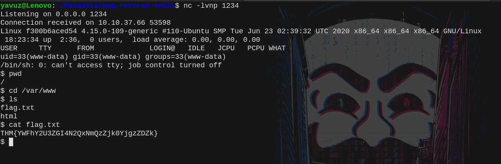<figcaption></figcaption></figure>

### Filtreleme sistemleri

Sistemlerde çeşitli tiplerde filtreleme yapılır. İlerleyen süreçte bu durumların üstesinden gelip dosyalarımızı nasıl yükleriz bunları öğreneceğiz.&#x20;

Öncelikle temel seviyede filtreleme işlemleri nasıl yapılıyor ondan bahsedeyim.&#x20;

Gönderdiğimiz dosyanın uzantısına göre bir filtreleme yöntemi var ve bu sayede farklı dosyaların yüklenmesi önüne geçilmeye çalışıyolar ama çok basit bir şekilde üstesinden geliniyor.&#x20;

Gönderdiğimiz dosyanın MIME type denilen bir dosya tipi vardır sistemler bu özelliğe göre dosyaların kontrolünü sağlar. Bunların dışında HTML etiketleri belirli dosyaların yüklenmesi de sağlanabilir. Unutmamak gerek ki en yararlı filtreleme yöntemi bütün filtreleme yöntemlerinin birlikte kullanıldığı zaman ortaya çıkmaktadır.

### Lab 3

Sitemizde JavaScript koduyla yüklenen dosyanın MIME type kontrolü sağlanıyor eğer geçerli bir durumdaysa yüklenmesine izin veriliyor eğer geçersizse hata veriyor. Öncelikle kaynak koda bakalım.

<figure>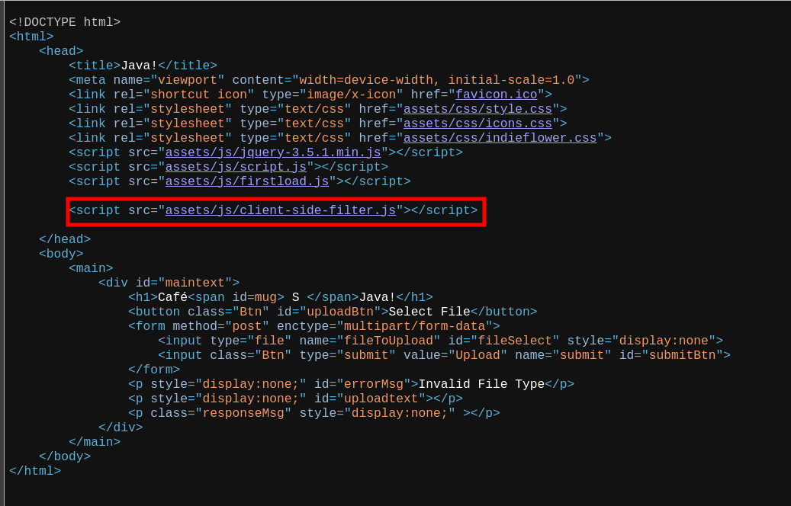<figcaption></figcaption></figure>

Kaynak koda baktığımızda bir JavaScript dosyası dikkatimizi çekiyor. İçeriğini incelediğimizde şöyle bir kod çıkıyor.

<figure>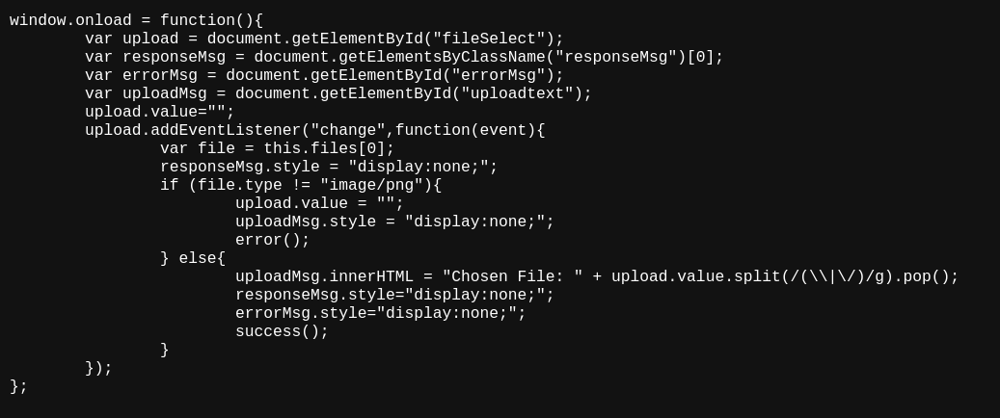<figcaption></figcaption></figure>

Bu kodun amacı yüklenen dosyanın MIME type kontrolünün yapılmasıdır. Yüklenen dosyanın MIME type değeri image/png ise sisteme yüklenmesine izin verilir. Eğer eşit değilse sistem hata verir.

Bu JavaScript dosyasının sistemimize gelmemesi lazım ve bizi kısıtlamaması lazım. Gelen response üzerinde değişikler yapmamız lazım.&#x20;

<figure>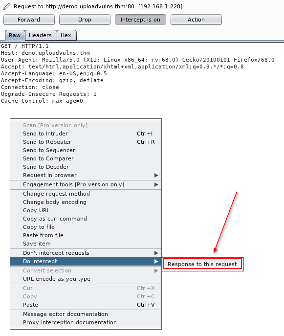<figcaption></figcaption></figure>

Burp Suite ile araya girip yukarıda ki değişikliği yapıyoruz ve bu istek sonucunda dönen cevap üzerinde değişiklik yapabiliyoruz.

<figure>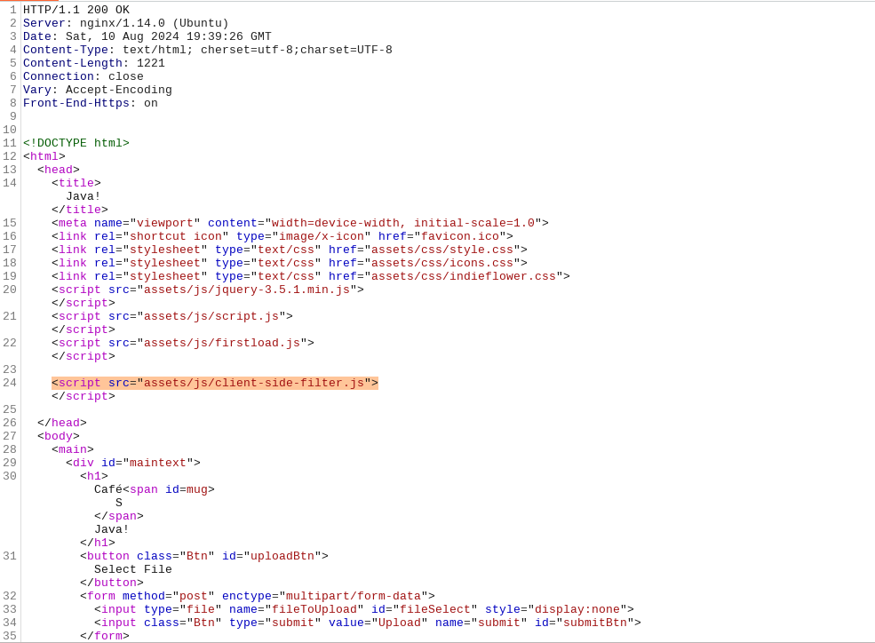<figcaption></figcaption></figure>

İşaretli kısmı siliyoruz ve böyle bir kontrole maruz kalmıyoruz. Bu kısımdan sonra sisteme istediğimiz shell dosyasını atabiliriz ve çalıştırabiliriz. Yükleme işleme başarıyla tamamlandı ama bizim bu dosyayı çalıştırmamız lazım ve yüklediğimiz dosyaların hangi dizine yüklendiğini bilmiyoruz. Daha önce yaptığımız gibi gobuster ile tarama yapıyoruz ve yüklediğimiz içeriklerin images klasöründe depolandığını görüyoruz.

Yüklediğimiz içeriğe tıklayıp p0wny-shellin çalışmasını sağlıyoruz. Soruda bize /var/www altında bulunan flag.txt içeriği soruluyor. Elde ettiğimiz shell sayesinde sistem üzerinde kod çalıştırabiliyoruz.

<figure>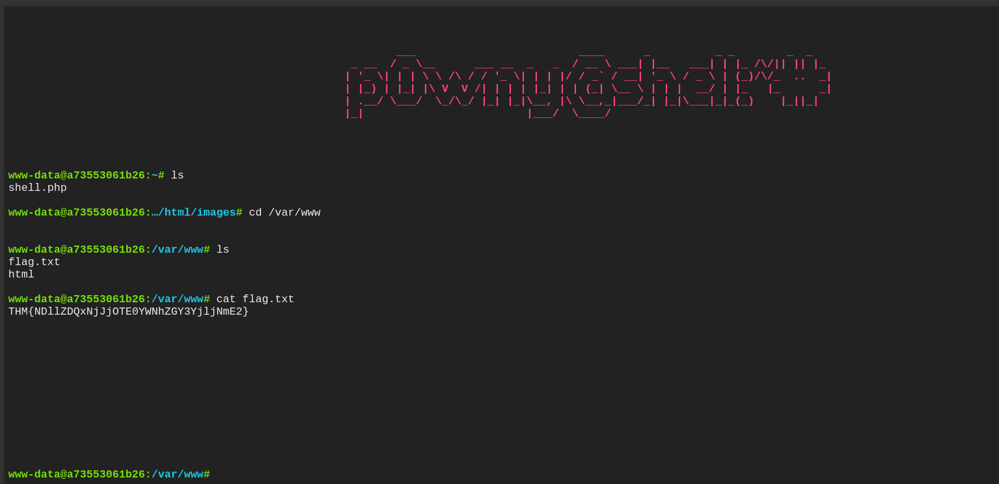<figcaption></figcaption></figure>

### Sunucu taraflı filtreleme

İstemci tarafında bulunan filtreleme işlemlerini görebiliyor ve bu duruma göre aksiyon alabiliyoruz. Server tarafında çalışan filtreleme yöntemlerinde ise filtreleme sistemlerinin ne tür bir filtreleme yaptığını göremeyiz. Çeşitli denemeler yaparak sistemin hangi dosya tiplerine izin verdiğini anlamamız gerek. Bir sürü farklı filtreleme yöntemi vardır.

Biz bu yazımızda 3 tane filtreleme yönteminden bahsedeceğiz.&#x20;

* Black list
* White list
* Magic Byte

Black list mantığı şu şekildedir. Sistemde tanımlanan bazı uzantı değerleri vardır. Örnek vermek gerekirse .exe, .php gibi uzantılar sistemde tanımlı bir şekilde duruyor. Eğer bu uzantılara sahip bir dosya yüklemeye çalışırsanız sistem hata verir. Atlatılması white liste göre çok daha kolaydır. Sistem sadece .php eklentisi engellediği için .php4 şeklinde dosya yüklemeye çalıştığımıza başarıyla yükleyeceğiz.

Ayrıca Magic Number denilen bir kontrol yöntemi ile yapılabilir. Magic Number bir dosyanın içeriğini belirlemenin daha doğru yoludur, yine de bunların sahtesini yapmak imkansız değildir. Bir dosyanın "sihirli numarası", dosya içeriğinin en başında yer alan ve içeriği tanımlayan bir bayt dizisidir. Örneğin, bir PNG dosyasının en üstünde şu baytlar bulunur: `89 50 4E 47 0D 0A 1A 0A`.

***

White list mantığı, Black listten farklıdır. Yine belirli dosya uzantıları vardır. Eğer yüklenen dosyanın uzantısı white list içinde bulunmazsa sistem hata verir ve dosyanın yüklenmesine izin vermez. Black list yönteminden daha güvenlidir.

Örnek sistem üzerinden reverse-shell ile komut çalıştırıp /var/www/ altında bulunan flag.txt dosyasın ulaşmamız lazım.

<figure>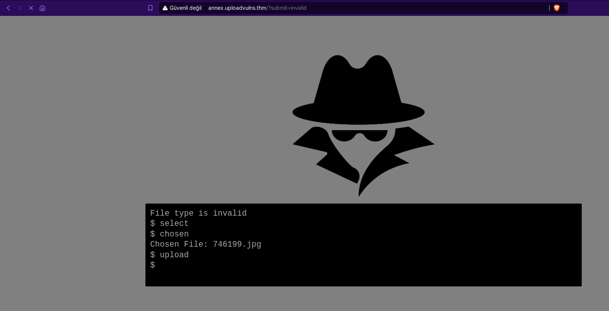<figcaption></figcaption></figure>

Normal bir jpg dosyası yükleyebiliyoruz. Ama bir php uzantılı bir dosya yüklemeye çalıştığımızda başarısız oluyoruz. Php dosyamızın uzantısını değiştirip tekrar deneyelim .php5 vb. denemeler yapalım.

<figure>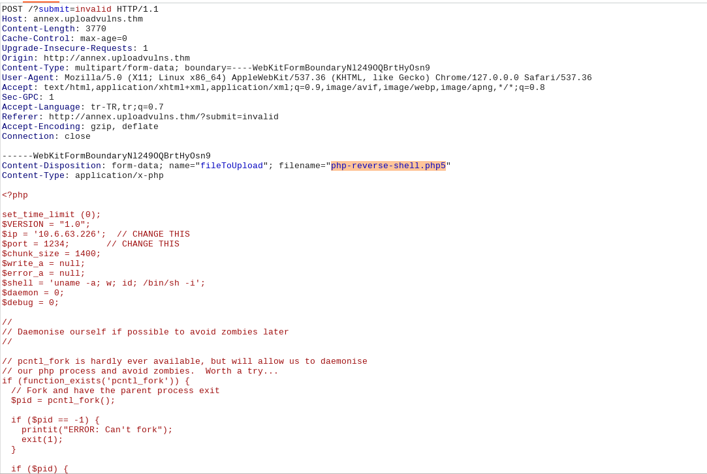<figcaption></figcaption></figure>

Uzantıyı değiştirdikten sonra başarılı bir şekilde yükleme yapabiliyoruz. Yüklenen dosyanın nereye depolandığını bulmamız gerekiyor. Gobuster ile yapacağız.

<figure>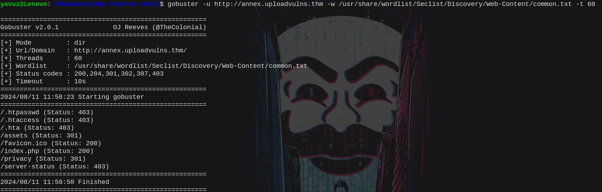<figcaption></figcaption></figure>

Privacy klasörünün altında yüklediğimiz içerikler depolanıyor. Yüklemiş olduğumuz içeriğe tıklamadan önce netcat ile gelen istekleri dinlememiz gerekiyor.&#x20;

```
nc -lnvp 1234
```

Yukarıdaki kod ile 1234 portundan gelen istekleri dinleyebiliyoruz. Sonrasında /privacy klasörünün altında bulunan php dosyamızı tıklayarak çalıştırıyoruz.&#x20;

Dosyayı çalıştırdığımız an netcat ile shell alabiliyor ve komutları çalıştırabiliyoruz.

<figure><figcaption></figcaption></figure>

### Magic Byte Bypass

Bazı sistemlerde filtreleme için dosyaların başında bulunan Magic Byte kısımlarını kontrol eder ve dosya tipine göre filtreleme yapar. Dosyamızın hangi veri tipinde olduğunu öğrenmek için komut satırında şu komutu yazmamız gerekiyor.

```
file php-reverse-shell.php
// Çıktı: php-reverse-shell.php: PHP script, ASCII text
```

Gönderdiğimiz dosyanın jpg dosyası olarak algılanması için php dosyasının başına ```FF D8 FF EE``` baytlarını eklememiz gerekiyor. Öncelikle php dosyamızın başına AAAA gibi bir kısım ekliyoruz. 

<figure>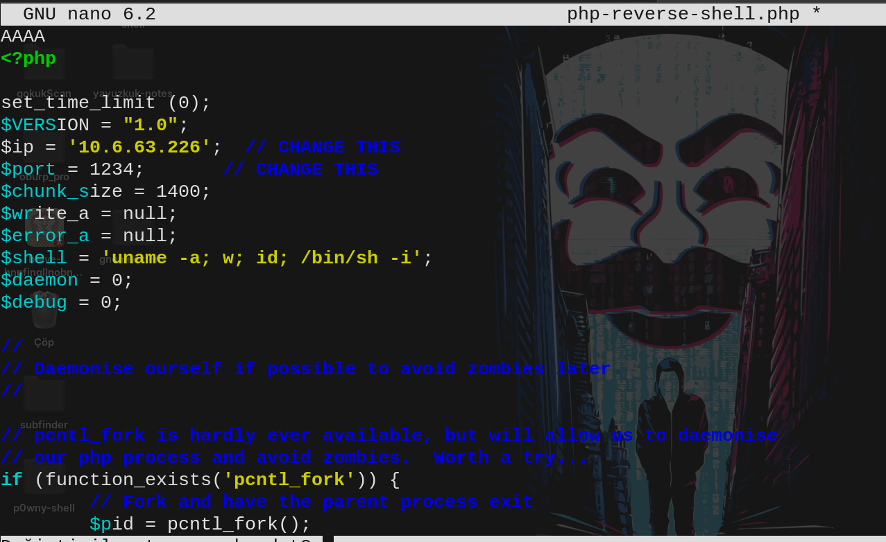<figcaption></figcaption></figure>

Php dosyamızın başına ekleme yaptıktan sonra hexeditor ile baktığımızda şöyle bir durum karşımıza çıkıyor. 

<figure>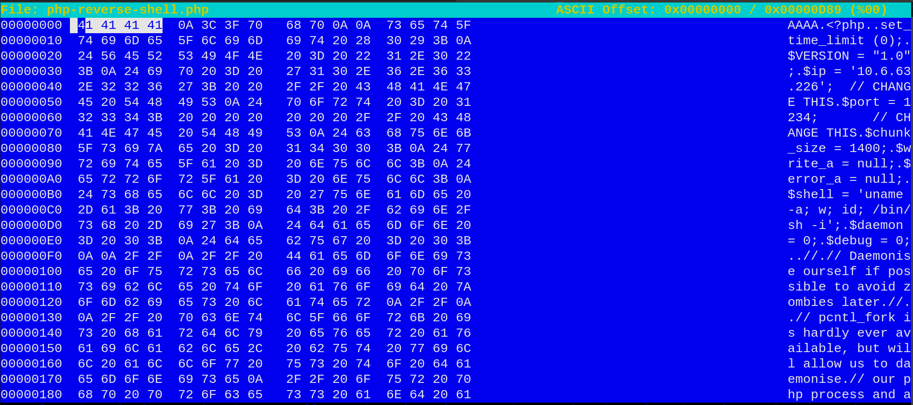<figcaption></figcaption></figure>

[Şu adresten](https://en.wikipedia.org/wiki/List_of_file_signatures) dosyaların Magic Byte değerlerine ulaşabiliriz. Bu örneğimiz için `FF D8 FF EE` değerini kullanacağız. Yukarıda hexeditor üzerinden açtığımızda 41 değerlerinin yerine bu değerleri yazıyoruz.

<figure>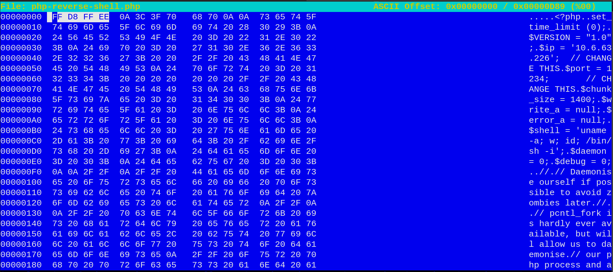<figcaption></figcaption></figure>

Bundan sonra Magic Byte kontrolü yapan sistemler dosyamızı artık php olarak değil bir JPEG dosyası olarak algılar.

```
file php-reverse-shell.php
// Çıktı: php-reverse-shell.php: JPEG image data
```
Bu şekilde sistemlere farklı formatlarda dosyalar yükleyebiliriz.

Bizim reverse shell alacağımız sistemde sadece GIF formatında dosyalara izin veriyor. 

<figure><figcaption></figcaption></figure>

Şimdi gidip GIF dosya tipinin Magic Byte değerini öğrenip aynı şekilde eklememiz gerek.

Geçen örneğimizde php dosyamızı JPG tipine çevirmiştik ve hexeditor üzerinden yapmıştık hexdeğerlerini eklemiştik. Şimdi daha kolay olması açısından hex değerlerini değil de ASCII değerlerini ekleyeceğiz. Bunun için nano ile dosyamızı açıyoruz.

<figure>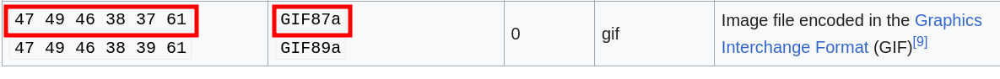<figcaption></figcaption></figure>

Nano ile dosyamızı açtıktan sonra `GIF87a` değerini başa ekleyeceğiz ve bu sayede .php uzantılı dosyamız GIF olarak algılanacak ve sisteme yükleyebileceğiz.

Bu sayede artık yükleme yapabiliriz. Gobuster ile dosyaların nereye yüklendiği öğrenmemiz lazım sonrasında netcat ile gelen istekleri dinleyip dosyayı çalıştırmamız lazım.

<figure>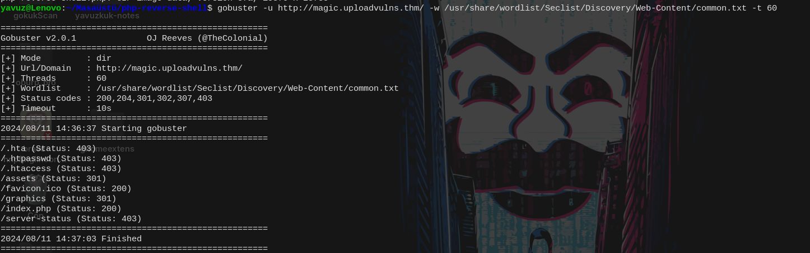<figcaption></figcaption></figure>

Bazı durumlarda yüklediğimiz içeriklerin nerede olduğunu bulabiliriz ama yüklenen dosyaları tıklayarak çalıştıramayız. Bunun için url üzerinden dosyayı seçmemiz gerekiyor. 

URL üzerinden `http://magic.uploadvulns.thm/graphics/php-reverse-shell.php` sayfasına gitmemiz lazım ve dosyamızı çalıştırmammız lazım bu sayede dosyamız çalışmaya başlar ve netcat aracılığıyla shell alabiliyoruz. 

<figure>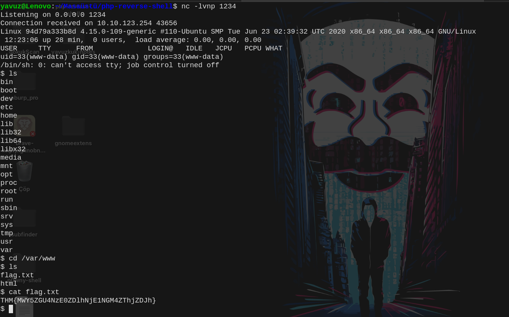</figure><figcaption></figcaption></figure>


> Bu yazı [*Yavuz Kuk*](https://www.linkedin.com/in/yavuzkuk/) tarafından hazırlanmıştır.