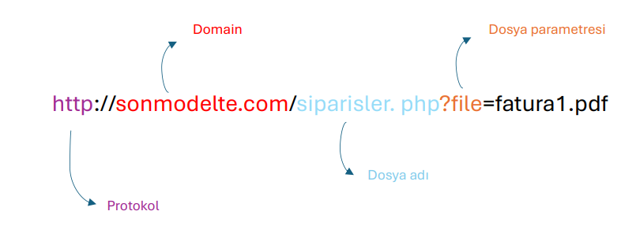
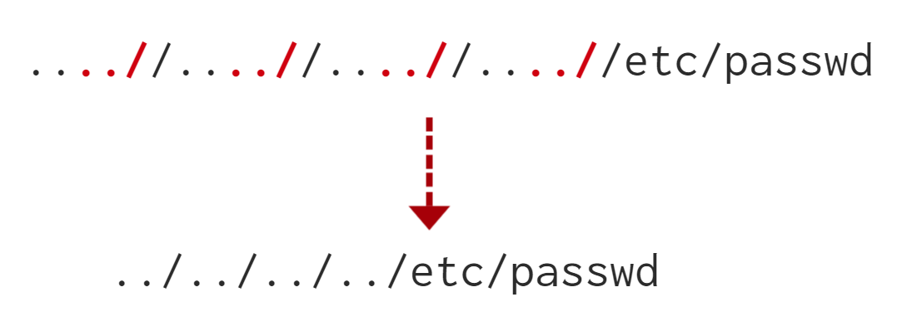

# LFI (Local File Inclusion)

Local File Inclusion kısa haliyle LFI. Arama motorumuza bir web sitesinin adresini girdiğimiz zaman o web sitesinin dosyalarını bulunduran sunucuya istek atmış oluyoruz. Kendisinden ilgili dosyaları bize göndermesini istiyoruz.&#x20;

Normal bir web sitesinde normal bir kullanıcının görmesi gereken dosyalar olduğu gibi görmemesi gereken dosyalar da mevcuttur. İşte LFI (Local File Inclusion) zafiyeti ile, bir saldırgan, web uygulamasının çalıştığı sunucudaki yerel dosyaları okumasına, çalıştırmasına veya dahil etmesine olanak tanıyan bir güvenlik zafiyetidir. Bu zafiyetin ortaya çıkma şekli kullanıcıdan alınan inputun kontrol edilmeden ya da kontrollerin atlatılmasıyla inputun işleme sokulmasıyla ortaya çıkar.

Bazı durumlarda web uygulamaları ekranda gösterecek olacağı sayfaları, fotoğrafları, videoları vb. parametre olarak alır.

<figure><figcaption></figcaption></figure>

Web sitesini geliştiren kişi ?file parametresiyle sunucuda bulunan dosyaları ekrana yansıtabiliyor. Ama aynı şekilde kötü niyetli insanlar bu parametreyi manipüle ederek normal kullanıcıların görmemesi gereken dosya içeriklerini görebiliyor.

Teorik anlamda LFI bu şekilde kod tarafına baktığımızda basitçe şöyle çalışıyor.

<pre><code>&#x3C;?php
<strong>    $file = $_GET['file'];
</strong>    // http://sonmodeltel.com/siparisler.php?file=fatura1.pdf
    
    include($file);
?>
</code></pre>

Yukarıda ki kodun açıklaması şu şekildedir. URL'de bulunan **file** parametresi alınıp **include()** fonksiyonu ile sayfa içine dahil ediliyor. Gördüğünüz gibi herhangi bir kontrol durumu gerçekleşmiyor.

***

LFI hakkında temel bilgileri edindik şimdi normal kullanıcının görmemesi gereken bazı hassas bilgileri içeren dizinlerden bahsedelim.

* **/etc/passwd :** Linux/Unix sistemlerinde kullanıcı bilgilerini içerir. Her kullanıcı için bir satır bulunur ve kullanıcı adı, kullanıcı ID'si, grup ID'si, yorum alanı, ana dizin ve kullanıcı kabuğu gibi bilgileri içerir.
* **/etc/shadow :** Kullanıcı parolalarının hash'lerini içerir. Bu dosya sadece root veya yetkili kullanıcılar tarafından okunabilir.
* **/var/log/ :** Çeşitli sistem ve uygulama log dosyalarını içerir. Bu log dosyaları sistemin ve uygulamaların çalışma durumunu, hataları ve kullanıcı aktivitelerini içerir.

LFI sayesinde parametre üzerinde işlem yaparak hassas bilgi içeren bu dosyalara ulaşabiliriz. Daha da ileriye gitmek istersek LFI ile RCE (Remote Code Execution) yapılabilir. Adım adım, labları çözerek ilerleyeceğiz.

Bu konuyu uygulamalı anlatmak için [Try Hack Me File Inclusion](https://tryhackme.com/r/room/fileinc) labını kullanacağım.

***

<figure><figcaption></figcaption></figure>

Fotoğrafta gördüğünüz gibi normal şartlarda url de bulunan **?file** parametresiyle /var/www/app/CVs/userCv.pdf dosyasına ulaşmamız gerekirken, **?file** parametresini manipüle ederek /etc/passwd dosyasına ulaşmış oluyoruz.

Fotoğrafta görünen ?file parametresi dikkatinizi çekmiştir, _**../../../../../../../../etc/passwd .**_ Parametre değerimizde bulunan **../** bir önceki dizine çıkmak anlamına gelir. Bir sürü kullanmamızın sebebi ise ne kadar kullanırsak kullanalım en fazla / (kök) dizine gidebiliriz.

&#x20;

<figure><figcaption></figcaption></figure>

### Lab 1

<figure><figcaption></figcaption></figure>

İlk labımızda bir input alanına girdiğimiz dosya isimlerini bize getiren bir mekanizma var. Olmayan bir dosya adını girdiğimizde ise bir hata alıyoruz.

<figure><figcaption></figcaption></figure>

İlk labımız olduğu için herhangi bir kısıtlama olmadığını düşünüp ve çıkan hataya baktığımızda input alanına yazdığımız içeriğin direkt bir şekilde include (dahil edildiğini) görünce deneme amaçlı input alanına yazıyorum.

<figure><figcaption></figcaption></figure>

Evet herhangi bir kontrol yapılmamış ve direkt bir şekile /etc/passwd dosyasımızın içeriğine ulaşmış olduk.

<figure><figcaption><p>İlk sorunun cevabı</p></figcaption></figure>

#### Lab 2

İkinci laba baktığımızda görünüş olarak diğer labla birebir aynı. Deneme amaçlı rastgele bir girdi girdiğimizde, hata mesajıyla karşılaşıyoruz.

<figure><figcaption></figcaption></figure>

Input kısmına admin yazmama rağmen verdiği hata mesajında includes/admin şeklinde hata veriyor. Yani includes klasörünün altında admini arıyor. Daha önce yaptığımız gibi input kısmına _**/etc/passwd**_ yazarsak bize şöyle bir hata verecektir.&#x20;

```
Warning: include(includes/etc/passwd) [function.include]: failed to open stream: No such file or directory in /var/www/html/lab2.php on line 26
```

Bizim burada ilk yapmamız gereken şey includes klasöründen çıkmak olacaktır. Bunun için ../ kullanacağız. Bir tane kullanmak bizim için yetmiyecektir. / dizinine ulaşmamız lazım bu yüzden fazla fazla ../ karakterlerini kullanabiliriz.

<figure><figcaption></figcaption></figure>

.. / karakterleriyle /  klasörüne kadar çıktım buradan sonra /etc/passwd klasörüne ulaşabilirim.

<figure><figcaption></figcaption></figure>

2.soruda labda hangi fonksiyonun kullanıldığı sorulmuş daha öncesinde hata mesajımızda include() fonksiyonunu görmüştük.

#### Lab 3

3.labda baktığımızda yine aynı içerik sayfası karşımızda deneme amaçlı rastgele bir şey yazıyorum ve çıkan hatayı kontrol ediyorum.

<figure><figcaption></figcaption></figure>

Input alanında deneme diye giriş yapıyorum ve hataya baktığımda yine _**includes**_ dizinini içinde olduğunu görüyoruz 2.labdan farkı girmiş olduğumuz dosyanın sonuna .php eklentisi ile birleştirmesi. 2.labda dizin içinden nasıl çıkacağımızı öğrendik ama uzantıyı nasıl devre dışı bırakacağız bunu bilmiyoruz. .php kısmını devre dışı bırakmak için ise Null Byte denilen bir karakteri kullanacağız.

Null Byte PHP 5.3.4 sürümünden sonra kaldırılmış durumda güncel sürümlerde işe yaramayacaktır. Null byteın amacı bulunduğu yerden sonra gelen karakterlerin işleme tabi tutulmaması için kullanılır. Bizim senaryomuzda da .php yi engellemek için kullanılabilir.

İlk başta içinde bulunduğumuz klasörden, / (kök) dizine kadar geri çıkalım ve sonrasında php uzantısını görmemesi için Null Byte kullanabiliriz. Bu dediklerimizi uygulayınca şöyle bir payload karşımıza çıkıyor:

<figure><figcaption></figcaption></figure>

Doğru bir payload yazmamıza rağmen istediğimiz çıktıyı alamıyoruz. Yazdığımız içerik url de karşımıza çıkıyor. Deneme işlemini bu sefer de url üzerinden yapalım ve çıktımıza bakalım.

<figure><figcaption></figcaption></figure>

Ve evet aynı payload ile url üzerinden denediğimizde çıktıyı alabiliyoruz.

<figure><figcaption></figcaption></figure>

#### Lab 4

Yine aynı ekran bizi karşılıyor, deneme amaçlı rastgele bir değer giriyoruz.

<figure><figcaption></figcaption></figure>

Göründüğü kadarıyla herhangi bir klasörün içinde değiliz geriye gitmemiz gerekmiyor. Direkt bir şekilde /etc/passwd dosyasın ulaşmaya çalışalım.

<figure><figcaption></figcaption></figure>

Kodu görütüleyemiyoruz. Bazı sistemlerde belirli dizinlere karşı filtreleme kullanılır. LFI zafiyeti olduğunu kanıtlamak /etc/passwd dosyası kullanıldığı için siteyi hazırlayan kişi burada bir filtreleme işlemi yapmış olabilir. Eğer inputtan _**/etc/passwd**_ değeri gelirse gösterme demiş olabilir.

Burada daha önce kullandığımız dizin değiştirme karakterlerini kullanacağız. Eğer direkt bir şekilde /etc/passwd dosyasına ulaşamıyorsam bir dizin geri çıkarım ve sonrasında tekrar dizin değiştiririm. Bu dediklerim sonucunda şöyle bir input karşımıza çıkıyor.

```
/etc/passwd/../passw
```

Yukarıda gördüğünüz payload işe yarayacaktır ama başka bir payload göstermek istiyorum. ../ karakteri gibi . (nokta) karakteri ile de biz bu işlemleri yapabiliyoruz. . (nokta) karakteri içinde bulunduğu dizin anlamına geliyor. Anlamadıysanız _**`cd .`**_ yaptığınızda herhangi bir dizin değişikliğinin olmadığını görmüş olmanız lazım aynı şekilde bizde payloadımızda bu . (nokta) karakterini kullanacağız.

```
/etc/passwd/.
```

<figure><figcaption></figcaption></figure>

Hatamızda gördüğümüz fonksiyonun ismini cevap olarak giriyoruz.

<figure><figcaption></figcaption></figure>

#### Lab 5

Daha hızlı ilerleyebilmek için `../../../../../../../../../../etc/passwd` şeklinde deneme yapıyorum.&#x20;

<figure><figcaption></figcaption></figure>

Girmiş olduğum inputun içinde ../ karakterleri olmasına göre sarı ile belirtmiş olduğum hata mesajında herhangi bir ../ karakteri göremiyorum. Bu yüzden includes klasöründen çıkamıyorum. Yazılımcı siteyi hazırlarken ../ karakterlerini silnmesi için bir kod yazmış olmalı.&#x20;

Bu durum içinde şöyle bir taktik geliştiriyoruz. 4 tane . (nokta) işaretinden sonra 2 tane / işareti koyuyoruz ve sistem ilk gördüğü ../ karakter grubunu siliyor. Sonrasında ekstradan koyduğumuz noktalar ve slash işareti birleşip yeni bir ../ karkater grubu oluşturuyor.

<figure><figcaption></figcaption></figure>

Belirttiğim duruma göre bir payload hazırladığımızda /etc/passwd dosyasına ulaşıyoruz.&#x20;

<figure><figcaption></figcaption></figure>

#### Lab 6

Tekrardan devam ediyoruz aynı sayfa bizi karşılıyor ve yukarıda belirttiğim komutu girdiğimde bana sadece THM-profile altında bulunan dosyalara erişimim olduğunu söylüyor ve input kısmında bulunan placeholder kısmına bakarsanız bize örnek bir dizin gösteriyor.

<figure><figcaption></figcaption></figure>

Bize gösterdiği örnek dizin üzerinden bir şeyler yapabiliriz gibi geliyor o dizinden çıkmamız gerekiyor. Daha önce öğrendiğimiz ../ karakterlerine göre tekrardan payload hazırlayalım ama şuna dikkat etmeliyiz payloadımızın başlangıcı THM-profile ile başlayacak.

<figure><figcaption></figcaption></figure>

Soru olarak baktığımızda nasıl /etc/passwd klasörüne ulaştıysak /etc/ os-release klasörüne erişmemiz isteniyor ve cevabı 12.04 olarak buluyoruz.

<figure><figcaption></figcaption></figure>

#### Challenge 1

<figure><figcaption></figcaption></figure>

Normalde girdiğimiz inputu göndermek istediğimizde girdiğimiz değer GET parametresiyle gidiyor. Soruda da belirttiği gibi bunu POST yapmamız isteniyor. Bunu nasıl yapacağız Burp Suite sayesinde yapacağız. Giden isteği durdurup istek tipini değiştireceğiz.

İnput alanına girdiğimiz değer GET parametresiyle giderken şu şekilde gidiyor.

<figure><figcaption></figcaption></figure>

Turuncu şekilde işaretlenmiş olan özellik ile istek tipini değiştirebiliriz. Artık isteğimiz bu şekilde gözükecektir.

<figure><figcaption></figcaption></figure>

Soruda bizden /etc/flag1 dosyasının içindeki flag değerini istiyor.

<figure><figcaption></figcaption></figure>

Aynı şekilde passwd yerine flag1 yazdığımızda cevaba ulaşıyoruz.

#### Challenge 2

Sayfayı açar açmaz karşımıza böyle bir ekran geliyor. Sadece adminler erişebilir diye bir yazı var.

<figure><figcaption></figcaption></figure>

Bu sayfa benim admin olup olmadığımı nerde biliyor. Sayfayı yenileyelim Burp Suite ile araya girip giden gelen paketleri kontrol edelim.&#x20;

<figure><figcaption></figcaption></figure>

Giden paketler arasında 11. satırda bir Cookie değeri var ve _Guest_ değerini almış. Bu Cookie değerini manipüle ettiğimde yukarıda ki uyarı ekranında ki Welcome Guest yazısı da değişiyor.

Yani ben Cookie değerine ne yazarsam ekrana o çıktıyı veriyor. Bu olayı farkına vardıktan sonra Cooki değerine `../../../../../etc/flag2` diye değer veriyorum.&#x20;

<figure><figcaption></figcaption></figure>

Ama görüyoruz ki girmiş olduğumuz payloadın sonuna php uzantısı eklenmiş bu durumu aşmak içinde Null Byte kullanıyoruz `../../../../../etc/flag2%00`  ve cevaba ulaşıyoruz.

<figure><figcaption></figcaption></figure>

#### Challenge 3

Burp Suite ile 3.challenge a baktığımızda yine cookie değeri gönderiliyor. Hiç bir şeye dokunmadan GET metodu ile gönderme işlemi yaptığımızda / karakterlerini siliyor ve sona php eklentisi ekliyor. Bu yüzden POST metodu ve Null Byte ekleyerek  deniyorum.&#x20;

Bu sefer / karakterlerimi silmedi pathimi doğru yazdı ama yine istediğim sonuca ulaşamadım. Arkada giden Cookie değerini admin olarak gönderirsem belki işe yarayabilir. Boş yere Cookie değerini göndermez diye düşünüyorum.

<figure><figcaption></figcaption></figure>

Ve bu payload sonucunda çıktıyı alıyoruz.

<figure><figcaption></figcaption></figure>

Ama bize /etc/flag3 dosyasının içindeki değer soruluyor. Aynı işlemleri yapıyoruz sadece passwd yazılacak yere flag3 yazıyoruz ve cevaba ulaşıyoruz.

<figure><figcaption></figcaption></figure>

#### Playground

Soruda bizden hostname komutunu çalıştırmamız isteniyor. İşte burada dışarıdan göndereceğimiz bir komut dosyası olacak ve bu dosya sayesinde hostname komudumuzu çalıştıracağız.

Öncelikle bir PHP dosyası oluşturuyorum. Hostname komudunu çalıştırmalı ve ekrana yansıtmasını istiyorum.

```
<?php

    echo system("hostname");

?>
```

Sonrasında bu dosyayı bir sunucu gibi servis etmem gerekiyor. Bunun için PHP dosyasını oluşturduğum dizinden power shell üzerinden şu komutu çalıştırıyorum.

```
python3 -m http.server
```

Bu komut sayesinde Try Hack Me'ye bağlandığımız adres üzerinden dosyalarımızı paylaşabiliyoruz. ipconfig yazarak OpenVPN'in bize sağlamış olduğu ip adresinin 8000 (default) portundan dosyalara erişebiliriz.

Input alanına da bu dosyanın adresini vereceğiz ve sistem php dosyasında bulunan kodu çalıştırıp ekranımıza yazdırıcak.

<figure><figcaption></figcaption></figure>

Linkin başında ki ip OpenVPN'in bağlanırken bana sağlamış olduğu ip adresi.

Ve cevaba ulaşıyoruz.

<figure><figcaption></figcaption></figure>

Kaynak: [Try Hack Me File Inclusion](https://tryhackme.com/r/room/fileinc)

Bu yazı [_Yavuz Kuk_](https://www.linkedin.com/in/yavuzkuk/) tarafından hazırlanmıştır.
