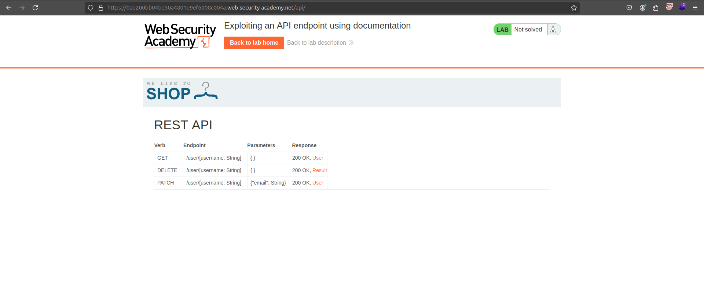

# HTTP Host Header Attack

Merhabalar bu yazımızda HTTP Host Header saldırısı konusundan bahsedeceğiz.&#x20;

<figure><figcaption></figcaption></figure>


Bir web sitesine istek atarken arka tarafta çeşitli istekler gönderiliyor. Öncelikle örnek bir web sitesi üzerinden bu istekleri inceleyelim:

example.com adlı web sitesinin iletişim sayfasına bir istek gerçekleştiriliyor.&#x20;

```
GET /contact HTTP/1.1
Host: example.com
User-Agent: Mozilla/5.0 (Windows NT 10.0; Win64; x64) AppleWebKit/537.36 (KHTML, like Gecko) Chrome/117.0.0.0 Safari/537.36
Accept: text/html,application/xhtml+xml,application/xml;q=0.9,image/webp,*/*;q=0.8
Accept-Language: tr-TR,tr;q=0.5
Connection: keep-alive
```

Yukarıdaki isteği parça parça inceleyelim:

* **GET / HTTP/1.1**: Bu satır, HTTP metodunu (`GET`), yolunu (`/`) ve HTTP versiyonunu (`HTTP/1.1`) belirtir.
* **Host**: İstek gönderilen sunucunun adresi; `example.com`.
* **User-Agent**: İsteği gönderen tarayıcı veya uygulama hakkında bilgi.
* **Accept**: Tarayıcının hangi türde içerikleri kabul edeceğini belirtir (HTML, XML, resim vb.).
* **Accept-Language**: İsteğin dil tercihlerini belirler (örneğin, `tr-TR` İngilizce dil seçeneği).
* **Connection**: İstek sonrası bağlantının durumu hakkında bilgi verir (`keep-alive`, bağlantıyı açık tutar).

Bizim burada ilgileneceğimiz ve manipüle edeceğimiz kısım Host header değeridir.&#x20;

### Host header değeri ne işe yarar?

Host header değeri ile birlikte hangi hedef sisteme istek atacağımızı anlamış oluruz. Host headerı HTTP/1.1 ile zorunlu bir başlık olarak kabul edilir. Eğer host değeri silinirse modern web sunucularında gelen istekler 400 Bad Request ile geri döndürülür.&#x20;

Teknolojinin ilk dönemlerinde, tek bir sunucu üzerinde genellikle yalnızca bir web sitesi veya uygulama barındırılıyordu. Bu durumda, Host header değerine IP adresi verildiğinde sunucu hangi siteye yönlendirileceğini kolayca anlayabiliyordu. Ancak günümüzde, sanallaştırma ve bulut teknolojilerinin gelişmesiyle aynı IP adresi üzerinde birçok farklı site veya uygulama barındırılabiliyor.

Modern altyapılarda, bir sunucu veya IP adresi genellikle birçok farklı alan adını (domain) destekler. Bu durumda, Host header'ın alan adıyla birlikte gönderilmesi, sunucunun istek yapılan kaynağı doğru bir şekilde belirleyebilmesi için gereklidir. Örneğin, aynı IP adresine sahip bir sunucu hem `example.com` hem de `example.net` sitelerini barındırıyorsa, Host header değeri olmadan sunucu gelen isteğin hangi siteye ait olduğunu bilemez.

### Host header saldırısı nasıl gerçekleşir?

Host header saldırısının gerçekleşmesi için öncelikle saldırganın gönderilen isteği durdurup bu istek üzerinde çeşitli işlemler yapması gerekir. Çeşitli sistemler programlanırken istek ile birlikte gelen host header değerini alır ve kullanırlar. Gerekli kontroller yapılmazsa ve sistem direkt bir şekilde host header değerini alıp kendi üzerinde kullanırsa çeşitli sıkıntılara yol açabilir.

### Host header zafiyetlerini test etme

Öncelikle hedef sistem üzerinde host header zafiyetini bulmamız gerekiyor. Bu yüzden Burp Suite aracıyla gönderilen paketleri durdurup çeşitli manipülasyonlar yapıp zafiyeti tetiklememiz gerekiyor.&#x20;

* Rastgele host header değeri eklenerek sistemin vereceği cevap gözlenebilir. Eğer sunucu cevap veriyorsa, sitenin bu hatalı domaini varsayılan bir seçenek olarak kabul ediyor olabilir. Bu durumda, uygulamanın Host header'ı nasıl işlediğini daha detaylı inceleyebilirsiniz. Ancak çoğu durumda, geçersiz bir Host header gönderdiğinizde "Invalid Host header" gibi bir hata alabilirsiniz.
* Bazı şartlar altında vereceğimiz domain adını kontrol eder vermiş olduğumuz port adresini önemsemezler. Ayrıca bazı siteler sadece aynı subdomaine sahip olan istekleri işleyebilirler.
* Bazı sistemler farklı şekilde içerikleri değerlendirebilirler. Bazı sistemleri manipüle etmek için ikinci host header değeri eklememiz gerekebilir. Gönderilen istekte toplamda 2 tane host header değeri olur ve buna göre bir zafiyet ortaya çıkar.&#x20;

```
GET /contact HTTP/1.1
Host: example.com
Host: badsite.com
```

* Bazı sistemlerde ise host header değerinin yerine geçebilecek çeşitli header değerleri vardır. Bu header değerlerini vererek host header değerini manipüle etmiş oluruz. Özellikle proxy veya yük dengeleyici sistemlerde, Host header yerine X-Forwarded-Host veya benzeri bir header kullanılabilir. Böyle durumlarda, doğrudan Host header’a müdahale etmek yerine X-Forwarded-Host header’ı üzerinden zararlı veriyi eklemek mümkündür

Host header değeri dışında kullanılabilecek bazı header'lar şunlardır:

* X-Forwarded-Host
* X-Host
* X-Forwarded-Server
* X-HTTP-Host-Override
* Forwarded

### Host header saldırısın zararları nelerdir?

* Password reset poisoning (Şifre değiştirme saldırısı)
* Web cache poisoning (Web önbelleği saldırısı)
* Exploiting classic server-side vulnerabilities (Klasik sunucu taraflı zafiyetlerin istismarı)
* Bypassing authentication (Kimlik doğrulamayı atlatma)
* Virtual host brute-forcing (Sanal ana makine brute-forcing (kaba kuvvet) saldırısı)
* SSRF
* Connection state attacks (Bağlantı durumu saldırıları)

***

Host headerın ne olduğu ne tür sorunlar çıkarabildiğini anladıktan sonra örneklerimize bakalım.

## [Lab: Basic password reset poisoning](https://portswigger.net/web-security/host-header/exploiting/password-reset-poisoning/lab-host-header-basic-password-reset-poisoning)

İlk örneğimiz başka bir kullanıcının şifresini yenileyerek hesabını ele geçirmek olacak. Öncelikle normal bir sistemin nasıl çalıştığını düşünelim. Şifre değiştirme işlemleri temelde iki şekilde gerçekleşiyor, eğer şifrenizi biliyorsanız sisteme giriş yapar ve profil kısmından yeni şifrenizi girip şifrenizi değiştirebilirsiniz.&#x20;

Başka bir yöntem olarak da giriş ekranında bulunan şifremi unuttum kısmına mail adresinizi ya da kullanıcı adınızı girerek size gelen linke tıklayarak şifrenizi değiştirebilirsiniz.&#x20;

<figure><figcaption></figcaption></figure>

Bir saldırgan olarak tabii ki de hedefimizde olan kişinin şifresini bilmiyoruz. Bunun için hedefimizin kullanıcı adını kullanarak kendi adına bir şifre yenileme bağlantısı oluşturacağız. Örnek labımızda carlos kullanıcısının şifresini değiştirmemiz ve hesabına erişmemiz gerekiyor.

Konumuz host header saldırısı olduğu için şifre sıfırlama ekranında host header değerini değiştirip nasıl sistemi kendimize uygun şekilde kullanabiliriz bunu düşünmemiz gerekiyor. Öncelikle şifremi unuttum kısmına kendi kullanıcı adımızı girip arka tarafta nasıl bir istek gönderiliyor inceleyelim.

<figure><figcaption></figcaption></figure>

Şifre değiştirme işlemi yaparken arka tarafta yukarıdaki gibi bir istek gönderiliyor. Bu istek wiener kullanıcısının mail adresine şifre sıfırlama maili gönderilmesini sağlar.

<figure><figcaption></figcaption></figure>

Mailde bulunan linke tıklayınca parametre olarak oluşturulmuş token değerini kontrol ederek şifre sıfırlama işlemi gerçekleşir. Şifre sıfırlama ekranına carlos yazdığımızda da carlos kullanıcısının mailine böyle bir mail gönderiliyor. Bizim burada yapmamız gereken carlos kullanıcısının token değerini ele geçirip şifresini sıfırlamak.&#x20;

Daha önce gösterdiğim şifre sıfırlama isteğindeki host header değeri alınıp, şifre sıfırlama linki olarak kullanılıyor.&#x20;

```
# İstek
Host: 0a0a002704ad076181f4c09100d300a1.web-security-academy.net

# Mail
https://0a0a002704ad076181f4c09100d300a1.web-security-academy.net/forgot-password...
```

Eğer host header değerini maipüle eder ve kendimizin sahip olduğu bir hedefe bu token değerini gönderebiliriz.&#x20;

Senaryo gereği carlos kullanıcısı kendisine gelen bütün maillerde bulunan linklere tıklıyor. Kendisine göndereceğimiz şifre yenileme bağlantısını ziyaret edecek ve bize token değeri ulaşmış olacak.

<figure><figcaption></figcaption></figure>

Host header değerini değiştirip kendi sahip olduğumuz sunucun adresini giriyoruz ve isteği gönderiyoruz. Sunucu üzerinde gerçekleşen istemleri kontrol ediyoruz ve parametre olarak gelen token değerini görebiliyoruz.&#x20;

<figure><figcaption></figcaption></figure>

Token değerini alıp tarayıcı üzerinden şifre değişikliği yapabiliriz.&#x20;

<figure><figcaption></figcaption></figure>

URL'i ayarlayıp carlos kullanıcısının şifresini değiştirebiliriz. Şifre değiştirme işleminden sonra değşitirdiğimiz şifre ile carlos kullanıcısı olarak giriş yapıp soruyu çözebiliriz.

## Lab: Web cache poisoning via ambiguous requests

Bu örneğimizde host header değerini mainpüle ederek web cache sistemiyle diğer kullanıcıları etkileyecek bir örnek lab çözeceğiz. Öncelikle web cache nedir kısaca ondan bahsedelim.&#x20;

Web cache dediğimiz şey sık kullanılan web içeriklerinin (HTML sayfaları, resimler, JavaScript dosyaları vb.) kopyalarını geçici olarak saklayan bir sistemdir. Bu sayede, aynı içeriğe tekrar erişim gerektiğinde sunucunun yeniden veri göndermesine gerek kalmadan bu önbellekten hızla yanıt alınabilir. Web cache, hem sunucu yükünü azaltır hem de kullanıcıların daha hızlı deneyim yaşamasını sağlar.

Web cache bir içerik saklarken key-value şeklinde işlem yapar. Key değeri olarak istek gönderilen url ve parametreler seçilir. Value değeri olarak ise bize döndürülen cevap (response) kullanılır.

Bizim burada yapmamız gereken şey web cache üzerinde zararlıı kod içeren bir sayfa saklamamız gerekiyor. Bunun için öncelikle sayfaların nasıl cache alındığına bakalım.&#x20;

Bir sistemin nasıl cache alındığını anlamak istiyorsak temel olarak iki yöntemi vardır.&#x20;

* Birincisi gelen cevabın süresine bakarak bir azalmanın olup olmadığına bakılabilir.
* Dönen cevap üzerinde çeşitli header değerleri bize bu durum ile ilgili bilgi verebilir. ( X-Cache, Cache-Control vb.

```
https://orneksite.com/anasayfa

<html>
<head></head>
<body>
...
<script>alert(document.cookie)</script>
.....
</body>
</html>
```

Yukarıdaki örnekte gördüğümüz gibi web cache tarafında `https://orneksite.com/anasayfa` adresine gitmek istediğimizde web cache tarafından bize saklanan yukarıdaki değer döner ve Web Cache poising saldırısını yapmış oluruz.

***

Öncelikle isteklerimizi atmadan ve başlıkları kontrol etmeden önce parametre olarak rastgele bir değer ekliyoruz ki web cache tarafında index sayfasının yerine başka bir şey saklanmasın.

<figure><figcaption></figcaption></figure>

`https://labId.h1-web-security-academy.net?param=1` adresine istek attığımızda X-Cache değerinin miss olduğunu görüyoruz, ikinci bir istek gönderdiğimizde X-Cache değeri hit oluyor. Bu da demek oluyor ki ikinci istekten sonra istek attığımız sayfa web cache tarafından saklanmış oluyor.&#x20;

Cache mekanizmasını öğrendikten sonra nasıl soruyu çözüceğimize bakalım. Soruda bizden istenen şey cache'i zehirleyip ana sayfada document.cookie diye bir pop-up çıkarmamız bizden bekleniyor.

Konumuz host header saldırıları olduğu için host değerinin dönen cevap üzerinde olup olmadığını kontrol edelim.&#x20;

<figure><figcaption></figcaption></figure>

Dönen cevap üzerinde host değerini görebiliyoruz. Önceki örneklerde yaptığımız gibi host değerini manipüle ederek istediğimizi yapabilir miyiz diye denemeler yapalım.&#x20;

<figure><figcaption></figcaption></figure>

Host değerini değiştirdiğimizde hata aldık. Host header değerini eski haline getirip ikinci bir host değeri ekleyebilir ve rastgele bir değer girip isteği gönderelim.&#x20;

<figure><figcaption></figcaption></figure>

İkinci bir host değeri girdiğimizde sistemde beklenmedik durumlara yol açabildik ve host değeri üzerinden manipüle edebildik.

İsteğimizi gönderirken kullandığımız host değeri alınıp direkt bir şekilde src parametresine verildiği için parametre içinden kaçmaya çalışabiliriz.&#x20;

```
Host: 0a93000003a4932681f4a2c200f600d0.h1-web-security-academy.net
Host: deneme"</script><script>alert(document.cookie)</script>
```

Yukarıdaki host değeriyle parametrelerden kaçabiliriz.&#x20;
