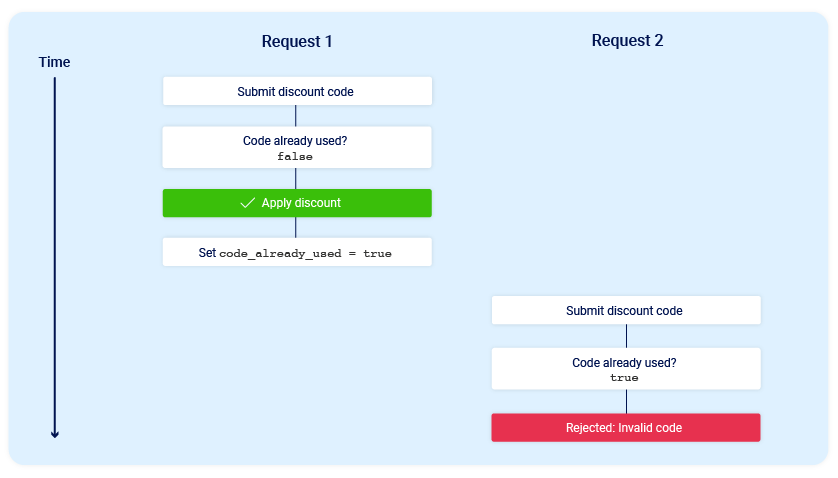

# Race Condition

Race Condition, Türkçe çevirisi olarak Yarış Hali olarak geçiyor. İsmindende az çok anlayabileceğiniz üzere sistemde bir yarış durumu var ve bu durumdan dolayı zafiyet ortaya çıkıyor.

Temel olarak anlatmak gerekirse sisteme gelen isteklerin aynı anda aynı değişken veya aynı kaynağa erişmesiyle ortaya çıkar.

Aynı anda aynı kaynak üzerinde değişiklik yapılmasına collision (çakışma,çarpışma) denir. İstekler çok kısa sürede collision durumunda bulunur. İsteklerin çarpıştığı anlık duruma ise race window denir.

Race window, uygulamanın veri işlemesi sırasında birden fazla işlemin aynı anda değişiklik yapmaya çalıştığı kritik bir bölgedir. Eğer işlemler bu kritik bölgeye girmeden düzgün şekilde sıralanamazsa, çakışma gerçekleşir. Bu tür kritik bölgelere erişim genellikle kilit (lock) veya senkronizasyon mekanizmaları ile kontrol edilir. Eğer gerekli kontroller sağlanmazsa birden fazla istek atılarak sistemin olağanın dışında çalışması sağlanabilir.

Temel olarak zafiyetin nasıl çalıştığını anladık, peki bu zafiyetle neler yapılabilir ona bakalım:

* İndirim kodunu birden fazla kullanmak.
* Ürünleri defalarca değerlendirmek.
* Hesaptaki bakiyeden fazla para transferi yapmak.
* Brute-force saldırılarını bypass etmek vb.

Örnek bir senaryo üzerinden şöyle bir anlatım yapalım. Bir alışveriş sitesinden bir şey almak istediğimize ve son aşamada indirim kodu uygulayabiliriz. Normal şartlarda indirim kodunu bir defe kullandıktan sonra sistem bize izin vermemeli. Gerekli önlemlerin alınmadığı bir sistemde aynı anda indirim kodunu girme isteği attığımızda sistem indirim kodunu birden fazla defa girmemize izin verir.

<figure><figcaption></figcaption></figure>

Yukarıdaki fotoğraf normal şartlarda neler olması gerektiğini anlatmak için koyulmuştur. İlk isteği gönderdiğimizde daha önce kodu kullanmadığımız için false değer karşımıza çıkıyor. Sonrasında kod kullanılıyor ve code\_already\_used değişkenine true değeri atanıyor. Tekrar bir istek gönderdiğimizde ise daha önce true olarak değişiklik yaptığımız değişken kontrol ediliyor ve tekrardan kodu kullanmamız engelleniyor.

<figure><figcaption></figcaption></figure>

Yukarıdaki fotoğrafta ise gerekli kontroller yapılmıyor ve aynı anda gönderilen istekler race window aralığında çakışıyorlar. İkisi de aynı anda aynı değişken üzerinde işlem yapıyor ve değişiklik yaptıkları değişkeni anlık olarak false olarak görüyorlar ve bu sebepten dolayı sistem iki defa kod kullanmamıza izin veriyor.

***

Aynı anda isteklerin gönderilmesi için Burp Repeater ya da Burp Suite eklentisi olan Turbo Intruder kullanılabilir.&#x20;

### [Lab: Limit overrun race conditions](https://portswigger.net/web-security/race-conditions/lab-race-conditions-limit-overrun)

Bu laboratuvarda wiener:peter giriş bilgileriyle sisteme giriş yapıyoruz. Giriş yaptıktan sonra sistemde 50$ paramız olduğunu görüyoruz. Bizden istenen şey 1337$ olan ceketi satın almamız bekleniyor. Sistem tarafından bize tanımlanmış %20 indirim kodu karşımıza çıkıyor. Normal şartlarda bu kodu bir kere kullanabiliyoruz. Hedef sistemde race condition zafiyeti varsa bu kod kullanma isteğini bir sürü defa göndererek , ceketin fiyatını düşürebiliriz.

Bu işlemler için öncelikle sepetimize ceketi ekliyoruz.

Sonrasında sepet kısmına gidip indirim kodu eklemek için bize tanımlana PROMO20 kodunu yazıyoruz.&#x20;

<figure><figcaption></figcaption></figure>

Kodu yazıp hemen göndermiyoruz. Bu esnada Burp Proxy özelliğini açıyoruz sonrasında kodu uygula tuşuna basıyoruz. Kodun uygulandığı esnadaki giden paket bize lazım. Bu paketi alıp tekrar tekrar göndermemiz gerekiyor.

<figure><figcaption></figcaption></figure>

Kodu uygula butonuna bastığımızda arka tarafta böyle bir istek atılıyor. Biz bu isteği bir sürü defa göndermek istiyoruz o yüzden isteğe sağ tıklayıp Burp Repeatera göndermemiz gerekiyor. Bu arada yukarıda yakaladığımız isteği drop etmemiz gerekiyor. Repeater'a gönderdiğimiz isteği birde fazla hale getirmemiz gerekiyor. Öncelikle yapıcağımız istekleri gruplamamız lazım.&#x20;

İsteğin yanında bulunan + sembolüne basıp Create New Group diyoruz. Burada istediğimiz ismi, rengi ve kullanacağımız isteği seçiyoruz.

<figure><figcaption></figcaption></figure>

Bir tane istek içeren bir grup oluşturduk. Şimdi bu istekleri çoğaltmanın sırası. Oluşturduğumuz istek grubuna sağ tıklıyoruz ve Duplicate tab diyoruz.

<figure><figcaption></figcaption></figure>

Karşımıza çıkan popup kısmına isteği kaç defa tekrar etmek istiyorsak o sayıyı giriyoruz. Bu örnekte 100 tane istek oluştursun istiyorum.&#x20;

<figure><figcaption></figcaption></figure>

Bu işlemlerden sonra 100 tane aynı isteği gerçekleştiren isteklerimiz oluyor.  Bu istekleri oluşturduk ama hala biz bunları hedef sisteme işlemesi için göndermedik. Şimdi burada yapacağımız şey şu olucak istekleri gönderme şekillerini inceleyeceğiz.

<figure><figcaption></figcaption></figure>

Send butonunun yanında bulunan ok işaretine bastığımızda istekleri farklı farklı şekillerde gönderebileceğimizi görüyoruz. Sırasıyla bunlara bakalım.

#### Send group in sequence (single connection)

Hazırlamış olduğumuz paketleri aynı bağlantı üzerinden sırasıyla göndermek için kullanılır. Hedefle bağlantı kurar, gruptaki tüm istekleri gönderir ve ardından bağlantıyı kapatır. Ayrıca TCP bağlantıları kurulurken oluşabilecek ağ gecikmelerini de azaltır.

**Send group in sequence (separate connections)**

Hedefle bağlantı kurar, ilk istek gönderir ve ardından bağlantı kapatılır. Bu işlemi diğer tüm istekler için grupta düzenlendikleri sıraya göre tekrarlanır.&#x20;

#### Send group in parallel (single packet attack)

Bu yöntem, birden fazla isteği aynı anda, yani paralel olarak gönderir. Aynı anda yapılan istekler, sistemin aynı kaynak ya da işlem üzerinde nasıl davrandığını gözlemlemeyi mümkün kılar.

***

Bizim senaryomuzu düşündüğümüzde istekleri teker teker atarsak yani PROMO20 kodunu bir kez kullandıktan sonra tekrar kullanmak için istek attığımızda bu kod daha önce kullanıldı diye bir uyarı ile karşı karşıya kalırız. Bu yüzden sırayla istekleri göndermek işimize yaramayacaktır.&#x20;

O yüzden aynı anda bir sürü istek atarak isteklerin çakışmasını sağlamamız lazım. Bu yüzden Send Group in parallel (single packet attack) bizim için yararlı bir istek yöntemi olucaktır.

Hazırlamış olduğumuz istekleri gönderip sistemde birden fazla indirim kodu kullanıp elimizde bulunan 50$ ile ceketi alabiliyor olmamız lazım.

<figure><figcaption></figcaption></figure>

İsteklerimizi paralel bir şekilde gönderdik çarpışma durumu olduysa indirim kodunu birden fazla defa kullanabilmişizdir.

Sepet kısmına gidiyoruz ve ekranı yeniliyoruz.

<figure><figcaption></figcaption></figure>

Ve evet indirim kodlarını birden fazla defa kullanabilmişiz. Elimizde 50$ vardı bu fiyatla ceketi alabiliriz ve soruyu çözebiliriz.

### [Lab: Bypassing rate limit via race conditions](https://portswigger.net/web-security/race-conditions/lab-race-conditions-bypassing-rate-limits)

Bu labımızda bir sisteme race condition ile girmeye çalışacağız. Öncelikle sisteme wiener:peter bilgileriyle girebiliyoruz. Soruyu çözmek için bizden istenen şey ise carlos kullanıcıs ile sisteme girş yaparak admin panelinden carlos kullanıcısını silmek olucaktır.&#x20;

Öncelikle kendi kullanıcı adımızı girip doğru olmayan şifrelerle giriş yapmaya çalışıyoruz. Çok fazla denemeden sonra sistem daha fazla deneme yapmamamız için kısa süreli bir süre engeli koyuyor.&#x20;

Daha sonrasında bu süre engelinin kişi bazında bir engel mi yoksa tarayıcı bazında bir engel mi olduğunu anlamak için carlos kullanıcısı için şifre denemeleri yapıyoruz. Denemeler sonucunda carlos kullanıcısı ile deneme yapabiliyoruz zaman engeli kullanıcı çapında bir engel olduğunu anlıyoruz.

Öncelikle bizim burada yapacağımız şey carlos kullanıcısı gibi giriş yaparken giden paketi yakalayıp Turbo Intruder kullanarak giriş yapma işlemini farklı şifreler ile collision(çarpışma) ortaya çıkarmak olacaktır.

<figure><figcaption></figcaption></figure>

Giriş işlemini araya girip yakalıyoruz ve Turbo Intruder aracına gönderiyoruz. Burada nasıl düzenleme yapacağız ondan bahsedeceğiz. Öncelikle üst tarafta bulunan istek penceresinden hangi parametre yerine içeriğimizi koyucağını belirtmek amacıyla %s karakteri koyuyoruz. Sonrasında hazır payloadlar içinden ne tür bir payload seçiceğimizi seçiyoruz ve bu payload üzerinde küçük değişikler yapıyoruz.&#x20;

Uygulama başlatılmadan önce bize verilen şifre örneklerini kopyalıyoruz ve kod içinde kopyaladığımız  şifreleri tek tek deneme yapıyoruz.&#x20;

<figure><figcaption></figcaption></figure>

Saldırı işlemini başlattıktan sonra dönen cevapların listelendiği bir sayfa karşımıza çıkıyor.

<figure><figcaption></figcaption></figure>

Dönen status kodlara baktığımızda 302 kodu diğerlerinden farklı duruyor. 302 kodu bir yönlendirmenin olduğu anlamına geliyor. mustang şifresiyle carlos hesabına ulaşabiliriz.&#x20;

(Şifreler her 15 dakikada bir yenileniyor, sizin şifreniz farklı olacaktır.)

Artık admin panele ulaşıp carlos kullanıcısını silip soruyu çözebiliriz.

<figure><figcaption></figcaption></figure>

### Hidden multi-step sequences 

Hedef bir sistemde bazı işlemlerden sonra başka küçük işlemler oluşur. Bu küçük işlemler arasında da race condition ortaya çıkabilir. 2FA kontrolü olan bir sistem düşünün. Normal şartlarda sisteme kayıt oluyoruz ve arka tarafta database kaydımız gerçekleştiriliyor sonrasında bize özel bir doğrulama kodu oluşturuluyor ve mail adresimize gönderiliyor.

Arka tarafta kaydımız gerçekleştikten sonra 2FA sayfasına gitmeden önce başka bir sayfaya istek atarak 2FA adımından kaçabiliriz. Çeşitli araştırmalar sonucunda profiles.php adında bir sayfa olduğunu ve normalde 2FA doğrulaması yapmadan bu sayfaya ulaşamıyoruz. Bu işlemi yapmak için öncelikle sisteme kayıt olan bir istek oluşturuyoruz ve bunu repeatera atıyoruz. Sonrasında profiles.php sayfasına istek atan bir isteği repeatera atıyoruz ve bu iki isteği grupluyoruz. Bu grubu aynı anda sisteme gönderdiğimizde hızlıca kayıt oluyor ve ardından çok hızlıca 2FA doğrulaması yapmadan profiles.php sayfasına ulaşmış oluyoruz.

## [Lab: Multi-endpoint race conditions](https://portswigger.net/web-security/race-conditions/lab-race-conditions-multi-endpoint)

Bu lab az önce bahsettiğimiz labın bir tık daha karışık hali. Bu labda bizden istenen şey 100$ para ile 1337$ olan ceketi almamız isteniyor. Öncelikle wiener:peter bilgileriyle sisteme giriş yapıyoruz.&#x20;

Sistem tarafından daha sonra paramızı kullanabilelim diye hediye kartı bulunuyor bu hediye kartlarını sonradan paraya döndürebiliyoruz. Öncelikle sepetimize hediye kartı ekleyelim ve Burp Suite ile giden pakete bakalım.

<figure><figcaption></figcaption></figure>

Ödeme ekranından işlemi onaylarken bakalım nasıl bir paket gönderiliyor ona bakalım.

<figure><figcaption></figcaption></figure>

Bu iki isteği repeatera gönderiyoruz. Bizim burada yapmamız gereken şey öncelikle alabileceğimiz bir ürün ekleyip sonrasında sepeti onaylayıp aynı anda ceketi ekleyerek alabiliriz. Öncelikle hediye kartını eklerken yakaladığımız istekteki productId değerini ceketin id değeriyle(1) değiştiriyoruz.&#x20;

<figure><figcaption>
Paketleri göndermeden önce ki sepetin son durumu
</figcaption></figure>

<figure><figcaption></figcaption></figure>

Repetarda bulunan isteklerden biri ceketin eklenmesi diğeri ise sepetin onaylanması. Paralel bir şekilde istekleri göndererek race window aralığında çakışmanın gerçekleşmesi beklenir ve ceketi bu şekilde alabiliriz. İstekleri gönderdikten sonra soruya dönüp ekranı yenilediğimizde soruyu çözmüş oluyoruz.

<figure><figcaption></figcaption></figure>

> Bu yazı [_Yavuz Kuk_](https://www.linkedin.com/in/yavuzkuk/) tarafından hazırlanmıştır.

