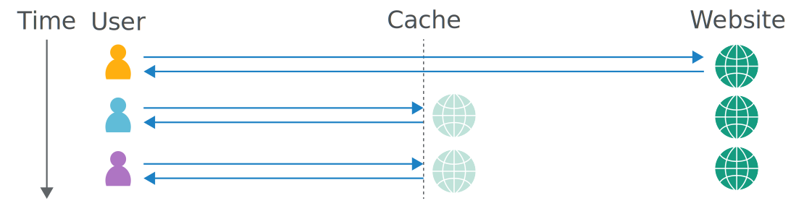

# Web Cache Poisoning

Önceki yazıda [Web Cache](../network/webcache.md)'in ne olduğundan bahsetmiştik. Bu yazımızda ise Web Cache'den kaynaklanabilecek zafiyetlere değineceğiz. Eğer Web Cache'in ne olduğunu bilmiyorsanız öncelikle o yazıyı okumanızı öneriyorum.

Basit bir şekilde açıklamak gerekirse, Web Cache, web sunucumuza gelen aynı isteklerin depolandığı bir yapıdır. Bu sayede, tekrar eden istekler doğrudan Web Cache üzerinden yanıtlanır, böylece sunucunun yükü azalır ve performans artışı sağlanır.

<figure></figure>

Yukarıdaki örneğimize bakarsak ilk kullanıcı web sitesine bir istekte bulunuyor ve cevabını web sunucundan alıyor. Daha sonrasında web sitesine istek gönderildiğinde cevap web sunucusundan değil, web cacheden alır. Bu sayede web sunucusunun yükü azalmış olur.

***

Eğer Web Cache mantığını anladıysak, burada yapmaya çalışacağımız şey, cache'de saklanan web sitesini çeşitli yöntemlerle manipüle ederek zararlı hale getirmek ve bu zararlı içeriği diğer kullanıcılarla paylaşmaya çalışmaktır.

## Cache ve Unkeyed Key
Web Cache mekanizmasına daha detaylı bakacak olursak, bir web sitesinin hangi koşullar altında önbelleğe alınacağını belirlemek için "cache key" adı verilen bir yapı kullanılır. Bunu, yapılan isteğin benzersiz bir kimliği (ID) olarak düşünebiliriz.

Cache Key olarak kullanılabilecek bazı bileşenler şunlardır:

- URL: İsteğin hedef adresi.
- HTTP Başlıkları (Headers): Örneğin, Authorization, User-Agent.
- HTTP Metodu: İstek yöntemi (GET, POST, vb.).
- Cookie ve Parametreler: Oturum bilgileri veya query string değerleri.

Gelen isteklerin cache key değerleri kontrol edilir ve önbellekte (cache'de) aynı key'e sahip bir yanıt olup olmadığına bakılır.

Eğer aynı cache key'e sahip bir yanıt bulunursa, web cache bu yanıtı doğrudan döner. Eğer bulunmazsa, isteğin web sunucusuna iletilmesi gerekir ve yanıt daha sonra önbelleğe kaydedilir. Bu mekanizma, özellikle yoğun trafik altındaki sitelerde sunucu yükünü azaltmak ve kullanıcı deneyimini iyileştirmek için kritik bir rol oynar.

Unkeyed değerler, bir Web Cache sistemi içinde cache key oluşturulurken dikkate alınmayan ve göz ardı edilen parametrelerdir. Eğer bu önemli parametreler cache key oluşturma sürecinde dahil edilmezse, güvenlik açıkları ve yanlış yönlendirmelere yol açabilir.

## Web Cache Poisoning etkileri

Zafiyet temelde iki faktöre bağlıdır. 

- Cache'de saklanan verinin etkisi.
    - Enjekte edilen zararlı içerik ne kadar tehlikeliyse, saldırının etkisi de o kadar büyük olur. Ayrıca, saldırı diğer yöntemlerle birleştirilerek daha büyük bir etki yaratabilir.
- Zehirlenmiş sayfanın trafik yoğunluğu
    - Cache zehirlenmesinin etkisi, yalnızca ilgili sayfayı ziyaret eden kullanıcıları etkiler. Eğer zehirlenen sayfa popüler bir sayfa ise (örneğin, bir ana sayfa), binlerce kullanıcı etkilenebilir.

## Web Cache Poisoning nasıl ortaya çıkar?

Web cache zafiyeti, genellikle unkeyed değerlerin tespit edilmesiyle başlar. İstek üzerinde bulunan unkeyed değerleri tespit etmek için istek üzerinde manuel olarak çeşitli değerler eklenip diğer isteklere göre farklı sonuç verip vermediği kontrol edilebilir.

Manuel işlem dışında BurpSuitede bulunan [Param Miner](https://portswigger.net/bappstore/17d2949a985c4b7ca092728dba871943) eklentisiyle bu durumu otomatikleştirebiliriz.

Unkeyed bir değer tespit edildikten sonra, bu değerin sunucu tarafından nasıl işlendiğini anlamak kritik önem taşır. Bu değer, sunucudan dönen yanıtta yer alıyorsa, bu durumu kullanarak nasıl tehlikeli bir yanıt elde edilebileceği araştırılmalıdır.

### Cache buster

Zafiyeti tespit ederken çeşitli denemelerde bulunmamız gerekecek. Ancak bu denemeler sırasında, farkında olmadan oluşturduğumuz bazı yanıtlar web cache tarafından kaydedilebilir ve diğer kullanıcılara sunulabilir.

Bu kısmı anlatmak için bir örnek üzerinden ilerlemek istiyorum. Örnek web sitemizin adı yvzkk.com olsun ve bu web sitesine bir istek attığımızda şöyle bir istek göndermiş oluruz.


```
GET / HTTP/2
Host: www.yvzkk.com
User-Agent: Mozilla/5.0 (X11; Ubuntu; Linux x86_64; rv:134.0) Gecko/20100101 Firefox/134.0
```
Eğer testlerimizi doğrudan bu temel URL üzerinde gerçekleştirirsek, istemeden oluşturduğumuz hatalı veya zararlı içerikler web cache tarafından kaydedilir. Bu durum, diğer kullanıcılara zarar verebilir.

Bu sorunu önlemek için 'cache buster' adı verilen bir yöntem kullanılır. Cache buster, hedef domain'e eşsiz bir parametre eklenmesiyle gerçekleştirilir. Örneğin, testlerimizi yvzkk.com?a=1234 gibi bir URL üzerinden yapmak, istemeden oluşturulan yanıtların diğer kullanıcıları etkilemesini engelleyecektir.

Eğer testler sırasında yanlış bir içeriğin cache tarafından kaydedildiğini fark edersek, parametre değerini değiştirebilir ve yeni testlerimizi farklı bir sorgu üzerinden gerçekleştirebiliriz. Örneğin: yvzkk.com?a=5678.

Zafiyeti başarılı bir şekilde tespit ettikten sonra, bu zafiyeti tüm kullanıcıları etkileyebilir hale getirmek için temel URL (yvzkk.com) üzerinde işlemi tekrar ederek exploit’i yayabiliriz.

***

## [Lab: Web cache poisoning with an unkeyed header](https://portswigger.net/web-security/web-cache-poisoning/exploiting-design-flaws/lab-web-cache-poisoning-with-an-unkeyed-header)

Öncelikle labda bizden ekranda ``document.cookie`` değerini alert fonksiyonu ile ekrana basmamız isteniyor. Öncelikle Intercepti açıp isteğimizi yakalıyoruz ve Param Miner aracıyla unkey değerleri bulmasını sağlıyoruz.

<figure></figure>

Bu işlem sonucunda cevap üzerinde etkisi olan değerleri bize gösteriyor.

<figure></figure>

Hedef web sitesinde ``X-Forwarded-Host`` değeri farklılık yarattığını keşfettik. Şimdi tekrardan isteğimizi Intercept ile yakalayalım ve repatera gönderelim. İsteği gönderdiğimizde bize gelen cevabı incelediğimizde `X-Cache: hit` değerini görüyoruz.

<figure></figure>

Bu sayede bize gelen cevabın sunucudan değil web cacheden geldiğini anlıyoruz.

Daha önce bahsettiğim gibi temel URL üzerinde işlem yapıp yanlışlık yapmamak için cache buster değerini ekliyoruz ve Param miner ile bulduğumuz `X-Forwarded-Host` değerini ekliyorum ve isteği gönderiyorum.

<figure></figure>

Dönen cevaba baktığımızda ``X-Forwarded-Host`` değeri karşımıza çıkıyor. Bizden istenen ise ``document.cookie`` değerini ekrana alert ile göstermekti. X-Forwarded-Host değerini değiştirerek önce src özelliğinden sonrasında script etiketinden çıkıp kendi script etiketlerimizi açabiliriz ve document.cookie değerini ekrana alert ile gösterebiliriz.

<figure></figure>

Yukarıdaki payloadda öncelikle içinde olduğumuz src parametresinden kurtuluyoruz ve açılmış olan script etiketini kapatıyoruz bundan sonra da kendi script etiketlerimizi açıp document.cookie değerini ekrana yansıtan kodu yazıyoruz. Gelen cevaba bakarsanız X-Cache değeri hit yani bu cevap bize web cacheden geliyor. Eğer biz ``.......webacademy.net?a=s3`` adresini ziyaret edersek bizim karşımıza bir alert fonksiyonu çıkacaktır. Ama bizim burada istediğimiz şey temel URL üzerinde böyle bir alert fonksiyonu çıkması bunun içinde cache buster değerini siliyoruz ve isteklerimizi tekrar gönderiyoruz.

<figure></figure>

Hedef web sitesini ziyaret ettiğimizde karşımıza bir pop-up çıkıyor ve soruyu çözmüş oluyoruz.


## [Lab: Web cache poisoning with an unkeyed cookie](https://portswigger.net/web-security/web-cache-poisoning/exploiting-design-flaws/lab-web-cache-poisoning-with-an-unkeyed-cookie)

Bu örnekte ise cookie değerlerinden ortaya çıkan bir durum söz konusu ve bizden ekrana pop-up içinde 1 değerini yansıtmamız isteniyor. Öncelikle Intercept ile isteği yakalayalım ve Repeatera gönderelim. Param Miner eklentisi ile tarama yapmadan önce istekte gönderilen cookie değerlerini kontrol etmek işimize yarayabilir.

<figure></figure>

Cookie değerlerine baktığımızda ``fehost`` cookiesi cevap içinde yer almış halde duruyor. Öncelikle ``fehost`` değerimizi manipüle ederek data değişkeni içerisinden çıkarmaya çalışalım, sonrasında script etiketini kapatıp yeni bir script etiketi açıp içerisinde işlemlerimizi yapalım.

Ama bu işlemlere başlamadan önce cache buster değerimizi ekleyelim ve işlemlere başlayalım.

<figure></figure>

Cookie değerimizi manipüle ederek payloadımızı oluşturduk artık `web-security-academy.net?a=123a` web sitesini ziyaret ettiğimizde karşımıza pop-up çıkıyor. Bu zafiyetli kısmı temel URL'e ulaşmaya çalışan herkese yaymak istiyoruz bu yüzden cache buster değerini silip isteğimizi tekrarda gönderiyoruz ve isteğin `X-Cache` değerinin hit dönmesini sağlamaya çalışıyoruz. 

İsteği web cache kaydettikten sonra temel URL'i ziyaret ettiğimizde karşımıza bir pop-up çıkıyor ve soruyu çözmüş oluyoruz.

***

Şu ana kadar yaptığımız örneklerde, istek satırında bulunan tüm parametreler cache key oluşturmak için yetkiliydi. Bu parametrelerde değişiklik yaptığımızda, cache buster değerlerini değiştirerek önbelleği kontrol edebiliyorduk. Ancak, bundan sonra yapacağımız örneklerde web cache sistemleri bazı parametreleri göz ardı edebilecek duruma geleceklerdir.

Örneğin, ``GET / HTTP/2`` ve ``GET /?page=2 HTTP/2`` isteklerine web cache tarafından aynı cache ile cevap verilebilir. Başka senaryolarda ise bazı parametreler dikkate alınabilirken, bazıları göz ardı edilebilir. 

## [Lab: Web cache poisoning via an unkeyed query parameter](https://portswigger.net/web-security/web-cache-poisoning/exploiting-implementation-flaws/lab-web-cache-poisoning-unkeyed-param)

Ana sayfa isteklerini Burp Suite ile durdurup yakalıyoruz. İsteği Repeater'a gönderiyoruz. İsteği tekrar gönderdikten sonra ``X-Cache:hit`` değerini görüyoruz. Denemek amacıyla bir cache buster değeri ekliyoruz ve gönderiyoruz.

<figure></figure>

Bu örneğimizde parametre cache mekanizmasının key üretmesi konusunda yetkili bir durumda. Parametreyi değiştirdiğimizde key değeri değiştiği için başka bir cevapmış gibi düşünülüyor. Normalde Param Miner eklentisiyle birlikte header değerlerini tarayıp eklentinin bize verdiği değerlerden yola çıkardık ama bu örneğimizde unkeyed query parameter diyor. Param Miner ile unkeyed query parameterları taramamız gerekiyor.

<figure></figure>

Tarama sonucunda `utm_content` adında bir parametreyi bize gösteriyor. Bu parametreyi ekleyip isteğimizi gönderelim ve sonucuna bakalım.

<figure></figure>

`utm_content` parametresi cevabın içinde yer alıyor. Tek başına `utm_content` parametresi unkeyed mi kontrol etmek için diğer parametreyi silelim ve tekrardan isteği gönderelim.

İsteği gönderdiğimizde ana safyanın cache hali bize dönüyor. Buradan anlıyoruz ki `utm_content` değeri cache buster bir parametre değil yani web cache tarafından dikkate alınan bir parametre değil. Soruyu çözmek için cache buster bir değer ekleyelim ve `utm_content` parametresini önce link etiketi içerisinden çıkaralım. Sonrasında script taglerini açıp alert(1) fonksiyonunu çalıştıralım.

<figure></figure>

Bize gelen cevaba sağ tıklayıp `"Request in browser" > "In original session"` seçeneğine tıkladıktan sonra değeri kopyalayıp tarayıcıya ziyaret ettiğimizde ekrana alert(1) fonksiyonu çıktısı verecektir. Web sitesini zehirledik ama parametre değerini `/?a=6` yapan kullanıcılar için zehirlenme işlemi gerçekleşti. Zehirlenmeyi bütün kullanıcılara yaymak istiyoruz bunun için cache buster değerini silip cache miss olana kadar istek atmaya devam etmeliyiz. Age değeri 0 olduğunda kendi payloadımızı web cache tarafından cachelenmiş hale getirebiliriz ve soruyu çözebiliriz.

<figure></figure>


> Bu yazı [_Yavuz Kuk_](https://www.linkedin.com/in/yavuzkuk/) tarafından hazırlanmıştır.